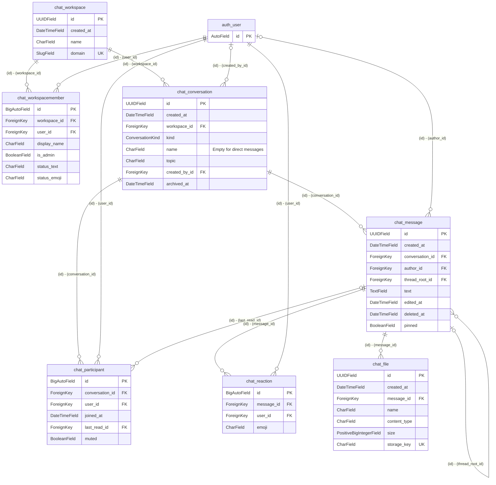

```mermaid
erDiagram
    chat_workspace ||--o{ chat_workspacemember : "(id) - (workspace_id)"
    auth_user ||--o{ chat_workspacemember : "(id) - (user_id)"
    chat_workspace ||--o{ chat_conversation : "(id) - (workspace_id)"
    auth_user |o--o{ chat_conversation : "(id) - (created_by_id)"
    chat_conversation ||--o{ chat_participant : "(id) - (conversation_id)"
    auth_user ||--o{ chat_participant : "(id) - (user_id)"
    chat_message |o--o{ chat_participant : "(id) - (last_read_id)"
    chat_conversation ||--o{ chat_message : "(id) - (conversation_id)"
    auth_user |o--o{ chat_message : "(id) - (author_id)"
    chat_message |o--o{ chat_message : "(id) - (thread_root_id)"
    chat_message ||--o{ chat_reaction : "(id) - (message_id)"
    auth_user ||--o{ chat_reaction : "(id) - (user_id)"
    chat_message ||--o{ chat_file : "(id) - (message_id)"
    chat_workspace {
        UUIDField id PK
        DateTimeField created_at
        CharField name
        SlugField domain UK
    }
    chat_workspacemember {
        BigAutoField id PK
        ForeignKey workspace_id FK
        ForeignKey user_id FK
        CharField display_name
        BooleanField is_admin
        CharField status_text
        CharField status_emoji
    }
    chat_conversation {
        UUIDField id PK
        DateTimeField created_at
        ForeignKey workspace_id FK
        ConversationKind kind
        CharField name "Empty for direct messages"
        CharField topic
        ForeignKey created_by_id FK
        DateTimeField archived_at
    }
    chat_participant {
        BigAutoField id PK
        ForeignKey conversation_id FK
        ForeignKey user_id FK
        DateTimeField joined_at
        ForeignKey last_read_id FK
        BooleanField muted
    }
    chat_message {
        UUIDField id PK
        DateTimeField created_at
        ForeignKey conversation_id FK
        ForeignKey author_id FK
        ForeignKey thread_root_id FK
        TextField text
        DateTimeField edited_at
        DateTimeField deleted_at
        BooleanField pinned
    }
    chat_reaction {
        BigAutoField id PK
        ForeignKey message_id FK
        ForeignKey user_id FK
        CharField emoji
    }
    chat_file {
        UUIDField id PK
        DateTimeField created_at
        ForeignKey message_id FK
        CharField name
        CharField content_type
        PositiveBigIntegerField size
        CharField storage_key UK
    }
    auth_user {
        AutoField id PK
    }
```
