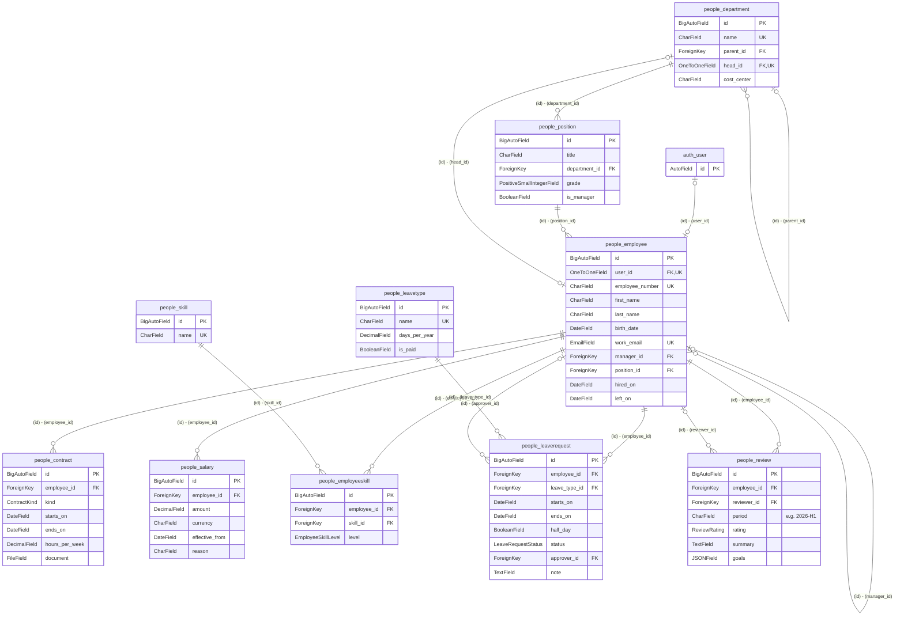

```mermaid
erDiagram
    people_department |o--o{ people_department : "(id) - (parent_id)"
    people_employee |o--o| people_department : "(id) - (head_id)"
    people_department ||--o{ people_position : "(id) - (department_id)"
    auth_user |o--o| people_employee : "(id) - (user_id)"
    people_employee |o--o{ people_employee : "(id) - (manager_id)"
    people_position ||--o{ people_employee : "(id) - (position_id)"
    people_employee ||--o{ people_contract : "(id) - (employee_id)"
    people_employee ||--o{ people_salary : "(id) - (employee_id)"
    people_employee ||--o{ people_employeeskill : "(id) - (employee_id)"
    people_skill ||--o{ people_employeeskill : "(id) - (skill_id)"
    people_employee ||--o{ people_leaverequest : "(id) - (employee_id)"
    people_leavetype ||--o{ people_leaverequest : "(id) - (leave_type_id)"
    people_employee |o--o{ people_leaverequest : "(id) - (approver_id)"
    people_employee ||--o{ people_review : "(id) - (employee_id)"
    people_employee |o--o{ people_review : "(id) - (reviewer_id)"
    people_department {
        BigAutoField id PK
        CharField name UK
        ForeignKey parent_id FK
        OneToOneField head_id FK, UK
        CharField cost_center
    }
    people_position {
        BigAutoField id PK
        CharField title
        ForeignKey department_id FK
        PositiveSmallIntegerField grade
        BooleanField is_manager
    }
    people_employee {
        BigAutoField id PK
        OneToOneField user_id FK, UK
        CharField employee_number UK
        CharField first_name
        CharField last_name
        DateField birth_date
        EmailField work_email UK
        ForeignKey manager_id FK
        ForeignKey position_id FK
        DateField hired_on
        DateField left_on
    }
    people_contract {
        BigAutoField id PK
        ForeignKey employee_id FK
        ContractKind kind
        DateField starts_on
        DateField ends_on
        DecimalField hours_per_week
        FileField document
    }
    people_salary {
        BigAutoField id PK
        ForeignKey employee_id FK
        DecimalField amount
        CharField currency
        DateField effective_from
        CharField reason
    }
    people_skill {
        BigAutoField id PK
        CharField name UK
    }
    people_employeeskill {
        BigAutoField id PK
        ForeignKey employee_id FK
        ForeignKey skill_id FK
        EmployeeSkillLevel level
    }
    people_leavetype {
        BigAutoField id PK
        CharField name UK
        DecimalField days_per_year
        BooleanField is_paid
    }
    people_leaverequest {
        BigAutoField id PK
        ForeignKey employee_id FK
        ForeignKey leave_type_id FK
        DateField starts_on
        DateField ends_on
        BooleanField half_day
        LeaveRequestStatus status
        ForeignKey approver_id FK
        TextField note
    }
    people_review {
        BigAutoField id PK
        ForeignKey employee_id FK
        ForeignKey reviewer_id FK
        CharField period "e.g. 2026-H1"
        ReviewRating rating
        TextField summary
        JSONField goals
    }
    auth_user {
        AutoField id PK
    }
```
