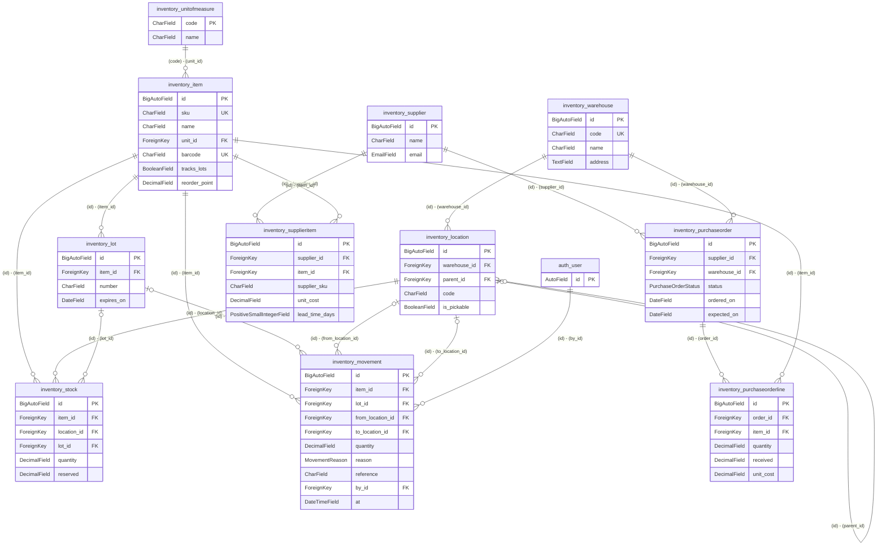

```mermaid
erDiagram
    inventory_warehouse ||--o{ inventory_location : "(id) - (warehouse_id)"
    inventory_location |o--o{ inventory_location : "(id) - (parent_id)"
    inventory_unitofmeasure ||--o{ inventory_item : "(code) - (unit_id)"
    inventory_item ||--o{ inventory_lot : "(id) - (item_id)"
    inventory_item ||--o{ inventory_stock : "(id) - (item_id)"
    inventory_location ||--o{ inventory_stock : "(id) - (location_id)"
    inventory_lot |o--o{ inventory_stock : "(id) - (lot_id)"
    inventory_item ||--o{ inventory_movement : "(id) - (item_id)"
    inventory_lot |o--o{ inventory_movement : "(id) - (lot_id)"
    inventory_location |o--o{ inventory_movement : "(id) - (from_location_id)"
    inventory_location |o--o{ inventory_movement : "(id) - (to_location_id)"
    auth_user ||--o{ inventory_movement : "(id) - (by_id)"
    inventory_supplier ||--o{ inventory_supplieritem : "(id) - (supplier_id)"
    inventory_item ||--o{ inventory_supplieritem : "(id) - (item_id)"
    inventory_supplier ||--o{ inventory_purchaseorder : "(id) - (supplier_id)"
    inventory_warehouse ||--o{ inventory_purchaseorder : "(id) - (warehouse_id)"
    inventory_purchaseorder ||--o{ inventory_purchaseorderline : "(id) - (order_id)"
    inventory_item ||--o{ inventory_purchaseorderline : "(id) - (item_id)"
    inventory_warehouse {
        BigAutoField id PK
        CharField code UK
        CharField name
        TextField address
    }
    inventory_location {
        BigAutoField id PK
        ForeignKey warehouse_id FK
        ForeignKey parent_id FK
        CharField code
        BooleanField is_pickable
    }
    inventory_unitofmeasure {
        CharField code PK
        CharField name
    }
    inventory_item {
        BigAutoField id PK
        CharField sku UK
        CharField name
        ForeignKey unit_id FK
        CharField barcode UK
        BooleanField tracks_lots
        DecimalField reorder_point
    }
    inventory_lot {
        BigAutoField id PK
        ForeignKey item_id FK
        CharField number
        DateField expires_on
    }
    inventory_stock {
        BigAutoField id PK
        ForeignKey item_id FK
        ForeignKey location_id FK
        ForeignKey lot_id FK
        DecimalField quantity
        DecimalField reserved
    }
    inventory_movement {
        BigAutoField id PK
        ForeignKey item_id FK
        ForeignKey lot_id FK
        ForeignKey from_location_id FK
        ForeignKey to_location_id FK
        DecimalField quantity
        MovementReason reason
        CharField reference
        ForeignKey by_id FK
        DateTimeField at
    }
    inventory_supplier {
        BigAutoField id PK
        CharField name
        EmailField email
    }
    inventory_supplieritem {
        BigAutoField id PK
        ForeignKey supplier_id FK
        ForeignKey item_id FK
        CharField supplier_sku
        DecimalField unit_cost
        PositiveSmallIntegerField lead_time_days
    }
    inventory_purchaseorder {
        BigAutoField id PK
        ForeignKey supplier_id FK
        ForeignKey warehouse_id FK
        PurchaseOrderStatus status
        DateField ordered_on
        DateField expected_on
    }
    inventory_purchaseorderline {
        BigAutoField id PK
        ForeignKey order_id FK
        ForeignKey item_id FK
        DecimalField quantity
        DecimalField received
        DecimalField unit_cost
    }
    auth_user {
        AutoField id PK
    }
```
