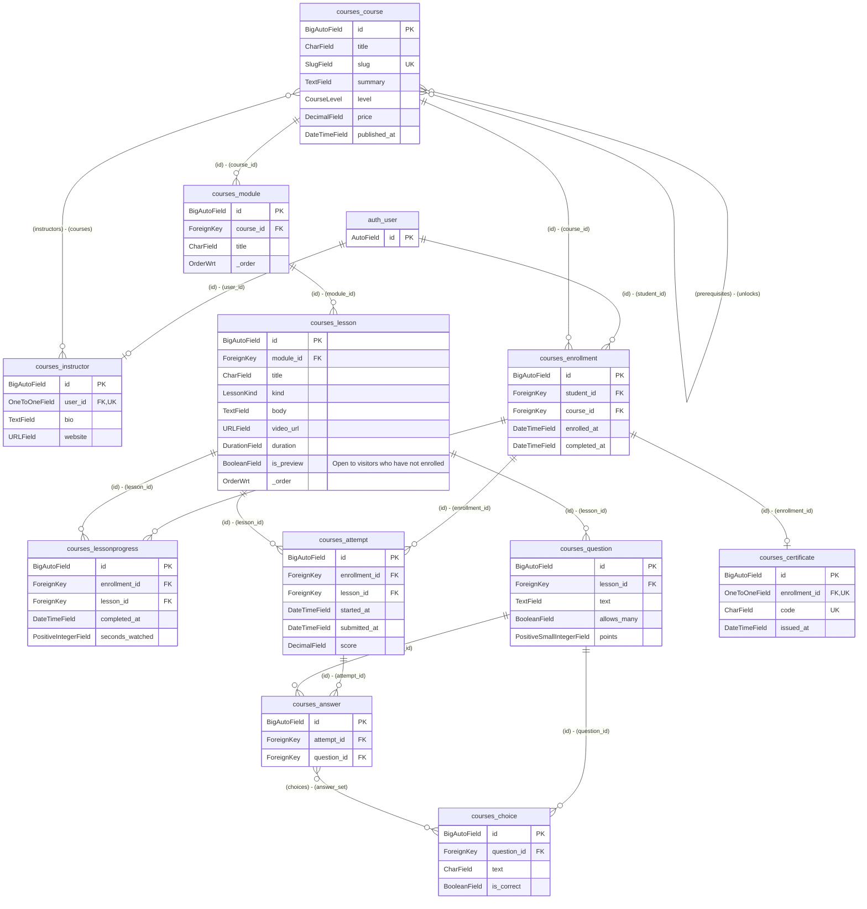

```mermaid
erDiagram
    auth_user ||--o| courses_instructor : "(id) - (user_id)"
    courses_course }o--o{ courses_instructor : "(instructors) - (courses)"
    courses_course }o--o{ courses_course : "(prerequisites) - (unlocks)"
    courses_course ||--o{ courses_module : "(id) - (course_id)"
    courses_module ||--o{ courses_lesson : "(id) - (module_id)"
    auth_user ||--o{ courses_enrollment : "(id) - (student_id)"
    courses_course ||--o{ courses_enrollment : "(id) - (course_id)"
    courses_enrollment ||--o{ courses_lessonprogress : "(id) - (enrollment_id)"
    courses_lesson ||--o{ courses_lessonprogress : "(id) - (lesson_id)"
    courses_lesson ||--o{ courses_question : "(id) - (lesson_id)"
    courses_question ||--o{ courses_choice : "(id) - (question_id)"
    courses_enrollment ||--o{ courses_attempt : "(id) - (enrollment_id)"
    courses_lesson ||--o{ courses_attempt : "(id) - (lesson_id)"
    courses_attempt ||--o{ courses_answer : "(id) - (attempt_id)"
    courses_question ||--o{ courses_answer : "(id) - (question_id)"
    courses_answer }o--o{ courses_choice : "(choices) - (answer_set)"
    courses_enrollment ||--o| courses_certificate : "(id) - (enrollment_id)"
    courses_instructor {
        BigAutoField id PK
        OneToOneField user_id FK, UK
        TextField bio
        URLField website
    }
    courses_course {
        BigAutoField id PK
        CharField title
        SlugField slug UK
        TextField summary
        CourseLevel level
        DecimalField price
        DateTimeField published_at
    }
    courses_module {
        BigAutoField id PK
        ForeignKey course_id FK
        CharField title
        OrderWrt _order
    }
    courses_lesson {
        BigAutoField id PK
        ForeignKey module_id FK
        CharField title
        LessonKind kind
        TextField body
        URLField video_url
        DurationField duration
        BooleanField is_preview "Open to visitors who have not enrolled"
        OrderWrt _order
    }
    courses_enrollment {
        BigAutoField id PK
        ForeignKey student_id FK
        ForeignKey course_id FK
        DateTimeField enrolled_at
        DateTimeField completed_at
    }
    courses_lessonprogress {
        BigAutoField id PK
        ForeignKey enrollment_id FK
        ForeignKey lesson_id FK
        DateTimeField completed_at
        PositiveIntegerField seconds_watched
    }
    courses_question {
        BigAutoField id PK
        ForeignKey lesson_id FK
        TextField text
        BooleanField allows_many
        PositiveSmallIntegerField points
    }
    courses_choice {
        BigAutoField id PK
        ForeignKey question_id FK
        CharField text
        BooleanField is_correct
    }
    courses_attempt {
        BigAutoField id PK
        ForeignKey enrollment_id FK
        ForeignKey lesson_id FK
        DateTimeField started_at
        DateTimeField submitted_at
        DecimalField score
    }
    courses_answer {
        BigAutoField id PK
        ForeignKey attempt_id FK
        ForeignKey question_id FK
    }
    courses_certificate {
        BigAutoField id PK
        OneToOneField enrollment_id FK, UK
        CharField code UK
        DateTimeField issued_at
    }
    auth_user {
        AutoField id PK
    }
```
