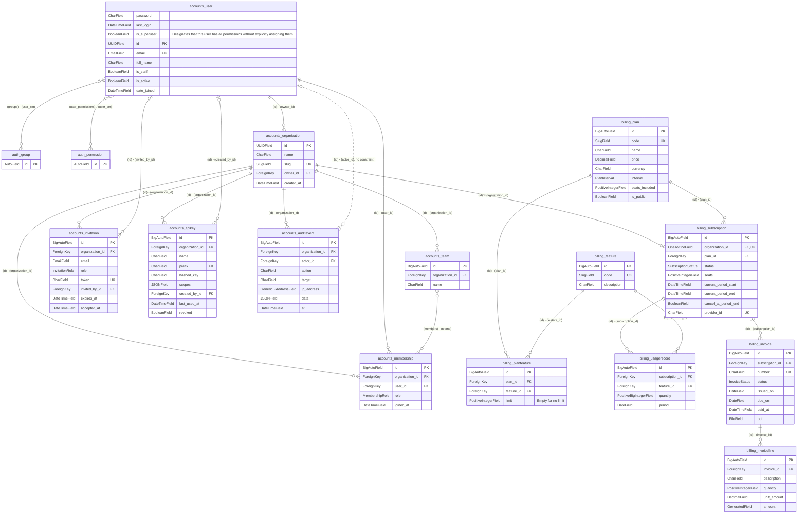

```mermaid
erDiagram
    accounts_user }o--o{ auth_group : "(groups) - (user_set)"
    accounts_user }o--o{ auth_permission : "(user_permissions) - (user_set)"
    accounts_user ||--o{ accounts_organization : "(id) - (owner_id)"
    accounts_organization ||--o{ accounts_membership : "(id) - (organization_id)"
    accounts_user ||--o{ accounts_membership : "(id) - (user_id)"
    accounts_organization ||--o{ accounts_team : "(id) - (organization_id)"
    accounts_team }o--o{ accounts_membership : "(members) - (teams)"
    accounts_organization ||--o{ accounts_invitation : "(id) - (organization_id)"
    accounts_user |o--o{ accounts_invitation : "(id) - (invited_by_id)"
    accounts_organization ||--o{ accounts_apikey : "(id) - (organization_id)"
    accounts_user |o--o{ accounts_apikey : "(id) - (created_by_id)"
    accounts_organization ||--o{ accounts_auditevent : "(id) - (organization_id)"
    accounts_user |o..o{ accounts_auditevent : "(id) - (actor_id), no constraint"
    billing_plan ||--o{ billing_planfeature : "(id) - (plan_id)"
    billing_feature ||--o{ billing_planfeature : "(id) - (feature_id)"
    accounts_organization ||--o| billing_subscription : "(id) - (organization_id)"
    billing_plan ||--o{ billing_subscription : "(id) - (plan_id)"
    billing_subscription ||--o{ billing_usagerecord : "(id) - (subscription_id)"
    billing_feature ||--o{ billing_usagerecord : "(id) - (feature_id)"
    billing_subscription ||--o{ billing_invoice : "(id) - (subscription_id)"
    billing_invoice ||--o{ billing_invoiceline : "(id) - (invoice_id)"
    accounts_user {
        CharField password
        DateTimeField last_login
        BooleanField is_superuser "Designates that this user has all permissions without explicitly assigning them."
        UUIDField id PK
        EmailField email UK
        CharField full_name
        BooleanField is_staff
        BooleanField is_active
        DateTimeField date_joined
    }
    accounts_organization {
        UUIDField id PK
        CharField name
        SlugField slug UK
        ForeignKey owner_id FK
        DateTimeField created_at
    }
    accounts_membership {
        BigAutoField id PK
        ForeignKey organization_id FK
        ForeignKey user_id FK
        MembershipRole role
        DateTimeField joined_at
    }
    accounts_team {
        BigAutoField id PK
        ForeignKey organization_id FK
        CharField name
    }
    accounts_invitation {
        BigAutoField id PK
        ForeignKey organization_id FK
        EmailField email
        InvitationRole role
        CharField token UK
        ForeignKey invited_by_id FK
        DateTimeField expires_at
        DateTimeField accepted_at
    }
    accounts_apikey {
        BigAutoField id PK
        ForeignKey organization_id FK
        CharField name
        CharField prefix UK
        CharField hashed_key
        JSONField scopes
        ForeignKey created_by_id FK
        DateTimeField last_used_at
        BooleanField revoked
    }
    accounts_auditevent {
        BigAutoField id PK
        ForeignKey organization_id FK
        ForeignKey actor_id FK
        CharField action
        CharField target
        GenericIPAddressField ip_address
        JSONField data
        DateTimeField at
    }
    billing_plan {
        BigAutoField id PK
        SlugField code UK
        CharField name
        DecimalField price
        CharField currency
        PlanInterval interval
        PositiveIntegerField seats_included
        BooleanField is_public
    }
    billing_feature {
        BigAutoField id PK
        SlugField code UK
        CharField description
    }
    billing_planfeature {
        BigAutoField id PK
        ForeignKey plan_id FK
        ForeignKey feature_id FK
        PositiveIntegerField limit "Empty for no limit"
    }
    billing_subscription {
        BigAutoField id PK
        OneToOneField organization_id FK, UK
        ForeignKey plan_id FK
        SubscriptionStatus status
        PositiveIntegerField seats
        DateTimeField current_period_start
        DateTimeField current_period_end
        BooleanField cancel_at_period_end
        CharField provider_id UK
    }
    billing_usagerecord {
        BigAutoField id PK
        ForeignKey subscription_id FK
        ForeignKey feature_id FK
        PositiveBigIntegerField quantity
        DateField period
    }
    billing_invoice {
        BigAutoField id PK
        ForeignKey subscription_id FK
        CharField number UK
        InvoiceStatus status
        DateField issued_on
        DateField due_on
        DateTimeField paid_at
        FileField pdf
    }
    billing_invoiceline {
        BigAutoField id PK
        ForeignKey invoice_id FK
        CharField description
        PositiveIntegerField quantity
        DecimalField unit_amount
        GeneratedField amount
    }
    auth_permission {
        AutoField id PK
    }
    auth_group {
        AutoField id PK
    }
```
