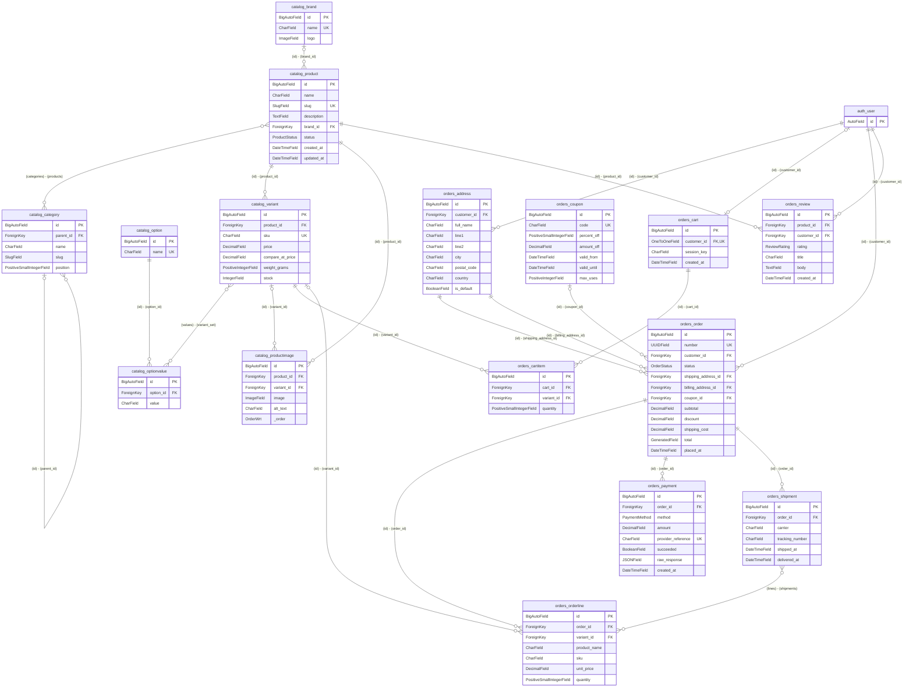

```mermaid
erDiagram
    catalog_category |o--o{ catalog_category : "(id) - (parent_id)"
    catalog_brand |o--o{ catalog_product : "(id) - (brand_id)"
    catalog_product }o--o{ catalog_category : "(categories) - (products)"
    catalog_option ||--o{ catalog_optionvalue : "(id) - (option_id)"
    catalog_product ||--o{ catalog_variant : "(id) - (product_id)"
    catalog_variant }o--o{ catalog_optionvalue : "(values) - (variant_set)"
    catalog_product ||--o{ catalog_productimage : "(id) - (product_id)"
    catalog_variant |o--o{ catalog_productimage : "(id) - (variant_id)"
    auth_user ||--o{ orders_address : "(id) - (customer_id)"
    auth_user |o--o| orders_cart : "(id) - (customer_id)"
    orders_cart ||--o{ orders_cartitem : "(id) - (cart_id)"
    catalog_variant ||--o{ orders_cartitem : "(id) - (variant_id)"
    auth_user ||--o{ orders_order : "(id) - (customer_id)"
    orders_address ||--o{ orders_order : "(id) - (shipping_address_id)"
    orders_address ||--o{ orders_order : "(id) - (billing_address_id)"
    orders_coupon |o--o{ orders_order : "(id) - (coupon_id)"
    orders_order ||--o{ orders_orderline : "(id) - (order_id)"
    catalog_variant |o--o{ orders_orderline : "(id) - (variant_id)"
    orders_order ||--o{ orders_payment : "(id) - (order_id)"
    orders_order ||--o{ orders_shipment : "(id) - (order_id)"
    orders_shipment }o--o{ orders_orderline : "(lines) - (shipments)"
    catalog_product ||--o{ orders_review : "(id) - (product_id)"
    auth_user ||--o{ orders_review : "(id) - (customer_id)"
    catalog_category {
        BigAutoField id PK
        ForeignKey parent_id FK
        CharField name
        SlugField slug
        PositiveSmallIntegerField position
    }
    catalog_brand {
        BigAutoField id PK
        CharField name UK
        ImageField logo
    }
    catalog_product {
        BigAutoField id PK
        CharField name
        SlugField slug UK
        TextField description
        ForeignKey brand_id FK
        ProductStatus status
        DateTimeField created_at
        DateTimeField updated_at
    }
    catalog_option {
        BigAutoField id PK
        CharField name UK
    }
    catalog_optionvalue {
        BigAutoField id PK
        ForeignKey option_id FK
        CharField value
    }
    catalog_variant {
        BigAutoField id PK
        ForeignKey product_id FK
        CharField sku UK
        DecimalField price
        DecimalField compare_at_price
        PositiveIntegerField weight_grams
        IntegerField stock
    }
    catalog_productimage {
        BigAutoField id PK
        ForeignKey product_id FK
        ForeignKey variant_id FK
        ImageField image
        CharField alt_text
        OrderWrt _order
    }
    orders_address {
        BigAutoField id PK
        ForeignKey customer_id FK
        CharField full_name
        CharField line1
        CharField line2
        CharField city
        CharField postal_code
        CharField country
        BooleanField is_default
    }
    orders_cart {
        BigAutoField id PK
        OneToOneField customer_id FK, UK
        CharField session_key
        DateTimeField created_at
    }
    orders_cartitem {
        BigAutoField id PK
        ForeignKey cart_id FK
        ForeignKey variant_id FK
        PositiveSmallIntegerField quantity
    }
    orders_coupon {
        BigAutoField id PK
        CharField code UK
        PositiveSmallIntegerField percent_off
        DecimalField amount_off
        DateTimeField valid_from
        DateTimeField valid_until
        PositiveIntegerField max_uses
    }
    orders_order {
        BigAutoField id PK
        UUIDField number UK
        ForeignKey customer_id FK
        OrderStatus status
        ForeignKey shipping_address_id FK
        ForeignKey billing_address_id FK
        ForeignKey coupon_id FK
        DecimalField subtotal
        DecimalField discount
        DecimalField shipping_cost
        GeneratedField total
        DateTimeField placed_at
    }
    orders_orderline {
        BigAutoField id PK
        ForeignKey order_id FK
        ForeignKey variant_id FK
        CharField product_name
        CharField sku
        DecimalField unit_price
        PositiveSmallIntegerField quantity
    }
    orders_payment {
        BigAutoField id PK
        ForeignKey order_id FK
        PaymentMethod method
        DecimalField amount
        CharField provider_reference UK
        BooleanField succeeded
        JSONField raw_response
        DateTimeField created_at
    }
    orders_shipment {
        BigAutoField id PK
        ForeignKey order_id FK
        CharField carrier
        CharField tracking_number
        DateTimeField shipped_at
        DateTimeField delivered_at
    }
    orders_review {
        BigAutoField id PK
        ForeignKey product_id FK
        ForeignKey customer_id FK
        ReviewRating rating
        CharField title
        TextField body
        DateTimeField created_at
    }
    auth_user {
        AutoField id PK
    }
```
