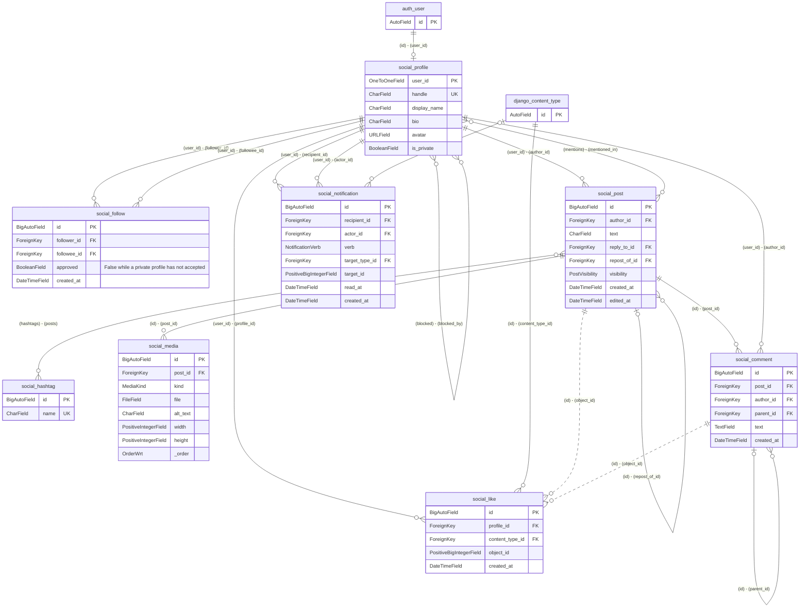

```mermaid
erDiagram
    auth_user ||--o| social_profile : "(id) - (user_id)"
    social_profile }o--o{ social_profile : "(blocked) - (blocked_by)"
    social_profile ||--o{ social_follow : "(user_id) - (follower_id)"
    social_profile ||--o{ social_follow : "(user_id) - (followee_id)"
    social_profile ||--o{ social_like : "(user_id) - (profile_id)"
    django_content_type ||--o{ social_like : "(id) - (content_type_id)"
    social_profile ||--o{ social_post : "(user_id) - (author_id)"
    social_post |o--o{ social_post : "(id) - (reply_to_id)"
    social_post |o--o{ social_post : "(id) - (repost_of_id)"
    social_post }o--o{ social_hashtag : "(hashtags) - (posts)"
    social_post }o--o{ social_profile : "(mentions) - (mentioned_in)"
    social_post ||..o{ social_like : "(id) - (object_id)"
    social_post ||--o{ social_media : "(id) - (post_id)"
    social_post ||--o{ social_comment : "(id) - (post_id)"
    social_profile ||--o{ social_comment : "(user_id) - (author_id)"
    social_comment |o--o{ social_comment : "(id) - (parent_id)"
    social_comment ||..o{ social_like : "(id) - (object_id)"
    social_profile ||--o{ social_notification : "(user_id) - (recipient_id)"
    social_profile ||--o{ social_notification : "(user_id) - (actor_id)"
    django_content_type |o--o{ social_notification : "(id) - (target_type_id)"
    social_profile {
        OneToOneField user_id PK
        CharField handle UK
        CharField display_name
        CharField bio
        URLField avatar
        BooleanField is_private
    }
    social_follow {
        BigAutoField id PK
        ForeignKey follower_id FK
        ForeignKey followee_id FK
        BooleanField approved "False while a private profile has not accepted"
        DateTimeField created_at
    }
    social_hashtag {
        BigAutoField id PK
        CharField name UK
    }
    social_like {
        BigAutoField id PK
        ForeignKey profile_id FK
        ForeignKey content_type_id FK
        PositiveBigIntegerField object_id
        DateTimeField created_at
    }
    social_post {
        BigAutoField id PK
        ForeignKey author_id FK
        CharField text
        ForeignKey reply_to_id FK
        ForeignKey repost_of_id FK
        PostVisibility visibility
        DateTimeField created_at
        DateTimeField edited_at
    }
    social_media {
        BigAutoField id PK
        ForeignKey post_id FK
        MediaKind kind
        FileField file
        CharField alt_text
        PositiveIntegerField width
        PositiveIntegerField height
        OrderWrt _order
    }
    social_comment {
        BigAutoField id PK
        ForeignKey post_id FK
        ForeignKey author_id FK
        ForeignKey parent_id FK
        TextField text
        DateTimeField created_at
    }
    social_notification {
        BigAutoField id PK
        ForeignKey recipient_id FK
        ForeignKey actor_id FK
        NotificationVerb verb
        ForeignKey target_type_id FK
        PositiveBigIntegerField target_id
        DateTimeField read_at
        DateTimeField created_at
    }
    django_content_type {
        AutoField id PK
    }
    auth_user {
        AutoField id PK
    }
```
