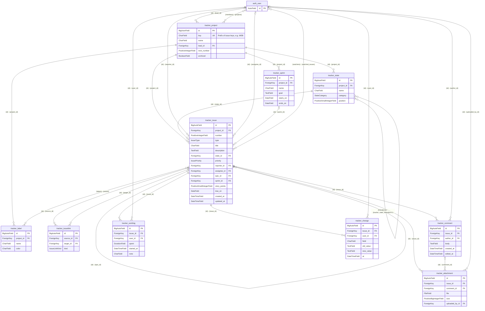

```mermaid
erDiagram
    auth_user |o--o{ tracker_project : "(id) - (lead_id)"
    tracker_project }o--o{ auth_user : "(members) - (projects)"
    tracker_project ||--o{ tracker_state : "(id) - (project_id)"
    tracker_state }o--o{ tracker_state : "(transitions) - (_tracker_state_transitions_+)"
    tracker_project ||--o{ tracker_label : "(id) - (project_id)"
    tracker_project ||--o{ tracker_sprint : "(id) - (project_id)"
    tracker_project ||--o{ tracker_issue : "(id) - (project_id)"
    tracker_state ||--o{ tracker_issue : "(id) - (state_id)"
    auth_user ||--o{ tracker_issue : "(id) - (reporter_id)"
    auth_user |o--o{ tracker_issue : "(id) - (assignee_id)"
    tracker_issue |o--o{ tracker_issue : "(id) - (epic_id)"
    tracker_sprint |o--o{ tracker_issue : "(id) - (sprint_id)"
    tracker_issue }o--o{ auth_user : "(watchers) - (watched_issues)"
    tracker_issue }o--o{ tracker_label : "(labels) - (issues)"
    tracker_issue ||--o{ tracker_issuelink : "(id) - (source_id)"
    tracker_issue ||--o{ tracker_issuelink : "(id) - (target_id)"
    tracker_issue ||--o{ tracker_comment : "(id) - (issue_id)"
    auth_user ||--o{ tracker_comment : "(id) - (author_id)"
    tracker_issue ||--o{ tracker_attachment : "(id) - (issue_id)"
    tracker_comment |o--o{ tracker_attachment : "(id) - (comment_id)"
    auth_user |o--o{ tracker_attachment : "(id) - (uploaded_by_id)"
    tracker_issue ||--o{ tracker_worklog : "(id) - (issue_id)"
    auth_user ||--o{ tracker_worklog : "(id) - (user_id)"
    tracker_issue ||--o{ tracker_change : "(id) - (issue_id)"
    auth_user |o--o{ tracker_change : "(id) - (user_id)"
    tracker_project {
        BigAutoField id PK
        CharField key UK "Prefix of issue keys, e.g. WEB"
        CharField name
        ForeignKey lead_id FK
        PositiveIntegerField next_number
        BooleanField archived
    }
    tracker_state {
        BigAutoField id PK
        ForeignKey project_id FK
        CharField name
        StateCategory category
        PositiveSmallIntegerField position
    }
    tracker_label {
        BigAutoField id PK
        ForeignKey project_id FK
        CharField name
        CharField color
    }
    tracker_sprint {
        BigAutoField id PK
        ForeignKey project_id FK
        CharField name
        TextField goal
        DateField starts_on
        DateField ends_on
    }
    tracker_issue {
        BigAutoField id PK
        ForeignKey project_id FK
        PositiveIntegerField number
        IssueType type
        CharField title
        TextField description
        ForeignKey state_id FK
        IssuePriority priority
        ForeignKey reporter_id FK
        ForeignKey assignee_id FK
        ForeignKey epic_id FK
        ForeignKey sprint_id FK
        PositiveSmallIntegerField story_points
        DateField due_on
        DateTimeField created_at
        DateTimeField updated_at
    }
    tracker_issuelink {
        BigAutoField id PK
        ForeignKey source_id FK
        ForeignKey target_id FK
        IssueLinkKind kind
    }
    tracker_comment {
        BigAutoField id PK
        ForeignKey issue_id FK
        ForeignKey author_id FK
        TextField body
        DateTimeField created_at
        DateTimeField edited_at
    }
    tracker_attachment {
        BigAutoField id PK
        ForeignKey issue_id FK
        ForeignKey comment_id FK
        FileField file
        PositiveBigIntegerField size
        ForeignKey uploaded_by_id FK
    }
    tracker_worklog {
        BigAutoField id PK
        ForeignKey issue_id FK
        ForeignKey user_id FK
        DurationField spent
        DateTimeField started_at
        CharField note
    }
    tracker_change {
        BigAutoField id PK
        ForeignKey issue_id FK
        ForeignKey user_id FK
        CharField field
        TextField old_value
        TextField new_value
        DateTimeField at
    }
    auth_user {
        AutoField id PK
    }
```
