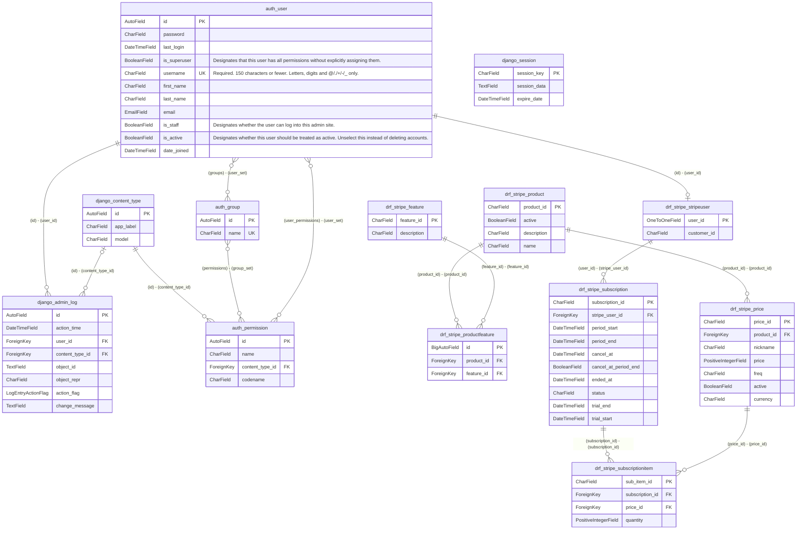

```mermaid
erDiagram
    auth_user ||--o{ django_admin_log : "(id) - (user_id)"
    django_content_type |o--o{ django_admin_log : "(id) - (content_type_id)"
    django_content_type ||--o{ auth_permission : "(id) - (content_type_id)"
    auth_group }o--o{ auth_permission : "(permissions) - (group_set)"
    auth_user }o--o{ auth_group : "(groups) - (user_set)"
    auth_user }o--o{ auth_permission : "(user_permissions) - (user_set)"
    auth_user ||--o| drf_stripe_stripeuser : "(id) - (user_id)"
    drf_stripe_product ||--o{ drf_stripe_productfeature : "(product_id) - (product_id)"
    drf_stripe_feature ||--o{ drf_stripe_productfeature : "(feature_id) - (feature_id)"
    drf_stripe_product ||--o{ drf_stripe_price : "(product_id) - (product_id)"
    drf_stripe_stripeuser ||--o{ drf_stripe_subscription : "(user_id) - (stripe_user_id)"
    drf_stripe_subscription ||--o{ drf_stripe_subscriptionitem : "(subscription_id) - (subscription_id)"
    drf_stripe_price ||--o{ drf_stripe_subscriptionitem : "(price_id) - (price_id)"
    django_admin_log {
        AutoField id PK
        DateTimeField action_time
        ForeignKey user_id FK
        ForeignKey content_type_id FK
        TextField object_id
        CharField object_repr
        LogEntryActionFlag action_flag
        TextField change_message
    }
    auth_permission {
        AutoField id PK
        CharField name
        ForeignKey content_type_id FK
        CharField codename
    }
    auth_group {
        AutoField id PK
        CharField name UK
    }
    auth_user {
        AutoField id PK
        CharField password
        DateTimeField last_login
        BooleanField is_superuser "Designates that this user has all permissions without explicitly assigning them."
        CharField username UK "Required. 150 characters or fewer. Letters, digits and @/./+/-/_ only."
        CharField first_name
        CharField last_name
        EmailField email
        BooleanField is_staff "Designates whether the user can log into this admin site."
        BooleanField is_active "Designates whether this user should be treated as active. Unselect this instead of deleting accounts."
        DateTimeField date_joined
    }
    django_content_type {
        AutoField id PK
        CharField app_label
        CharField model
    }
    django_session {
        CharField session_key PK
        TextField session_data
        DateTimeField expire_date
    }
    drf_stripe_stripeuser {
        OneToOneField user_id PK
        CharField customer_id
    }
    drf_stripe_feature {
        CharField feature_id PK
        CharField description
    }
    drf_stripe_product {
        CharField product_id PK
        BooleanField active
        CharField description
        CharField name
    }
    drf_stripe_productfeature {
        BigAutoField id PK
        ForeignKey product_id FK
        ForeignKey feature_id FK
    }
    drf_stripe_price {
        CharField price_id PK
        ForeignKey product_id FK
        CharField nickname
        PositiveIntegerField price
        CharField freq
        BooleanField active
        CharField currency
    }
    drf_stripe_subscription {
        CharField subscription_id PK
        ForeignKey stripe_user_id FK
        DateTimeField period_start
        DateTimeField period_end
        DateTimeField cancel_at
        BooleanField cancel_at_period_end
        DateTimeField ended_at
        CharField status
        DateTimeField trial_end
        DateTimeField trial_start
    }
    drf_stripe_subscriptionitem {
        CharField sub_item_id PK
        ForeignKey subscription_id FK
        ForeignKey price_id FK
        PositiveIntegerField quantity
    }
```
