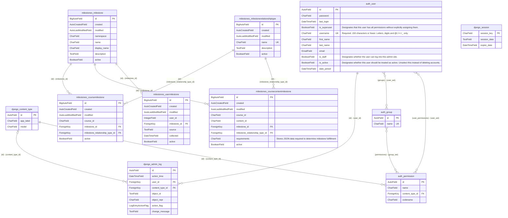

```mermaid
erDiagram
    auth_user ||--o{ django_admin_log : "(id) - (user_id)"
    django_content_type |o--o{ django_admin_log : "(id) - (content_type_id)"
    django_content_type ||--o{ auth_permission : "(id) - (content_type_id)"
    auth_group }o--o{ auth_permission : "(permissions) - (group_set)"
    auth_user }o--o{ auth_group : "(groups) - (user_set)"
    auth_user }o--o{ auth_permission : "(user_permissions) - (user_set)"
    milestones_milestone ||--o{ milestones_coursemilestone : "(id) - (milestone_id)"
    milestones_milestonerelationshiptype ||--o{ milestones_coursemilestone : "(id) - (milestone_relationship_type_id)"
    milestones_milestone ||--o{ milestones_coursecontentmilestone : "(id) - (milestone_id)"
    milestones_milestonerelationshiptype ||--o{ milestones_coursecontentmilestone : "(id) - (milestone_relationship_type_id)"
    milestones_milestone ||--o{ milestones_usermilestone : "(id) - (milestone_id)"
    django_admin_log {
        AutoField id PK
        DateTimeField action_time
        ForeignKey user_id FK
        ForeignKey content_type_id FK
        TextField object_id
        CharField object_repr
        LogEntryActionFlag action_flag
        TextField change_message
    }
    auth_permission {
        AutoField id PK
        CharField name
        ForeignKey content_type_id FK
        CharField codename
    }
    auth_group {
        AutoField id PK
        CharField name UK
    }
    auth_user {
        AutoField id PK
        CharField password
        DateTimeField last_login
        BooleanField is_superuser "Designates that this user has all permissions without explicitly assigning them."
        CharField username UK "Required. 150 characters or fewer. Letters, digits and @/./+/-/_ only."
        CharField first_name
        CharField last_name
        EmailField email
        BooleanField is_staff "Designates whether the user can log into this admin site."
        BooleanField is_active "Designates whether this user should be treated as active. Unselect this instead of deleting accounts."
        DateTimeField date_joined
    }
    django_content_type {
        AutoField id PK
        CharField app_label
        CharField model
    }
    django_session {
        CharField session_key PK
        TextField session_data
        DateTimeField expire_date
    }
    milestones_milestone {
        BigAutoField id PK
        AutoCreatedField created
        AutoLastModifiedField modified
        CharField namespace
        CharField name
        CharField display_name
        TextField description
        BooleanField active
    }
    milestones_milestonerelationshiptype {
        BigAutoField id PK
        AutoCreatedField created
        AutoLastModifiedField modified
        CharField name UK
        TextField description
        BooleanField active
    }
    milestones_coursemilestone {
        BigAutoField id PK
        AutoCreatedField created
        AutoLastModifiedField modified
        CharField course_id
        ForeignKey milestone_id FK
        ForeignKey milestone_relationship_type_id FK
        BooleanField active
    }
    milestones_coursecontentmilestone {
        BigAutoField id PK
        AutoCreatedField created
        AutoLastModifiedField modified
        CharField course_id
        CharField content_id
        ForeignKey milestone_id FK
        ForeignKey milestone_relationship_type_id FK
        CharField requirements "Stores JSON data required to determine milestone fulfillment"
        BooleanField active
    }
    milestones_usermilestone {
        BigAutoField id PK
        AutoCreatedField created
        AutoLastModifiedField modified
        IntegerField user_id
        ForeignKey milestone_id FK
        TextField source
        DateTimeField collected
        BooleanField active
    }
```
