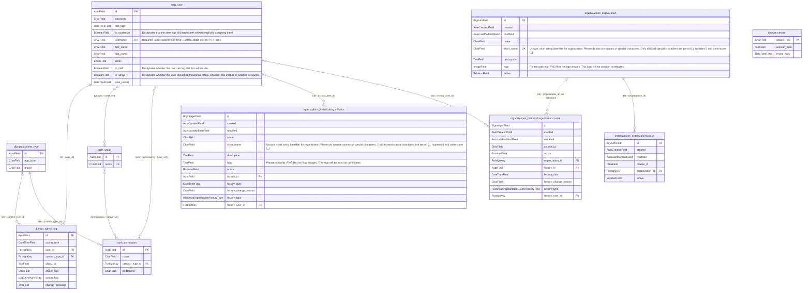

```mermaid
erDiagram
    auth_user ||--o{ django_admin_log : "(id) - (user_id)"
    django_content_type |o--o{ django_admin_log : "(id) - (content_type_id)"
    django_content_type ||--o{ auth_permission : "(id) - (content_type_id)"
    auth_group }o--o{ auth_permission : "(permissions) - (group_set)"
    auth_user }o--o{ auth_group : "(groups) - (user_set)"
    auth_user }o--o{ auth_permission : "(user_permissions) - (user_set)"
    auth_user |o--o{ organizations_historicalorganization : "(id) - (history_user_id)"
    organizations_organization |o..o{ organizations_historicalorganizationcourse : "(id) - (organization_id), no constraint"
    auth_user |o--o{ organizations_historicalorganizationcourse : "(id) - (history_user_id)"
    organizations_organization ||--o{ organizations_organizationcourse : "(id) - (organization_id)"
    django_admin_log {
        AutoField id PK
        DateTimeField action_time
        ForeignKey user_id FK
        ForeignKey content_type_id FK
        TextField object_id
        CharField object_repr
        LogEntryActionFlag action_flag
        TextField change_message
    }
    auth_permission {
        AutoField id PK
        CharField name
        ForeignKey content_type_id FK
        CharField codename
    }
    auth_group {
        AutoField id PK
        CharField name UK
    }
    auth_user {
        AutoField id PK
        CharField password
        DateTimeField last_login
        BooleanField is_superuser "Designates that this user has all permissions without explicitly assigning them."
        CharField username UK "Required. 150 characters or fewer. Letters, digits and @/./+/-/_ only."
        CharField first_name
        CharField last_name
        EmailField email
        BooleanField is_staff "Designates whether the user can log into this admin site."
        BooleanField is_active "Designates whether this user should be treated as active. Unselect this instead of deleting accounts."
        DateTimeField date_joined
    }
    django_content_type {
        AutoField id PK
        CharField app_label
        CharField model
    }
    django_session {
        CharField session_key PK
        TextField session_data
        DateTimeField expire_date
    }
    organizations_historicalorganization {
        BigIntegerField id
        AutoCreatedField created
        AutoLastModifiedField modified
        CharField name
        CharField short_name "Unique, short string identifier for organization. Please do not use spaces or special characters. Only allowed special characters are period (.), hyphen (-) and underscore (_)."
        TextField description
        TextField logo "Please add only .PNG files for logo images. This logo will be used on certificates."
        BooleanField active
        AutoField history_id PK
        DateTimeField history_date
        CharField history_change_reason
        HistoricalOrganizationHistoryType history_type
        ForeignKey history_user_id FK
    }
    organizations_organization {
        BigAutoField id PK
        AutoCreatedField created
        AutoLastModifiedField modified
        CharField name
        CharField short_name UK "Unique, short string identifier for organization. Please do not use spaces or special characters. Only allowed special characters are period (.), hyphen (-) and underscore (_)."
        TextField description
        ImageField logo "Please add only .PNG files for logo images. This logo will be used on certificates."
        BooleanField active
    }
    organizations_historicalorganizationcourse {
        BigIntegerField id
        AutoCreatedField created
        AutoLastModifiedField modified
        CharField course_id
        BooleanField active
        ForeignKey organization_id FK
        AutoField history_id PK
        DateTimeField history_date
        CharField history_change_reason
        HistoricalOrganizationCourseHistoryType history_type
        ForeignKey history_user_id FK
    }
    organizations_organizationcourse {
        BigAutoField id PK
        AutoCreatedField created
        AutoLastModifiedField modified
        CharField course_id
        ForeignKey organization_id FK
        BooleanField active
    }
```
