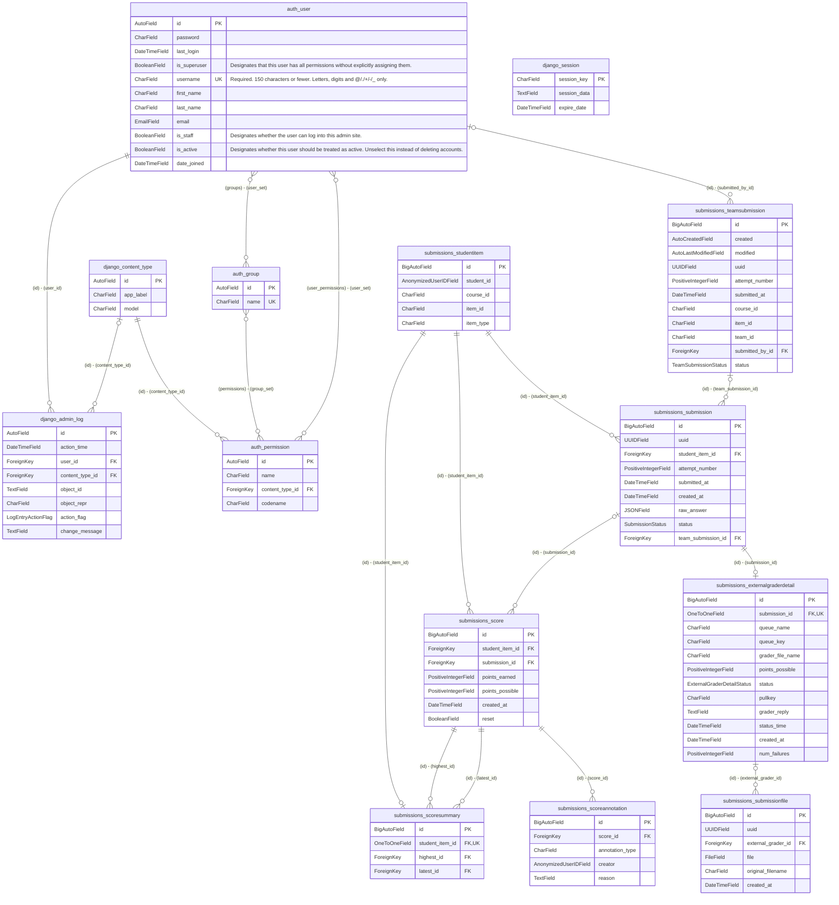

```mermaid
erDiagram
    auth_user ||--o{ django_admin_log : "(id) - (user_id)"
    django_content_type |o--o{ django_admin_log : "(id) - (content_type_id)"
    django_content_type ||--o{ auth_permission : "(id) - (content_type_id)"
    auth_group }o--o{ auth_permission : "(permissions) - (group_set)"
    auth_user }o--o{ auth_group : "(groups) - (user_set)"
    auth_user }o--o{ auth_permission : "(user_permissions) - (user_set)"
    auth_user |o--o{ submissions_teamsubmission : "(id) - (submitted_by_id)"
    submissions_studentitem ||--o{ submissions_submission : "(id) - (student_item_id)"
    submissions_teamsubmission |o--o{ submissions_submission : "(id) - (team_submission_id)"
    submissions_studentitem ||--o{ submissions_score : "(id) - (student_item_id)"
    submissions_submission |o--o{ submissions_score : "(id) - (submission_id)"
    submissions_studentitem ||--o| submissions_scoresummary : "(id) - (student_item_id)"
    submissions_score ||--o{ submissions_scoresummary : "(id) - (highest_id)"
    submissions_score ||--o{ submissions_scoresummary : "(id) - (latest_id)"
    submissions_score ||--o{ submissions_scoreannotation : "(id) - (score_id)"
    submissions_submission ||--o| submissions_externalgraderdetail : "(id) - (submission_id)"
    submissions_externalgraderdetail |o--o{ submissions_submissionfile : "(id) - (external_grader_id)"
    django_admin_log {
        AutoField id PK
        DateTimeField action_time
        ForeignKey user_id FK
        ForeignKey content_type_id FK
        TextField object_id
        CharField object_repr
        LogEntryActionFlag action_flag
        TextField change_message
    }
    auth_permission {
        AutoField id PK
        CharField name
        ForeignKey content_type_id FK
        CharField codename
    }
    auth_group {
        AutoField id PK
        CharField name UK
    }
    auth_user {
        AutoField id PK
        CharField password
        DateTimeField last_login
        BooleanField is_superuser "Designates that this user has all permissions without explicitly assigning them."
        CharField username UK "Required. 150 characters or fewer. Letters, digits and @/./+/-/_ only."
        CharField first_name
        CharField last_name
        EmailField email
        BooleanField is_staff "Designates whether the user can log into this admin site."
        BooleanField is_active "Designates whether this user should be treated as active. Unselect this instead of deleting accounts."
        DateTimeField date_joined
    }
    django_content_type {
        AutoField id PK
        CharField app_label
        CharField model
    }
    django_session {
        CharField session_key PK
        TextField session_data
        DateTimeField expire_date
    }
    submissions_studentitem {
        BigAutoField id PK
        AnonymizedUserIDField student_id
        CharField course_id
        CharField item_id
        CharField item_type
    }
    submissions_teamsubmission {
        BigAutoField id PK
        AutoCreatedField created
        AutoLastModifiedField modified
        UUIDField uuid
        PositiveIntegerField attempt_number
        DateTimeField submitted_at
        CharField course_id
        CharField item_id
        CharField team_id
        ForeignKey submitted_by_id FK
        TeamSubmissionStatus status
    }
    submissions_submission {
        BigAutoField id PK
        UUIDField uuid
        ForeignKey student_item_id FK
        PositiveIntegerField attempt_number
        DateTimeField submitted_at
        DateTimeField created_at
        JSONField raw_answer
        SubmissionStatus status
        ForeignKey team_submission_id FK
    }
    submissions_score {
        BigAutoField id PK
        ForeignKey student_item_id FK
        ForeignKey submission_id FK
        PositiveIntegerField points_earned
        PositiveIntegerField points_possible
        DateTimeField created_at
        BooleanField reset
    }
    submissions_scoresummary {
        BigAutoField id PK
        OneToOneField student_item_id FK, UK
        ForeignKey highest_id FK
        ForeignKey latest_id FK
    }
    submissions_scoreannotation {
        BigAutoField id PK
        ForeignKey score_id FK
        CharField annotation_type
        AnonymizedUserIDField creator
        TextField reason
    }
    submissions_externalgraderdetail {
        BigAutoField id PK
        OneToOneField submission_id FK, UK
        CharField queue_name
        CharField queue_key
        CharField grader_file_name
        PositiveIntegerField points_possible
        ExternalGraderDetailStatus status
        CharField pullkey
        TextField grader_reply
        DateTimeField status_time
        DateTimeField created_at
        PositiveIntegerField num_failures
    }
    submissions_submissionfile {
        BigAutoField id PK
        UUIDField uuid
        ForeignKey external_grader_id FK
        FileField file
        CharField original_filename
        DateTimeField created_at
    }
```
