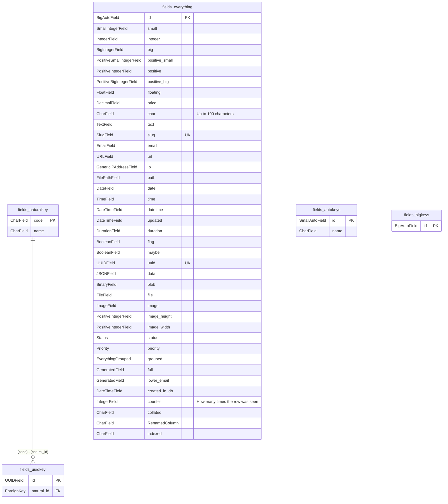

```mermaid
erDiagram
    fields_naturalkey ||--o{ fields_uuidkey : "(code) - (natural_id)"
    fields_everything {
        BigAutoField id PK
        SmallIntegerField small
        IntegerField integer
        BigIntegerField big
        PositiveSmallIntegerField positive_small
        PositiveIntegerField positive
        PositiveBigIntegerField positive_big
        FloatField floating
        DecimalField price
        CharField char "Up to 100 characters"
        TextField text
        SlugField slug UK
        EmailField email
        URLField url
        GenericIPAddressField ip
        FilePathField path
        DateField date
        TimeField time
        DateTimeField datetime
        DateTimeField updated
        DurationField duration
        BooleanField flag
        BooleanField maybe
        UUIDField uuid UK
        JSONField data
        BinaryField blob
        FileField file
        ImageField image
        PositiveIntegerField image_height
        PositiveIntegerField image_width
        Status status
        Priority priority
        EverythingGrouped grouped
        GeneratedField full
        GeneratedField lower_email
        DateTimeField created_in_db
        IntegerField counter "How many times the row was seen"
        CharField collated
        CharField RenamedColumn
        CharField indexed
    }
    fields_autokeys {
        SmallAutoField id PK
        CharField name
    }
    fields_bigkeys {
        BigAutoField id PK
    }
    fields_naturalkey {
        CharField code PK
        CharField name
    }
    fields_uuidkey {
        UUIDField id PK
        ForeignKey natural_id FK
    }
```
