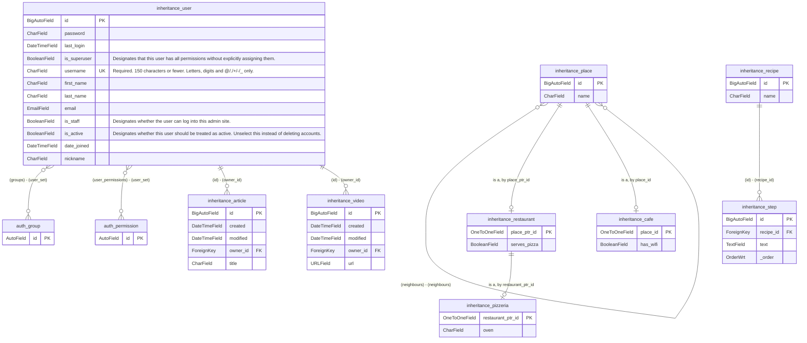

```mermaid
erDiagram
    inheritance_user }o--o{ auth_group : "(groups) - (user_set)"
    inheritance_user }o--o{ auth_permission : "(user_permissions) - (user_set)"
    inheritance_user ||--o{ inheritance_article : "(id) - (owner_id)"
    inheritance_user ||--o{ inheritance_video : "(id) - (owner_id)"
    inheritance_place }o--o{ inheritance_place : "(neighbours) - (neighbours)"
    inheritance_place ||--o| inheritance_restaurant : "is a, by place_ptr_id"
    inheritance_restaurant ||--o| inheritance_pizzeria : "is a, by restaurant_ptr_id"
    inheritance_place ||--o| inheritance_cafe : "is a, by place_id"
    inheritance_recipe ||--o{ inheritance_step : "(id) - (recipe_id)"
    inheritance_user {
        BigAutoField id PK
        CharField password
        DateTimeField last_login
        BooleanField is_superuser "Designates that this user has all permissions without explicitly assigning them."
        CharField username UK "Required. 150 characters or fewer. Letters, digits and @/./+/-/_ only."
        CharField first_name
        CharField last_name
        EmailField email
        BooleanField is_staff "Designates whether the user can log into this admin site."
        BooleanField is_active "Designates whether this user should be treated as active. Unselect this instead of deleting accounts."
        DateTimeField date_joined
        CharField nickname
    }
    inheritance_article {
        BigAutoField id PK
        DateTimeField created
        DateTimeField modified
        ForeignKey owner_id FK
        CharField title
    }
    inheritance_video {
        BigAutoField id PK
        DateTimeField created
        DateTimeField modified
        ForeignKey owner_id FK
        URLField url
    }
    inheritance_place {
        BigAutoField id PK
        CharField name
    }
    inheritance_restaurant {
        OneToOneField place_ptr_id PK
        BooleanField serves_pizza
    }
    inheritance_pizzeria {
        OneToOneField restaurant_ptr_id PK
        CharField oven
    }
    inheritance_cafe {
        OneToOneField place_id PK
        BooleanField has_wifi
    }
    inheritance_step {
        BigAutoField id PK
        ForeignKey recipe_id FK
        TextField text
        OrderWrt _order
    }
    inheritance_recipe {
        BigAutoField id PK
        CharField name
    }
    auth_permission {
        AutoField id PK
    }
    auth_group {
        AutoField id PK
    }
```
