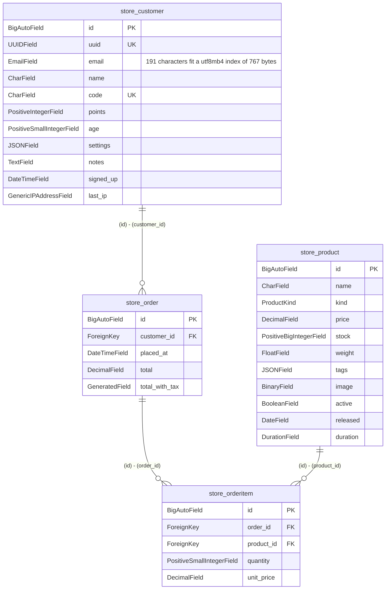

```mermaid
erDiagram
    store_customer ||--o{ store_order : "(id) - (customer_id)"
    store_order ||--o{ store_orderitem : "(id) - (order_id)"
    store_product ||--o{ store_orderitem : "(id) - (product_id)"
    store_customer {
        BigAutoField id PK
        UUIDField uuid UK
        EmailField email "191 characters fit a utf8mb4 index of 767 bytes"
        CharField name
        CharField code UK
        PositiveIntegerField points
        PositiveSmallIntegerField age
        JSONField settings
        TextField notes
        DateTimeField signed_up
        GenericIPAddressField last_ip
    }
    store_product {
        BigAutoField id PK
        CharField name
        ProductKind kind
        DecimalField price
        PositiveBigIntegerField stock
        FloatField weight
        JSONField tags
        BinaryField image
        BooleanField active
        DateField released
        DurationField duration
    }
    store_order {
        BigAutoField id PK
        ForeignKey customer_id FK
        DateTimeField placed_at
        DecimalField total
        GeneratedField total_with_tax
    }
    store_orderitem {
        BigAutoField id PK
        ForeignKey order_id FK
        ForeignKey product_id FK
        PositiveSmallIntegerField quantity
        DecimalField unit_price
    }
```
