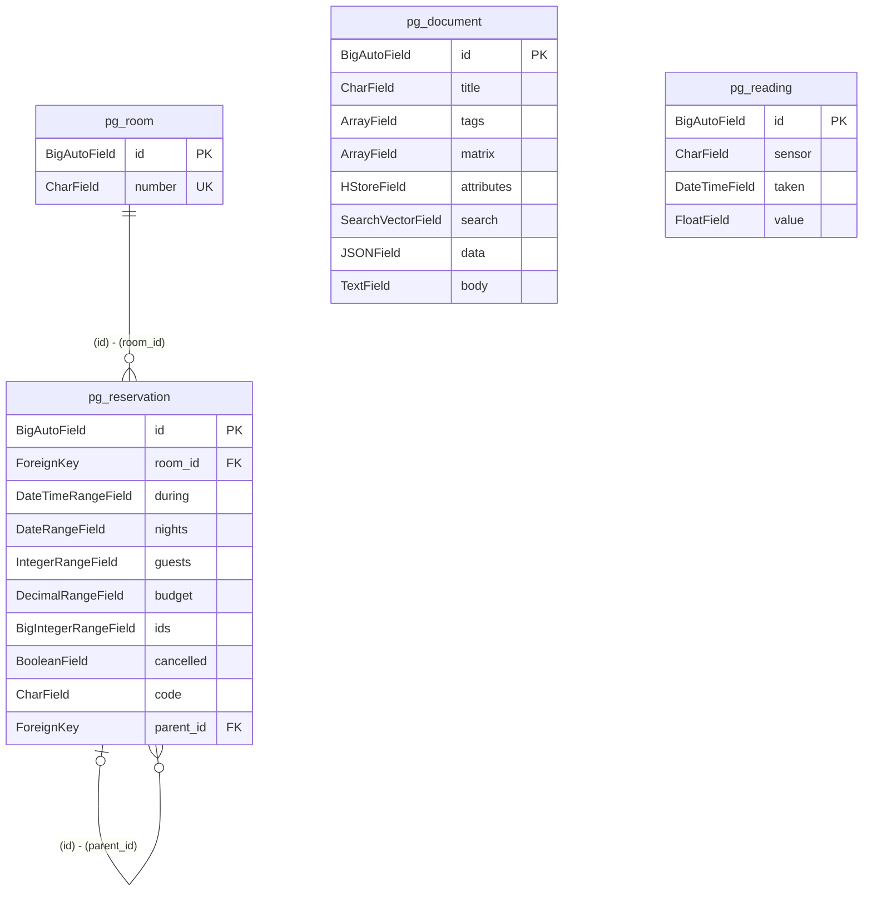

```mermaid
erDiagram
    pg_room ||--o{ pg_reservation : "(id) - (room_id)"
    pg_reservation |o--o{ pg_reservation : "(id) - (parent_id)"
    pg_document {
        BigAutoField id PK
        CharField title
        ArrayField tags
        ArrayField matrix
        HStoreField attributes
        SearchVectorField search
        JSONField data
        TextField body
    }
    pg_reading {
        BigAutoField id PK
        CharField sensor
        DateTimeField taken
        FloatField value
    }
    pg_room {
        BigAutoField id PK
        CharField number UK
    }
    pg_reservation {
        BigAutoField id PK
        ForeignKey room_id FK
        DateTimeRangeField during
        DateRangeField nights
        IntegerRangeField guests
        DecimalRangeField budget
        BigIntegerRangeField ids
        BooleanField cancelled
        CharField code
        ForeignKey parent_id FK
    }
```
