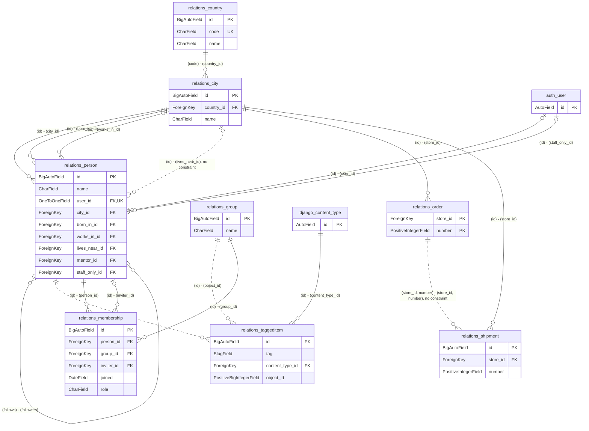

```mermaid
erDiagram
    relations_country ||--o{ relations_city : "(code) - (country_id)"
    auth_user |o--o| relations_person : "(id) - (user_id)"
    relations_city |o--o{ relations_person : "(id) - (city_id)"
    relations_city |o--o{ relations_person : "(id) - (born_in_id)"
    relations_city |o--o{ relations_person : "(id) - (works_in_id)"
    relations_city |o..o{ relations_person : "(id) - (lives_near_id), no constraint"
    relations_person |o--o{ relations_person : "(id) - (mentor_id)"
    auth_user |o--o{ relations_person : "(id) - (staff_only_id)"
    relations_person }o--o{ relations_person : "(friends) - (friends)"
    relations_person }o--o{ relations_person : "(follows) - (followers)"
    relations_person ||..o{ relations_taggeditem : "(id) - (object_id)"
    relations_group ||..o{ relations_taggeditem : "(id) - (object_id)"
    relations_person ||--o{ relations_membership : "(id) - (person_id)"
    relations_group ||--o{ relations_membership : "(id) - (group_id)"
    relations_person |o--o{ relations_membership : "(id) - (inviter_id)"
    django_content_type ||--o{ relations_taggeditem : "(id) - (content_type_id)"
    relations_city ||--o{ relations_order : "(id) - (store_id)"
    relations_city ||--o{ relations_shipment : "(id) - (store_id)"
    relations_order ||..o{ relations_shipment : "(store_id, number) - (store_id, number), no constraint"
    relations_country {
        BigAutoField id PK
        CharField code UK
        CharField name
    }
    relations_city {
        BigAutoField id PK
        ForeignKey country_id FK
        CharField name
    }
    relations_person {
        BigAutoField id PK
        CharField name
        OneToOneField user_id FK, UK
        ForeignKey city_id FK
        ForeignKey born_in_id FK
        ForeignKey works_in_id FK
        ForeignKey lives_near_id FK
        ForeignKey mentor_id FK
        ForeignKey staff_only_id FK
    }
    relations_group {
        BigAutoField id PK
        CharField name
    }
    relations_membership {
        BigAutoField id PK
        ForeignKey person_id FK
        ForeignKey group_id FK
        ForeignKey inviter_id FK
        DateField joined
        CharField role
    }
    relations_taggeditem {
        BigAutoField id PK
        SlugField tag
        ForeignKey content_type_id FK
        PositiveBigIntegerField object_id
    }
    relations_order {
        ForeignKey store_id PK
        PositiveIntegerField number PK
    }
    relations_shipment {
        BigAutoField id PK
        ForeignKey store_id FK
        PositiveIntegerField number
    }
    django_content_type {
        AutoField id PK
    }
    auth_user {
        AutoField id PK
    }
```
