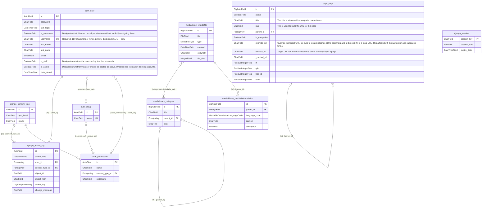

```mermaid
erDiagram
    auth_user ||--o{ django_admin_log : "(id) - (user_id)"
    django_content_type |o--o{ django_admin_log : "(id) - (content_type_id)"
    django_content_type ||--o{ auth_permission : "(id) - (content_type_id)"
    auth_group }o--o{ auth_permission : "(permissions) - (group_set)"
    auth_user }o--o{ auth_group : "(groups) - (user_set)"
    auth_user }o--o{ auth_permission : "(user_permissions) - (user_set)"
    page_page |o--o{ page_page : "(id) - (parent_id)"
    medialibrary_category |o--o{ medialibrary_category : "(id) - (parent_id)"
    medialibrary_mediafile }o--o{ medialibrary_category : "(categories) - (mediafile_set)"
    medialibrary_mediafile ||--o{ medialibrary_mediafiletranslation : "(id) - (parent_id)"
    django_admin_log {
        AutoField id PK
        DateTimeField action_time
        ForeignKey user_id FK
        ForeignKey content_type_id FK
        TextField object_id
        CharField object_repr
        LogEntryActionFlag action_flag
        TextField change_message
    }
    auth_permission {
        AutoField id PK
        CharField name
        ForeignKey content_type_id FK
        CharField codename
    }
    auth_group {
        AutoField id PK
        CharField name UK
    }
    auth_user {
        AutoField id PK
        CharField password
        DateTimeField last_login
        BooleanField is_superuser "Designates that this user has all permissions without explicitly assigning them."
        CharField username UK "Required. 150 characters or fewer. Letters, digits and @/./+/-/_ only."
        CharField first_name
        CharField last_name
        EmailField email
        BooleanField is_staff "Designates whether the user can log into this admin site."
        BooleanField is_active "Designates whether this user should be treated as active. Unselect this instead of deleting accounts."
        DateTimeField date_joined
    }
    django_content_type {
        AutoField id PK
        CharField app_label
        CharField model
    }
    django_session {
        CharField session_key PK
        TextField session_data
        DateTimeField expire_date
    }
    page_page {
        BigAutoField id PK
        BooleanField active
        CharField title "This title is also used for navigation menu items."
        SlugField slug "This is used to build the URL for this page"
        ForeignKey parent_id FK
        BooleanField in_navigation
        CharField override_url "Override the target URL. Be sure to include slashes at the beginning and at the end if it is a local URL. This affects both the navigation and subpages' URLs."
        CharField redirect_to "Target URL for automatic redirects or the primary key of a page."
        CharField _cached_url
        PositiveIntegerField lft
        PositiveIntegerField rght
        PositiveIntegerField tree_id
        PositiveIntegerField level
    }
    medialibrary_category {
        BigAutoField id PK
        CharField title
        ForeignKey parent_id FK
        SlugField slug
    }
    medialibrary_mediafile {
        BigAutoField id PK
        FileField file
        MediaFileType type
        DateTimeField created
        CharField copyright
        IntegerField file_size
    }
    medialibrary_mediafiletranslation {
        BigAutoField id PK
        ForeignKey parent_id FK
        MediaFileTranslationLanguageCode language_code
        CharField caption
        TextField description
    }
```
