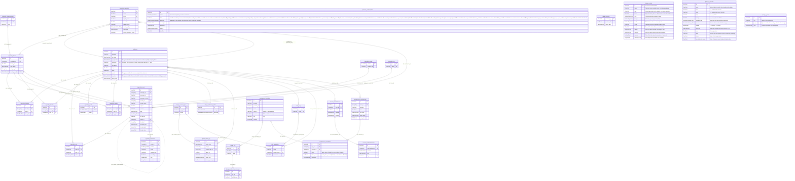

```mermaid
erDiagram
    hyperkitty_mailinglist ||--o{ hyperkitty_thread : "(id) - (mailinglist_id)"
    hyperkitty_threadcategory |o--o{ hyperkitty_thread : "(id) - (category_id)"
    hyperkitty_email |o--o| hyperkitty_thread : "(id) - (starting_email_id)"
    hyperkitty_thread ||--o{ hyperkitty_lastview : "(id) - (thread_id)"
    auth_user ||--o{ hyperkitty_lastview : "(id) - (user_id)"
    hyperkitty_mailinglist }o--o{ auth_user : "(owners) - (owned_lists)"
    hyperkitty_mailinglist }o--o{ auth_user : "(moderators) - (moderated_lists)"
    hyperkitty_email ||--o{ hyperkitty_vote : "(id) - (email_id)"
    auth_user ||--o{ hyperkitty_vote : "(id) - (user_id)"
    hyperkitty_mailinglist ||--o{ hyperkitty_email : "(id) - (mailinglist_id)"
    hyperkitty_sender ||--o{ hyperkitty_email : "(address) - (sender_id)"
    hyperkitty_email |o..o{ hyperkitty_email : "(id) - (parent_id), no constraint"
    hyperkitty_thread ||--o{ hyperkitty_email : "(id) - (thread_id)"
    hyperkitty_email ||--o{ hyperkitty_attachment : "(id) - (email_id)"
    hyperkitty_thread ||--o{ hyperkitty_favorite : "(id) - (thread_id)"
    auth_user ||--o{ hyperkitty_favorite : "(id) - (user_id)"
    auth_user ||--o| hyperkitty_profile : "(id) - (user_id)"
    hyperkitty_thread ||--o{ hyperkitty_tagging : "(id) - (thread_id)"
    auth_user ||--o{ hyperkitty_tagging : "(id) - (user_id)"
    hyperkitty_tag ||--o{ hyperkitty_tagging : "(id) - (tag_id)"
    auth_user ||--o| django_mailman3_profile : "(id) - (user_id)"
    django_site ||--o{ django_mailman3_maildomain : "(id) - (site_id)"
    auth_user ||--o{ django_admin_log : "(id) - (user_id)"
    django_content_type |o--o{ django_admin_log : "(id) - (content_type_id)"
    django_content_type ||--o{ auth_permission : "(id) - (content_type_id)"
    auth_group }o--o{ auth_permission : "(permissions) - (group_set)"
    auth_user }o--o{ auth_group : "(groups) - (user_set)"
    auth_user }o--o{ auth_permission : "(user_permissions) - (user_set)"
    auth_user ||--o{ account_emailaddress : "(id) - (user_id)"
    account_emailaddress ||--o{ account_emailconfirmation : "(id) - (email_address_id)"
    socialaccount_socialapp }o--o{ django_site : "(sites) - (socialapp_set)"
    auth_user ||--o{ socialaccount_socialaccount : "(id) - (user_id)"
    socialaccount_socialapp |o--o{ socialaccount_socialtoken : "(id) - (app_id)"
    socialaccount_socialaccount ||--o{ socialaccount_socialtoken : "(id) - (account_id)"
    hyperkitty_threadcategory {
        AutoField id PK
        CharField name UK
        ColorField color
    }
    hyperkitty_thread {
        AutoField id PK
        ForeignKey mailinglist_id FK
        CharField thread_id
        DateTimeField date_active
        ForeignKey category_id FK
        OneToOneField starting_email_id FK, UK
    }
    hyperkitty_lastview {
        AutoField id PK
        ForeignKey thread_id FK
        ForeignKey user_id FK
        DateTimeField view_date
    }
    hyperkitty_mailinglist {
        AutoField id PK
        CharField name UK
        CharField list_id UK
        CharField display_name
        TextField description
        CharField subject_prefix
        MailingListArchivePolicy archive_policy
        DateTimeField created_at
        CharField archive_rendering_mode
    }
    hyperkitty_vote {
        AutoField id PK
        ForeignKey email_id FK
        ForeignKey user_id FK
        SmallIntegerField value
    }
    hyperkitty_email {
        AutoField id PK
        ForeignKey mailinglist_id FK
        CharField message_id
        CharField message_id_hash
        ForeignKey sender_id FK
        CharField sender_name
        CharField subject
        TextField content
        DateTimeField date
        SmallIntegerField timezone
        CharField in_reply_to
        ForeignKey parent_id FK
        ForeignKey thread_id FK
        DateTimeField archived_date
        IntegerField thread_depth
        IntegerField thread_order
    }
    hyperkitty_attachment {
        AutoField id PK
        ForeignKey email_id FK
        SmallIntegerField counter
        CharField name
        CharField content_type
        CharField encoding
        IntegerField size
        BinaryField content
    }
    hyperkitty_favorite {
        AutoField id PK
        ForeignKey thread_id FK
        ForeignKey user_id FK
    }
    hyperkitty_profile {
        AutoField id PK
        OneToOneField user_id FK, UK
        IntegerField karma
    }
    hyperkitty_sender {
        EmailField address PK
        CharField mailman_id
    }
    hyperkitty_tagging {
        AutoField id PK
        ForeignKey thread_id FK
        ForeignKey user_id FK
        ForeignKey tag_id FK
    }
    hyperkitty_tag {
        AutoField id PK
        CharField name UK
    }
    postorius_emailtemplate {
        AutoField id PK
        EmailTemplateName name "Choose the template you want to customize."
        TextField data "Note: Do not add any secret content in templates as they are publicly accessible. You can use these variables in the templates.  $hyperkitty_url: Permalink to archived message in Hyperkitty  - only in list:member:regular:footer and list:member:regular:header $listname: Name of the Mailing List e.g. ant@example.com  $list_id: The List-ID header e.g. ant.example.com  $display_name: Display name of the mailing list e.g. Ant  $short_listname: Local part of the listname e.g. ant  $domain: The domain part of the listname e.g. example.com  $description: The mailing list's short description text  $info: The mailing list's longer descriptive text  $request_email: The email address for -request address  $owner_email: The email address for -owner address  $site_email: The email address to reach the owners of the site  $language: The two letter language code for list's preferred language e.g. fr, en, de  Some templates accept additional variables. See <a href='https://docs.mailman3.org/projects/mailman/en/latest/src/mailman/rest/docs/templates.html#templated-texts'>this doc</a>"
        EmailTemplateLanguage language "Language for the template, this should be the list's preferred language."
        DateTimeField created_at
        DateTimeField modified_at
        EmailTemplateContext context
        CharField identifier
    }
    django_mailman3_profile {
        AutoField id PK
        OneToOneField user_id FK, UK
        DjangoMailman3ProfileTimezone timezone
    }
    django_mailman3_maildomain {
        AutoField id PK
        ForeignKey site_id FK
        CharField mail_domain UK
    }
    django_admin_log {
        AutoField id PK
        DateTimeField action_time
        ForeignKey user_id FK
        ForeignKey content_type_id FK
        TextField object_id
        CharField object_repr
        LogEntryActionFlag action_flag
        TextField change_message
    }
    auth_permission {
        AutoField id PK
        CharField name
        ForeignKey content_type_id FK
        CharField codename
    }
    auth_group {
        AutoField id PK
        CharField name UK
    }
    auth_user {
        AutoField id PK
        CharField password
        DateTimeField last_login
        BooleanField is_superuser "Designates that this user has all permissions without explicitly assigning them."
        CharField username UK "Required. 150 characters or fewer. Letters, digits and @/./+/-/_ only."
        CharField first_name
        CharField last_name
        EmailField email
        BooleanField is_staff "Designates whether the user can log into this admin site."
        BooleanField is_active "Designates whether this user should be treated as active. Unselect this instead of deleting accounts."
        DateTimeField date_joined
    }
    django_content_type {
        AutoField id PK
        CharField app_label
        CharField model
    }
    django_session {
        CharField session_key PK
        TextField session_data
        DateTimeField expire_date
    }
    django_site {
        AutoField id PK
        CharField domain UK
        CharField name
    }
    django_q_task {
        CharField id PK "32-character task identifier."
        CharField name "Optional human-readable name for lookup and display."
        CharField func "Dotted import path to the callable, e.g. myapp.tasks.job."
        CharField hook "Optional dotted path to a callback that receives the task result."
        PickledObjectField args "Pickled positional arguments (tuple)."
        PickledObjectField kwargs "Pickled keyword arguments (dict)."
        PickledObjectField result "Pickled return value or error payload."
        CharField group "Optional group id to aggregate related tasks."
        CharField cluster "Name of the cluster that executed this task."
        DateTimeField started "When the worker started executing the task."
        DateTimeField stopped "When the worker finished (success or failure)."
        BooleanField success "False if the task raised an exception or timed out."
        IntegerField attempt_count "How many times execution was attempted."
    }
    django_q_schedule {
        AutoField id PK
        CharField name "Optional label to identify this schedule in the admin."
        CharField func "e.g. module.tasks.function"
        CharField hook "e.g. module.tasks.result_function"
        TextField args "e.g. 1, 2, 'John'"
        TextField kwargs "e.g. x=1, y=2, name='John'"
        ScheduleScheduleType schedule_type "How often this task should be enqueued."
        PositiveSmallIntegerField minutes "Number of minutes for the Minutes type"
        IntegerField repeats "n = n times, -1 = forever"
        DateTimeField next_run "When this schedule runs next (stored in UTC)."
        CharField cron "Cron expression"
        CharField task "Id of the last task spawned from this schedule (read-only)."
        CharField cluster "Name of the target cluster"
        CharField intended_date_kwarg "Name of kwarg to pass intended schedule date"
    }
    django_q_ormq {
        AutoField id PK
        CharField key "Name of the target cluster"
        TextField payload "Signed serialized task package (do not edit manually)."
        DateTimeField lock "Prevent any cluster from pulling until"
    }
    account_emailaddress {
        AutoField id PK
        ForeignKey user_id FK
        EmailField email
        BooleanField verified
        BooleanField primary
    }
    account_emailconfirmation {
        AutoField id PK
        ForeignKey email_address_id FK
        DateTimeField created
        DateTimeField sent
        CharField key UK
    }
    socialaccount_socialapp {
        AutoField id PK
        CharField provider
        CharField provider_id
        CharField name
        CharField client_id "App ID, or consumer key"
        CharField secret "API secret, client secret, or consumer secret"
        CharField key "Key"
        JSONField settings
    }
    socialaccount_socialaccount {
        AutoField id PK
        ForeignKey user_id FK
        CharField provider
        CharField uid
        DateTimeField last_login
        DateTimeField date_joined
        JSONField extra_data
    }
    socialaccount_socialtoken {
        AutoField id PK
        ForeignKey app_id FK
        ForeignKey account_id FK
        TextField token "'oauth_token' (OAuth1) or access token (OAuth2)"
        TextField token_secret "'oauth_token_secret' (OAuth1) or refresh token (OAuth2)"
        DateTimeField expires_at
    }
```
