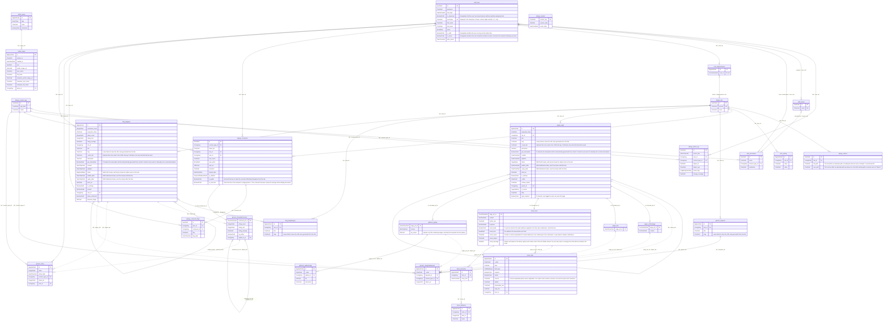

```mermaid
erDiagram
    auth_user ||--o{ django_admin_log : "(id) - (user_id)"
    django_content_type |o--o{ django_admin_log : "(id) - (content_type_id)"
    django_content_type ||--o{ auth_permission : "(id) - (content_type_id)"
    auth_group }o--o{ auth_permission : "(permissions) - (group_set)"
    auth_user }o--o{ auth_group : "(groups) - (user_set)"
    auth_user }o--o{ auth_permission : "(user_permissions) - (user_set)"
    django_site ||--o{ django_redirect : "(id) - (site_id)"
    django_site ||--o{ conf_setting : "(id) - (site_id)"
    auth_user ||--o| core_sitepermission : "(id) - (user_id)"
    core_sitepermission }o--o{ django_site : "(sites) - (sitepermission_set)"
    django_content_type ||--o{ django_comments : "(id) - (content_type_id)"
    django_site ||--o{ django_comments : "(id) - (site_id)"
    auth_user |o--o{ django_comments : "(id) - (user_id)"
    auth_user ||--o{ django_comment_flags : "(id) - (user_id)"
    django_comments ||--o{ django_comment_flags : "(id) - (comment_id)"
    django_comments ||--o| generic_threadedcomment : "is a, by comment_ptr_id"
    generic_threadedcomment |o--o{ generic_threadedcomment : "(comment_ptr_id) - (replied_to_id)"
    generic_threadedcomment ||..o{ generic_rating : "(comment_ptr_id) - (object_pk)"
    django_site ||--o{ generic_keyword : "(id) - (site_id)"
    generic_keyword ||--o{ generic_assignedkeyword : "(id) - (keyword_id)"
    django_content_type ||--o{ generic_assignedkeyword : "(id) - (content_type_id)"
    django_content_type ||--o{ generic_rating : "(id) - (content_type_id)"
    auth_user |o--o{ generic_rating : "(id) - (user_id)"
    django_site ||--o{ pages_page : "(id) - (site_id)"
    pages_page |o--o{ pages_page : "(id) - (parent_id)"
    pages_page ||..o{ generic_assignedkeyword : "(id) - (object_pk)"
    pages_page ||--o| pages_richtextpage : "is a, by page_ptr_id"
    pages_richtextpage ||..o{ generic_assignedkeyword : "(page_ptr_id) - (object_pk)"
    pages_page ||--o| pages_link : "is a, by page_ptr_id"
    pages_link ||..o{ generic_assignedkeyword : "(page_ptr_id) - (object_pk)"
    django_site ||--o{ blog_blogpost : "(id) - (site_id)"
    auth_user ||--o{ blog_blogpost : "(id) - (user_id)"
    blog_blogpost }o--o{ blog_blogcategory : "(categories) - (blogposts)"
    blog_blogpost }o--o{ blog_blogpost : "(related_posts) - (related_posts)"
    blog_blogpost ||..o{ generic_threadedcomment : "(id) - (object_pk)"
    blog_blogpost ||..o{ generic_rating : "(id) - (object_pk)"
    blog_blogpost ||..o{ generic_assignedkeyword : "(id) - (object_pk)"
    django_site ||--o{ blog_blogcategory : "(id) - (site_id)"
    pages_page ||--o| forms_form : "is a, by page_ptr_id"
    forms_form ||..o{ generic_assignedkeyword : "(page_ptr_id) - (object_pk)"
    forms_form ||--o{ forms_field : "(page_ptr_id) - (form_id)"
    forms_form ||--o{ forms_formentry : "(page_ptr_id) - (form_id)"
    forms_formentry ||--o{ forms_fieldentry : "(id) - (entry_id)"
    pages_page ||--o| galleries_gallery : "is a, by page_ptr_id"
    galleries_gallery ||..o{ generic_assignedkeyword : "(page_ptr_id) - (object_pk)"
    galleries_gallery ||--o{ galleries_galleryimage : "(page_ptr_id) - (gallery_id)"
    twitter_query ||--o{ twitter_tweet : "(id) - (query_id)"
    django_admin_log {
        AutoField id PK
        DateTimeField action_time
        ForeignKey user_id FK
        ForeignKey content_type_id FK
        TextField object_id
        CharField object_repr
        LogEntryActionFlag action_flag
        TextField change_message
    }
    auth_permission {
        AutoField id PK
        CharField name
        ForeignKey content_type_id FK
        CharField codename
    }
    auth_group {
        AutoField id PK
        CharField name UK
    }
    auth_user {
        AutoField id PK
        CharField password
        DateTimeField last_login
        BooleanField is_superuser "Designates that this user has all permissions without explicitly assigning them."
        CharField username UK "Required. 150 characters or fewer. Letters, digits and @/./+/-/_ only."
        CharField first_name
        CharField last_name
        EmailField email
        BooleanField is_staff "Designates whether the user can log into this admin site."
        BooleanField is_active "Designates whether this user should be treated as active. Unselect this instead of deleting accounts."
        DateTimeField date_joined
    }
    django_content_type {
        AutoField id PK
        CharField app_label
        CharField model
    }
    django_session {
        CharField session_key PK
        TextField session_data
        DateTimeField expire_date
    }
    django_redirect {
        AutoField id PK
        ForeignKey site_id FK
        CharField old_path "This should be an absolute path, excluding the domain name. Example: “/events/search/”."
        CharField new_path "This can be either an absolute path (as above) or a full URL starting with a scheme such as “https://”."
    }
    django_site {
        AutoField id PK
        CharField domain UK
        CharField name
    }
    conf_setting {
        BigAutoField id PK
        ForeignKey site_id FK
        CharField name
        CharField value
    }
    core_sitepermission {
        BigAutoField id PK
        OneToOneField user_id FK, UK
    }
    django_comments {
        AutoField id PK
        ForeignKey content_type_id FK
        CharField object_pk
        ForeignKey site_id FK
        ForeignKey user_id FK
        CharField user_name
        EmailField user_email
        URLField user_url
        TextField comment
        DateTimeField submit_date
        GenericIPAddressField ip_address
        BooleanField is_public "Uncheck this box to make the comment effectively disappear from the site."
        BooleanField is_removed "Check this box if the comment is inappropriate. A 'This comment has been removed' message will be displayed instead."
    }
    django_comment_flags {
        AutoField id PK
        ForeignKey user_id FK
        ForeignKey comment_id FK
        CharField flag
        DateTimeField flag_date
    }
    generic_threadedcomment {
        OneToOneField comment_ptr_id PK
        IntegerField rating_count
        IntegerField rating_sum
        FloatField rating_average
        BooleanField by_author
        ForeignKey replied_to_id FK
    }
    generic_keyword {
        BigAutoField id PK
        ForeignKey site_id FK
        CharField title
        CharField slug "Leave blank to have the URL auto-generated from the title."
    }
    generic_assignedkeyword {
        BigAutoField id PK
        OrderField _order
        ForeignKey keyword_id FK
        ForeignKey content_type_id FK
        IntegerField object_pk
    }
    generic_rating {
        BigAutoField id PK
        IntegerField value
        DateTimeField rating_date
        ForeignKey content_type_id FK
        IntegerField object_pk
        ForeignKey user_id FK
    }
    pages_page {
        BigAutoField id PK
        CharField keywords_string
        ForeignKey site_id FK
        CharField title
        CharField slug "Leave blank to have the URL auto-generated from the title."
        CharField _meta_title "Optional title to be used in the HTML title tag. If left blank, the main title field will be used."
        TextField description
        BooleanField gen_description "If checked, the description will be automatically generated from content. Uncheck if you want to manually set a custom description."
        DateTimeField created
        DateTimeField updated
        PageStatus status "With Draft chosen, will only be shown for admin users on the site."
        DateTimeField publish_date "With Published chosen, won't be shown until this time"
        DateTimeField expiry_date "With Published chosen, won't be shown after this time"
        URLField short_url
        BooleanField in_sitemap
        OrderField _order
        CharField content_model
        ForeignKey parent_id FK
        PageInMenus in_menus
        CharField titles
        BooleanField login_required "If checked, only logged in users can view this page"
    }
    pages_richtextpage {
        OneToOneField page_ptr_id PK
        RichTextField content
    }
    pages_link {
        OneToOneField page_ptr_id PK
    }
    blog_blogpost {
        BigAutoField id PK
        IntegerField comments_count
        CharField keywords_string
        IntegerField rating_count
        IntegerField rating_sum
        FloatField rating_average
        ForeignKey site_id FK
        CharField title
        CharField slug "Leave blank to have the URL auto-generated from the title."
        CharField _meta_title "Optional title to be used in the HTML title tag. If left blank, the main title field will be used."
        TextField description
        BooleanField gen_description "If checked, the description will be automatically generated from content. Uncheck if you want to manually set a custom description."
        DateTimeField created
        DateTimeField updated
        BlogPostStatus status "With Draft chosen, will only be shown for admin users on the site."
        DateTimeField publish_date "With Published chosen, won't be shown until this time"
        DateTimeField expiry_date "With Published chosen, won't be shown after this time"
        URLField short_url
        BooleanField in_sitemap
        RichTextField content
        ForeignKey user_id FK
        BooleanField allow_comments
        FileField featured_image
    }
    blog_blogcategory {
        BigAutoField id PK
        ForeignKey site_id FK
        CharField title
        CharField slug "Leave blank to have the URL auto-generated from the title."
    }
    forms_form {
        OneToOneField page_ptr_id PK
        RichTextField content
        CharField button_text
        RichTextField response
        BooleanField send_email "To send an email to the email address supplied in the form upon submission, check this box."
        EmailField email_from "The address the email will be sent from"
        CharField email_copies "Provide a comma separated list of email addresses to be notified upon form submission. Leave blank to disable notifications."
        CharField email_subject
        TextField email_message "Emails sent based on the above options will contain each of the form fields entered. You can also enter a message here that will be included in the email."
    }
    forms_field {
        BigAutoField id PK
        OrderField _order
        TextField label
        FieldFieldType field_type
        BooleanField required
        BooleanField visible
        CharField choices "Comma separated options where applicable. If an option itself contains commas, surround the option with `backticks`."
        CharField default
        CharField placeholder_text
        TextField help_text
        ForeignKey form_id FK
    }
    forms_formentry {
        BigAutoField id PK
        ForeignKey form_id FK
        DateTimeField entry_time
    }
    forms_fieldentry {
        BigAutoField id PK
        ForeignKey entry_id FK
        IntegerField field_id
        CharField value
    }
    galleries_gallery {
        OneToOneField page_ptr_id PK
        RichTextField content
        FileField zip_import "Upload a zip file containing images, and they'll be imported into this gallery."
    }
    galleries_galleryimage {
        BigAutoField id PK
        OrderField _order
        ForeignKey gallery_id FK
        FileField file
        CharField description
    }
    twitter_query {
        BigAutoField id PK
        QueryType type
        CharField value
        BooleanField interested
    }
    twitter_tweet {
        BigAutoField id PK
        CharField remote_id
        DateTimeField created_at
        TextField text
        URLField profile_image_url
        CharField user_name
        CharField full_name
        URLField retweeter_profile_image_url
        CharField retweeter_user_name
        CharField retweeter_full_name
        ForeignKey query_id FK
    }
```
