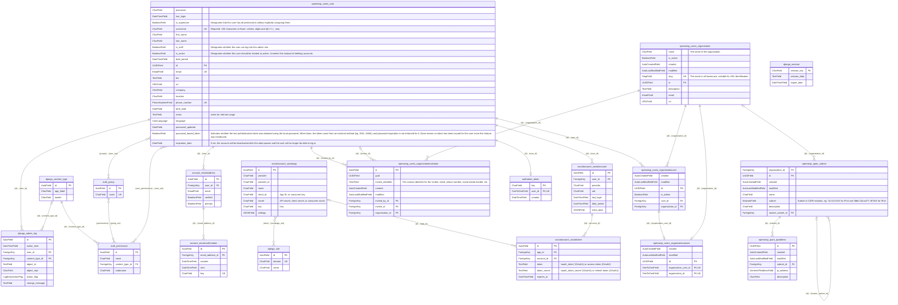

```mermaid
erDiagram
    openwisp_users_user ||--o{ django_admin_log : "(id) - (user_id)"
    django_content_type |o--o{ django_admin_log : "(id) - (content_type_id)"
    django_content_type ||--o{ auth_permission : "(id) - (content_type_id)"
    auth_group }o--o{ auth_permission : "(permissions) - (group_set)"
    openwisp_users_user ||--o{ account_emailaddress : "(id) - (user_id)"
    account_emailaddress ||--o{ account_emailconfirmation : "(id) - (email_address_id)"
    socialaccount_socialapp }o--o{ django_site : "(sites) - (socialapp_set)"
    openwisp_users_user ||--o{ socialaccount_socialaccount : "(id) - (user_id)"
    socialaccount_socialapp |o--o{ socialaccount_socialtoken : "(id) - (app_id)"
    socialaccount_socialaccount ||--o{ socialaccount_socialtoken : "(id) - (account_id)"
    openwisp_users_user }o--o{ auth_group : "(groups) - (user_set)"
    openwisp_users_user }o--o{ auth_permission : "(user_permissions) - (user_set)"
    openwisp_users_user ||--o{ openwisp_users_organizationuser : "(id) - (user_id)"
    openwisp_users_organization ||--o{ openwisp_users_organizationuser : "(id) - (organization_id)"
    openwisp_users_organizationuser ||--o| openwisp_users_organizationowner : "(id) - (organization_user_id)"
    openwisp_users_organization ||--o| openwisp_users_organizationowner : "(id) - (organization_id)"
    openwisp_users_user ||--o{ openwisp_users_organizationinvitation : "(id) - (invited_by_id)"
    openwisp_users_user |o--o{ openwisp_users_organizationinvitation : "(id) - (invitee_id)"
    openwisp_users_organization ||--o{ openwisp_users_organizationinvitation : "(id) - (organization_id)"
    openwisp_users_user ||--o| authtoken_token : "(id) - (user_id)"
    openwisp_users_organization |o--o{ openwisp_ipam_subnet : "(id) - (organization_id)"
    openwisp_ipam_subnet |o--o{ openwisp_ipam_subnet : "(id) - (master_subnet_id)"
    openwisp_ipam_subnet ||--o{ openwisp_ipam_ipaddress : "(id) - (subnet_id)"
    django_admin_log {
        AutoField id PK
        DateTimeField action_time
        ForeignKey user_id FK
        ForeignKey content_type_id FK
        TextField object_id
        CharField object_repr
        LogEntryActionFlag action_flag
        TextField change_message
    }
    auth_permission {
        AutoField id PK
        CharField name
        ForeignKey content_type_id FK
        CharField codename
    }
    auth_group {
        AutoField id PK
        CharField name UK
    }
    django_content_type {
        AutoField id PK
        CharField app_label
        CharField model
    }
    django_session {
        CharField session_key PK
        TextField session_data
        DateTimeField expire_date
    }
    django_site {
        AutoField id PK
        CharField domain UK
        CharField name
    }
    account_emailaddress {
        AutoField id PK
        ForeignKey user_id FK
        EmailField email
        BooleanField verified
        BooleanField primary
    }
    account_emailconfirmation {
        AutoField id PK
        ForeignKey email_address_id FK
        DateTimeField created
        DateTimeField sent
        CharField key UK
    }
    socialaccount_socialapp {
        AutoField id PK
        CharField provider
        CharField provider_id
        CharField name
        CharField client_id "App ID, or consumer key"
        CharField secret "API secret, client secret, or consumer secret"
        CharField key "Key"
        JSONField settings
    }
    socialaccount_socialaccount {
        AutoField id PK
        ForeignKey user_id FK
        CharField provider
        CharField uid
        DateTimeField last_login
        DateTimeField date_joined
        JSONField extra_data
    }
    socialaccount_socialtoken {
        AutoField id PK
        ForeignKey app_id FK
        ForeignKey account_id FK
        TextField token "'oauth_token' (OAuth1) or access token (OAuth2)"
        TextField token_secret "'oauth_token_secret' (OAuth1) or refresh token (OAuth2)"
        DateTimeField expires_at
    }
    openwisp_users_user {
        CharField password
        DateTimeField last_login
        BooleanField is_superuser "Designates that this user has all permissions without explicitly assigning them."
        CharField username UK "Required. 150 characters or fewer. Letters, digits and @/./+/-/_ only."
        CharField first_name
        CharField last_name
        BooleanField is_staff "Designates whether the user can log into this admin site."
        BooleanField is_active "Designates whether this user should be treated as active. Unselect this instead of deleting accounts."
        DateTimeField date_joined
        UUIDField id PK
        EmailField email UK
        TextField bio
        URLField url
        CharField company
        CharField location
        PhoneNumberField phone_number UK
        DateField birth_date
        TextField notes "notes for internal usage"
        UserLanguage language
        DateField password_updated
        BooleanField password_based_token "Indicates whether the last authentication token was obtained using the local password. When false, the token came from an external method (eg: SSO, SAML) and password expiration is not enforced for it. None means no token has been issued for this user since this feature was introduced."
        DateField expiration_date "If set, the account will be deactivated after this date passes and the user will no longer be able to log in."
    }
    openwisp_users_organization {
        CharField name "The name of the organization"
        BooleanField is_active
        AutoCreatedField created
        AutoLastModifiedField modified
        SlugField slug UK "The name in all lowercase, suitable for URL identification"
        UUIDField id PK
        TextField description
        EmailField email
        URLField url
    }
    openwisp_users_organizationuser {
        AutoCreatedField created
        AutoLastModifiedField modified
        UUIDField id PK
        BooleanField is_admin
        ForeignKey user_id FK
        ForeignKey organization_id FK
    }
    openwisp_users_organizationowner {
        AutoCreatedField created
        AutoLastModifiedField modified
        UUIDField id PK
        OneToOneField organization_user_id FK, UK
        OneToOneField organization_id FK, UK
    }
    openwisp_users_organizationinvitation {
        AutoField id PK
        UUIDField guid
        CharField invitee_identifier "The contact identifier for the invitee, email, phone number, social media handle, etc."
        AutoCreatedField created
        AutoLastModifiedField modified
        ForeignKey invited_by_id FK
        ForeignKey invitee_id FK
        ForeignKey organization_id FK
    }
    authtoken_token {
        CharField key PK
        OneToOneField user_id FK, UK
        DateTimeField created
    }
    openwisp_ipam_subnet {
        ForeignKey organization_id FK
        UUIDField id PK
        AutoCreatedField created
        AutoLastModifiedField modified
        CharField name
        NetworkField subnet "Subnet in CIDR notation, eg: '10.0.0.0/24' for IPv4 and 'fdb6:21b:a477::9f7/64' for IPv6"
        CharField description
        ForeignKey master_subnet_id FK
    }
    openwisp_ipam_ipaddress {
        UUIDField id PK
        AutoCreatedField created
        AutoLastModifiedField modified
        ForeignKey subnet_id FK
        GenericIPAddressField ip_address
        CharField description
    }
```
