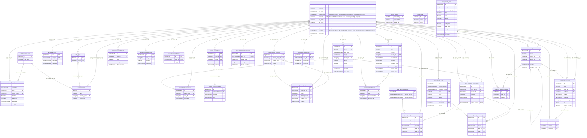

```mermaid
erDiagram
    auth_user ||--o{ django_admin_log : "(id) - (user_id)"
    django_content_type |o--o{ django_admin_log : "(id) - (content_type_id)"
    django_content_type ||--o{ auth_permission : "(id) - (content_type_id)"
    auth_group }o--o{ auth_permission : "(permissions) - (group_set)"
    auth_user }o--o{ auth_group : "(groups) - (user_set)"
    auth_user }o--o{ auth_permission : "(user_permissions) - (user_set)"
    auth_user ||--o| account_account : "(id) - (user_id)"
    auth_user |o--o{ account_signupcode : "(id) - (inviter_id)"
    account_signupcode ||--o{ account_signupcoderesult : "(id) - (signup_code_id)"
    auth_user ||--o{ account_signupcoderesult : "(id) - (user_id)"
    auth_user ||--o{ account_emailaddress : "(id) - (user_id)"
    account_emailaddress ||--o{ account_emailconfirmation : "(id) - (email_address_id)"
    auth_user |o--o{ account_accountdeletion : "(id) - (user_id)"
    auth_user ||--o{ account_passwordhistory : "(id) - (user_id)"
    auth_user ||--o| account_passwordexpiry : "(id) - (user_id)"
    pinax_images_image |o--o{ pinax_images_imageset : "(id) - (primary_image_id)"
    auth_user ||--o{ pinax_images_imageset : "(id) - (created_by_id)"
    pinax_images_imageset ||--o{ pinax_images_image : "(id) - (image_set_id)"
    auth_user ||--o{ pinax_images_image : "(id) - (created_by_id)"
    auth_user ||--o{ announcements_announcement : "(id) - (creator_id)"
    auth_user ||--o{ announcements_dismissal : "(id) - (user_id)"
    announcements_announcement ||--o{ announcements_dismissal : "(id) - (announcement_id)"
    auth_user ||--o{ pinax_invitations_joininvitation : "(id) - (from_user_id)"
    auth_user |o--o{ pinax_invitations_joininvitation : "(id) - (to_user_id)"
    account_signupcode ||--o| pinax_invitations_joininvitation : "(id) - (signup_code_id)"
    auth_user ||--o| pinax_invitations_invitationstat : "(id) - (user_id)"
    auth_user ||--o{ pinax_teams_team : "(id) - (creator_id)"
    pinax_teams_simpleteam ||--o{ pinax_teams_simplemembership : "(id) - (team_id)"
    auth_user |o--o{ pinax_teams_simplemembership : "(id) - (user_id)"
    pinax_invitations_joininvitation |o--o{ pinax_teams_simplemembership : "(id) - (invite_id)"
    pinax_teams_team ||--o{ pinax_teams_membership : "(id) - (team_id)"
    auth_user |o--o{ pinax_teams_membership : "(id) - (user_id)"
    pinax_invitations_joininvitation |o--o{ pinax_teams_membership : "(id) - (invite_id)"
    documents_folder |o--o{ documents_folder : "(id) - (parent_id)"
    auth_user ||--o{ documents_folder : "(id) - (author_id)"
    auth_user ||--o{ documents_folder : "(id) - (modified_by_id)"
    documents_folder |o--o{ documents_document : "(id) - (folder_id)"
    auth_user ||--o{ documents_document : "(id) - (author_id)"
    auth_user ||--o{ documents_document : "(id) - (modified_by_id)"
    auth_user ||--o{ documents_foldershareduser : "(id) - (user_id)"
    documents_folder ||--o{ documents_foldershareduser : "(id) - (folder_id)"
    auth_user ||--o{ documents_documentshareduser : "(id) - (user_id)"
    documents_document ||--o{ documents_documentshareduser : "(id) - (document_id)"
    auth_user ||--o| documents_userstorage : "(id) - (user_id)"
    django_admin_log {
        AutoField id PK
        DateTimeField action_time
        ForeignKey user_id FK
        ForeignKey content_type_id FK
        TextField object_id
        CharField object_repr
        LogEntryActionFlag action_flag
        TextField change_message
    }
    auth_permission {
        AutoField id PK
        CharField name
        ForeignKey content_type_id FK
        CharField codename
    }
    auth_group {
        AutoField id PK
        CharField name UK
    }
    auth_user {
        AutoField id PK
        CharField password
        DateTimeField last_login
        BooleanField is_superuser "Designates that this user has all permissions without explicitly assigning them."
        CharField username UK "Required. 150 characters or fewer. Letters, digits and @/./+/-/_ only."
        CharField first_name
        CharField last_name
        EmailField email
        BooleanField is_staff "Designates whether the user can log into this admin site."
        BooleanField is_active "Designates whether this user should be treated as active. Unselect this instead of deleting accounts."
        DateTimeField date_joined
    }
    django_content_type {
        AutoField id PK
        CharField app_label
        CharField model
    }
    django_session {
        CharField session_key PK
        TextField session_data
        DateTimeField expire_date
    }
    django_site {
        AutoField id PK
        CharField domain UK
        CharField name
    }
    account_account {
        BigAutoField id PK
        OneToOneField user_id FK, UK
        AccountTimezone timezone
        AccountLanguage language
    }
    account_signupcode {
        BigAutoField id PK
        CharField code UK
        PositiveIntegerField max_uses
        DateTimeField expiry
        ForeignKey inviter_id FK
        EmailField email
        TextField notes
        DateTimeField sent
        DateTimeField created
        PositiveIntegerField use_count
    }
    account_signupcoderesult {
        BigAutoField id PK
        ForeignKey signup_code_id FK
        ForeignKey user_id FK
        DateTimeField timestamp
    }
    account_emailaddress {
        BigAutoField id PK
        ForeignKey user_id FK
        EmailField email UK
        BooleanField verified
        BooleanField primary
    }
    account_emailconfirmation {
        BigAutoField id PK
        ForeignKey email_address_id FK
        DateTimeField created
        DateTimeField sent
        CharField key UK
    }
    account_accountdeletion {
        BigAutoField id PK
        ForeignKey user_id FK
        EmailField email
        DateTimeField date_requested
        DateTimeField date_expunged
    }
    account_passwordhistory {
        BigAutoField id PK
        ForeignKey user_id FK
        CharField password
        DateTimeField timestamp
    }
    account_passwordexpiry {
        BigAutoField id PK
        OneToOneField user_id FK, UK
        PositiveIntegerField expiry
    }
    pinax_images_imageset {
        BigAutoField id PK
        ForeignKey primary_image_id FK
        ForeignKey created_by_id FK
        DateTimeField created_at
    }
    pinax_images_image {
        BigAutoField id PK
        ForeignKey image_set_id FK
        ImageField image
        CharField original_filename
        ForeignKey created_by_id FK
        DateTimeField created_at
    }
    announcements_announcement {
        BigAutoField id PK
        CharField title
        TextField content
        ForeignKey creator_id FK
        DateTimeField creation_date
        BooleanField site_wide
        BooleanField members_only
        AnnouncementDismissalType dismissal_type
        DateTimeField publish_start
        DateTimeField publish_end
    }
    announcements_dismissal {
        BigAutoField id PK
        ForeignKey user_id FK
        ForeignKey announcement_id FK
        DateTimeField dismissed_at
    }
    pinax_invitations_joininvitation {
        BigAutoField id PK
        ForeignKey from_user_id FK
        ForeignKey to_user_id FK
        TextField message
        DateTimeField sent
        JoinInvitationStatus status
        OneToOneField signup_code_id FK, UK
    }
    pinax_invitations_invitationstat {
        BigAutoField id PK
        OneToOneField user_id FK, UK
        IntegerField invites_sent
        IntegerField invites_allocated
        IntegerField invites_accepted
    }
    pinax_teams_simpleteam {
        BigAutoField id PK
        SimpleTeamMemberAccess member_access
        SimpleTeamManagerAccess manager_access
    }
    pinax_teams_team {
        BigAutoField id PK
        TeamMemberAccess member_access
        TeamManagerAccess manager_access
        SlugField slug UK
        CharField name
        ImageField avatar
        TextField description
        ForeignKey creator_id FK
        DateTimeField created
    }
    pinax_teams_simplemembership {
        BigAutoField id PK
        SimpleMembershipState state
        SimpleMembershipRole role
        DateTimeField created
        ForeignKey team_id FK
        ForeignKey user_id FK
        ForeignKey invite_id FK
    }
    pinax_teams_membership {
        BigAutoField id PK
        MembershipState state
        MembershipRole role
        DateTimeField created
        ForeignKey team_id FK
        ForeignKey user_id FK
        ForeignKey invite_id FK
    }
    pinax_events_event {
        BigAutoField id PK
        ImageField image
        ImageField secondary_image
        CharField title
        TextField url
        CharField where
        TextField what
        TextField what_html
        DateField start_date
        DateField end_date
        DateTimeField published_at
        DateTimeField created_at
    }
    documents_folder {
        BigAutoField id PK
        CharField name
        ForeignKey parent_id FK
        ForeignKey author_id FK
        DateTimeField created
        DateTimeField modified
        ForeignKey modified_by_id FK
    }
    documents_document {
        BigAutoField id PK
        CharField name
        ForeignKey folder_id FK
        ForeignKey author_id FK
        DateTimeField created
        DateTimeField modified
        ForeignKey modified_by_id FK
        FileField file
        CharField original_filename
    }
    documents_foldershareduser {
        BigAutoField id PK
        ForeignKey user_id FK
        ForeignKey folder_id FK
    }
    documents_documentshareduser {
        BigAutoField id PK
        ForeignKey user_id FK
        ForeignKey document_id FK
    }
    documents_userstorage {
        BigAutoField id PK
        OneToOneField user_id FK, UK
        BigIntegerField bytes_used
        BigIntegerField bytes_total
    }
```
