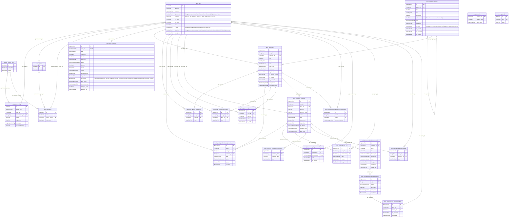

```mermaid
erDiagram
    auth_user ||--o{ django_admin_log : "(id) - (user_id)"
    django_content_type |o--o{ django_admin_log : "(id) - (content_type_id)"
    django_content_type ||--o{ auth_permission : "(id) - (content_type_id)"
    auth_group }o--o{ auth_permission : "(permissions) - (group_set)"
    auth_user }o--o{ auth_group : "(groups) - (user_set)"
    auth_user }o--o{ auth_permission : "(user_permissions) - (user_set)"
    auth_user ||--o| spirit_user_userprofile : "(id) - (user_id)"
    spirit_category_category |o--o{ spirit_category_category : "(id) - (parent_id)"
    auth_user ||--o{ spirit_topic_topic : "(id) - (user_id)"
    spirit_category_category ||--o{ spirit_topic_topic : "(id) - (category_id)"
    auth_user ||--o{ spirit_topic_favorite_topicfavorite : "(id) - (user_id)"
    spirit_topic_topic ||--o{ spirit_topic_favorite_topicfavorite : "(id) - (topic_id)"
    auth_user ||--o{ spirit_topic_notification_topicnotification : "(id) - (user_id)"
    spirit_topic_topic ||--o{ spirit_topic_notification_topicnotification : "(id) - (topic_id)"
    spirit_comment_comment ||--o{ spirit_topic_notification_topicnotification : "(id) - (comment_id)"
    auth_user ||--o{ spirit_topic_private_topicprivate : "(id) - (user_id)"
    spirit_topic_topic ||--o{ spirit_topic_private_topicprivate : "(id) - (topic_id)"
    auth_user ||--o{ spirit_topic_unread_topicunread : "(id) - (user_id)"
    spirit_topic_topic ||--o{ spirit_topic_unread_topicunread : "(id) - (topic_id)"
    auth_user ||--o{ spirit_comment_comment : "(id) - (user_id)"
    spirit_topic_topic ||--o{ spirit_comment_comment : "(id) - (topic_id)"
    auth_user ||--o{ spirit_comment_bookmark_commentbookmark : "(id) - (user_id)"
    spirit_topic_topic ||--o{ spirit_comment_bookmark_commentbookmark : "(id) - (topic_id)"
    auth_user |o--o{ spirit_comment_flag_commentflag : "(id) - (moderator_id)"
    spirit_comment_comment ||--o| spirit_comment_flag_commentflag : "(id) - (comment_id)"
    auth_user ||--o{ spirit_comment_flag_flag : "(id) - (user_id)"
    spirit_comment_comment ||--o{ spirit_comment_flag_flag : "(id) - (comment_id)"
    spirit_comment_comment ||--o{ spirit_comment_history_commenthistory : "(id) - (comment_fk_id)"
    auth_user ||--o{ spirit_comment_like_commentlike : "(id) - (user_id)"
    spirit_comment_comment ||--o{ spirit_comment_like_commentlike : "(id) - (comment_id)"
    spirit_comment_comment ||--o{ spirit_comment_poll_commentpoll : "(id) - (comment_id)"
    spirit_comment_poll_commentpoll ||--o{ spirit_comment_poll_commentpollchoice : "(id) - (poll_id)"
    auth_user ||--o{ spirit_comment_poll_commentpollvote : "(id) - (voter_id)"
    spirit_comment_poll_commentpollchoice ||--o{ spirit_comment_poll_commentpollvote : "(id) - (choice_id)"
    django_admin_log {
        AutoField id PK
        DateTimeField action_time
        ForeignKey user_id FK
        ForeignKey content_type_id FK
        TextField object_id
        CharField object_repr
        LogEntryActionFlag action_flag
        TextField change_message
    }
    auth_permission {
        AutoField id PK
        CharField name
        ForeignKey content_type_id FK
        CharField codename
    }
    auth_group {
        AutoField id PK
        CharField name UK
    }
    auth_user {
        AutoField id PK
        CharField password
        DateTimeField last_login
        BooleanField is_superuser "Designates that this user has all permissions without explicitly assigning them."
        CharField username UK "Required. 150 characters or fewer. Letters, digits and @/./+/-/_ only."
        CharField first_name
        CharField last_name
        EmailField email
        BooleanField is_staff "Designates whether the user can log into this admin site."
        BooleanField is_active "Designates whether this user should be treated as active. Unselect this instead of deleting accounts."
        DateTimeField date_joined
    }
    django_content_type {
        AutoField id PK
        CharField app_label
        CharField model
    }
    django_session {
        CharField session_key PK
        TextField session_data
        DateTimeField expire_date
    }
    spirit_user_userprofile {
        BigAutoField id PK
        OneToOneField user_id FK, UK
        AutoSlugField slug
        CharField nickname
        CharField location
        DateTimeField last_seen
        GenericIPAddressField last_ip
        CharField timezone
        ImageField avatar
        PositiveIntegerField notify
        BooleanField is_administrator
        BooleanField is_moderator
        BooleanField is_verified "Designates whether the user has verified his account by email or by other means. Un-select this to let the user activate his account."
        PositiveIntegerField topic_count
        PositiveIntegerField comment_count
        CharField last_post_hash
        DateTimeField last_post_on
    }
    spirit_category_category {
        BigAutoField id PK
        ForeignKey parent_id FK
        CharField title
        AutoSlugField slug
        CharField description
        CharField color "Title color in hex format (i.e: #1aafd0)."
        PositiveIntegerField sort
        DateTimeField reindex_at
        BooleanField is_global "Designates whether the topics will bedisplayed in the all-categories list."
        BooleanField is_closed
        BooleanField is_removed
        BooleanField is_private
    }
    spirit_topic_topic {
        BigAutoField id PK
        ForeignKey user_id FK
        ForeignKey category_id FK
        CharField title
        AutoSlugField slug
        DateTimeField date
        DateTimeField last_active
        DateTimeField reindex_at
        BooleanField is_pinned
        BooleanField is_globally_pinned
        BooleanField is_closed
        BooleanField is_removed
        PositiveIntegerField view_count
        PositiveIntegerField comment_count
    }
    spirit_topic_favorite_topicfavorite {
        BigAutoField id PK
        ForeignKey user_id FK
        ForeignKey topic_id FK
        DateTimeField date
    }
    spirit_topic_notification_topicnotification {
        BigAutoField id PK
        ForeignKey user_id FK
        ForeignKey topic_id FK
        ForeignKey comment_id FK
        DateTimeField date
        TopicNotificationAction action
        BooleanField is_read
        BooleanField is_active
    }
    spirit_topic_private_topicprivate {
        BigAutoField id PK
        ForeignKey user_id FK
        ForeignKey topic_id FK
        DateTimeField date
    }
    spirit_topic_unread_topicunread {
        BigAutoField id PK
        ForeignKey user_id FK
        ForeignKey topic_id FK
        DateTimeField date
        BooleanField is_read
    }
    spirit_comment_comment {
        BigAutoField id PK
        ForeignKey user_id FK
        ForeignKey topic_id FK
        TextField comment
        TextField comment_html
        CommentAction action
        DateTimeField date
        BooleanField is_removed
        BooleanField is_modified
        GenericIPAddressField ip_address
        PositiveIntegerField modified_count
        PositiveIntegerField likes_count
    }
    spirit_comment_bookmark_commentbookmark {
        BigAutoField id PK
        ForeignKey user_id FK
        ForeignKey topic_id FK
        PositiveIntegerField comment_number
    }
    spirit_comment_flag_commentflag {
        BigAutoField id PK
        ForeignKey moderator_id FK
        OneToOneField comment_id FK, UK
        DateTimeField date
        BooleanField is_closed
    }
    spirit_comment_flag_flag {
        BigAutoField id PK
        ForeignKey user_id FK
        ForeignKey comment_id FK
        DateTimeField date
        FlagReason reason
        TextField body
    }
    spirit_comment_history_commenthistory {
        BigAutoField id PK
        ForeignKey comment_fk_id FK
        TextField comment_html
        DateTimeField date
    }
    spirit_comment_like_commentlike {
        BigAutoField id PK
        ForeignKey user_id FK
        ForeignKey comment_id FK
        DateTimeField date
    }
    spirit_comment_poll_commentpoll {
        BigAutoField id PK
        ForeignKey comment_id FK
        CharField name
        CharField title
        PositiveIntegerField choice_min
        PositiveIntegerField choice_max
        CommentPollMode mode
        DateTimeField close_at
        BooleanField is_removed
        DateTimeField created_at
    }
    spirit_comment_poll_commentpollchoice {
        BigAutoField id PK
        ForeignKey poll_id FK
        PositiveIntegerField number
        CharField description
        PositiveIntegerField vote_count
        BooleanField is_removed
    }
    spirit_comment_poll_commentpollvote {
        BigAutoField id PK
        ForeignKey voter_id FK
        ForeignKey choice_id FK
        BooleanField is_removed
        DateTimeField created_at
    }
    djconfig_config {
        AutoField id PK
        CharField key UK
        TextField value
    }
```
