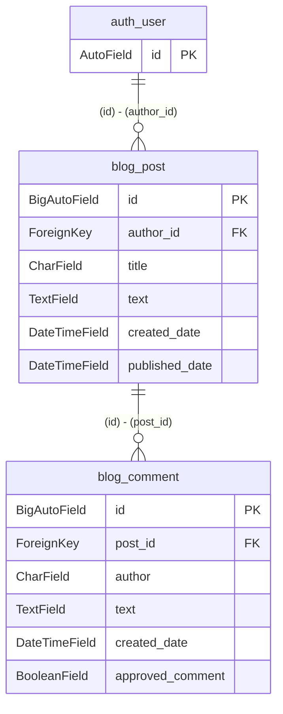

```mermaid
erDiagram
    auth_user ||--o{ blog_post : "(id) - (author_id)"
    blog_post ||--o{ blog_comment : "(id) - (post_id)"
    blog_post {
        BigAutoField id PK
        ForeignKey author_id FK
        CharField title
        TextField text
        DateTimeField created_date
        DateTimeField published_date
    }
    blog_comment {
        BigAutoField id PK
        ForeignKey post_id FK
        CharField author
        TextField text
        DateTimeField created_date
        BooleanField approved_comment
    }
    auth_user {
        AutoField id PK
    }
```
