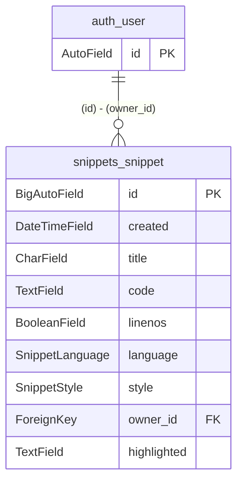

```mermaid
erDiagram
    auth_user ||--o{ snippets_snippet : "(id) - (owner_id)"
    snippets_snippet {
        BigAutoField id PK
        DateTimeField created
        CharField title
        TextField code
        BooleanField linenos
        SnippetLanguage language
        SnippetStyle style
        ForeignKey owner_id FK
        TextField highlighted
    }
    auth_user {
        AutoField id PK
    }
```
