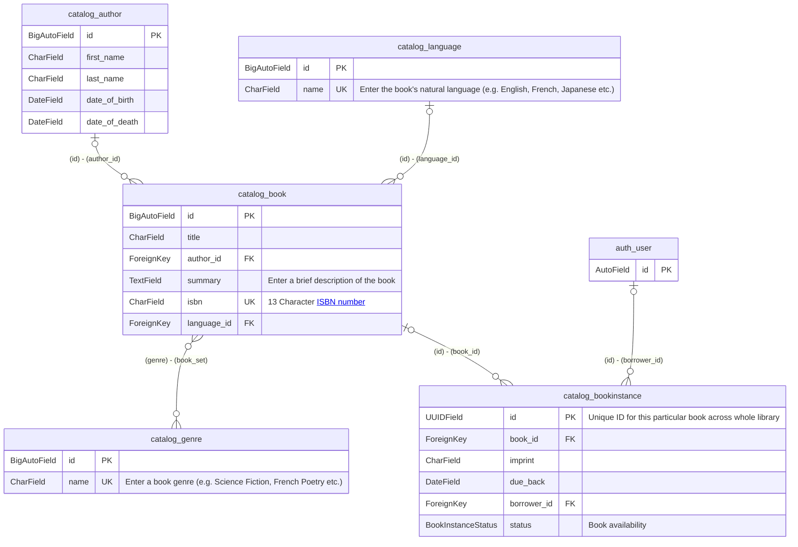

```mermaid
erDiagram
    catalog_author |o--o{ catalog_book : "(id) - (author_id)"
    catalog_language |o--o{ catalog_book : "(id) - (language_id)"
    catalog_book }o--o{ catalog_genre : "(genre) - (book_set)"
    catalog_book |o--o{ catalog_bookinstance : "(id) - (book_id)"
    auth_user |o--o{ catalog_bookinstance : "(id) - (borrower_id)"
    catalog_genre {
        BigAutoField id PK
        CharField name UK "Enter a book genre (e.g. Science Fiction, French Poetry etc.)"
    }
    catalog_language {
        BigAutoField id PK
        CharField name UK "Enter the book's natural language (e.g. English, French, Japanese etc.)"
    }
    catalog_book {
        BigAutoField id PK
        CharField title
        ForeignKey author_id FK
        TextField summary "Enter a brief description of the book"
        CharField isbn UK "13 Character <a href='https://www.isbn-international.org/content/what-isbn'>ISBN number</a>"
        ForeignKey language_id FK
    }
    catalog_bookinstance {
        UUIDField id PK "Unique ID for this particular book across whole library"
        ForeignKey book_id FK
        CharField imprint
        DateField due_back
        ForeignKey borrower_id FK
        BookInstanceStatus status "Book availability"
    }
    catalog_author {
        BigAutoField id PK
        CharField first_name
        CharField last_name
        DateField date_of_birth
        DateField date_of_death
    }
    auth_user {
        AutoField id PK
    }
```
