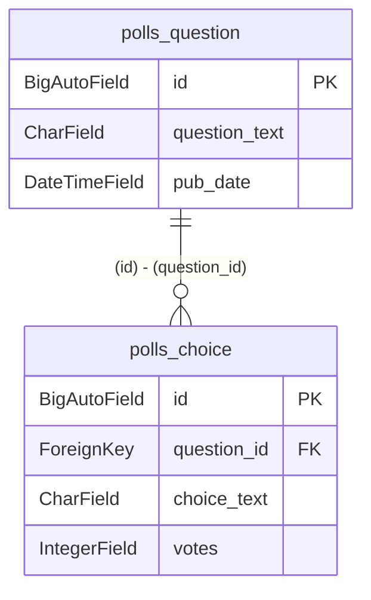

```mermaid
erDiagram
    polls_question ||--o{ polls_choice : "(id) - (question_id)"
    polls_question {
        BigAutoField id PK
        CharField question_text
        DateTimeField pub_date
    }
    polls_choice {
        BigAutoField id PK
        ForeignKey question_id FK
        CharField choice_text
        IntegerField votes
    }
```
