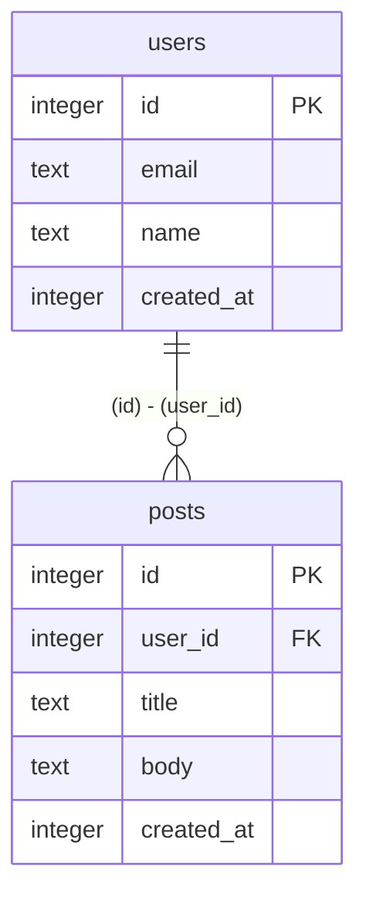

```mermaid
erDiagram
    users ||--o{ posts : "(id) - (user_id)"
    users {
        integer id PK
        text email
        text name
        integer created_at
    }
    posts {
        integer id PK
        integer user_id FK
        text title
        text body
        integer created_at
    }
```
