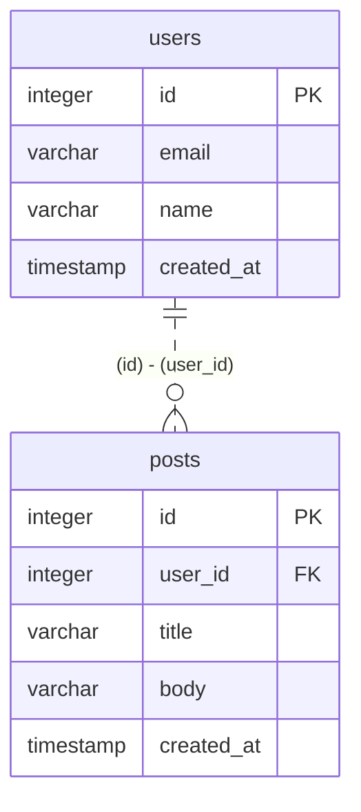

```mermaid
erDiagram
    users ||..o{ posts : "(id) - (user_id)"
    users {
        integer id PK
        varchar email
        varchar name
        timestamp created_at
    }
    posts {
        integer id PK
        integer user_id FK
        varchar title
        varchar body
        timestamp created_at
    }
```
