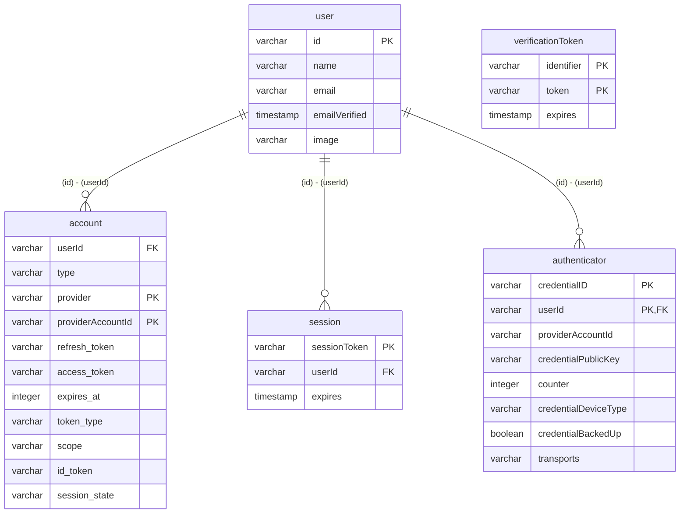

```mermaid
erDiagram
    user ||--o{ account : "(id) - (userId)"
    user ||--o{ session : "(id) - (userId)"
    user ||--o{ authenticator : "(id) - (userId)"
    user {
        varchar id PK
        varchar name
        varchar email
        timestamp emailVerified
        varchar image
    }
    account {
        varchar userId FK
        varchar type
        varchar provider PK
        varchar providerAccountId PK
        varchar refresh_token
        varchar access_token
        integer expires_at
        varchar token_type
        varchar scope
        varchar id_token
        varchar session_state
    }
    session {
        varchar sessionToken PK
        varchar userId FK
        timestamp expires
    }
    verificationToken {
        varchar identifier PK
        varchar token PK
        timestamp expires
    }
    authenticator {
        varchar credentialID PK
        varchar userId PK, FK
        varchar providerAccountId
        varchar credentialPublicKey
        integer counter
        varchar credentialDeviceType
        boolean credentialBackedUp
        varchar transports
    }
```
