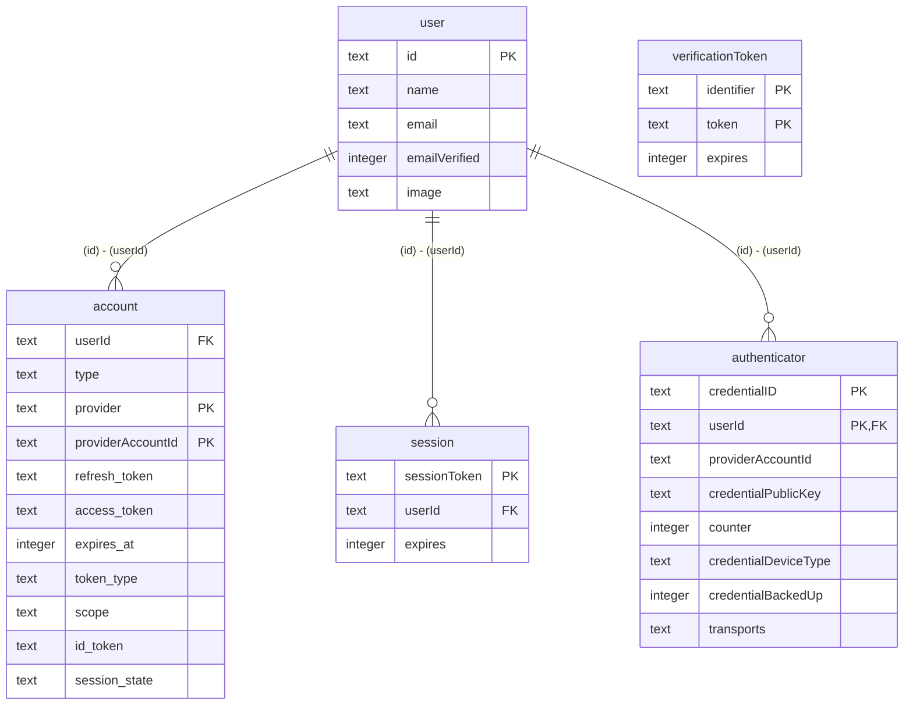

```mermaid
erDiagram
    user ||--o{ account : "(id) - (userId)"
    user ||--o{ session : "(id) - (userId)"
    user ||--o{ authenticator : "(id) - (userId)"
    user {
        text id PK
        text name
        text email
        integer emailVerified
        text image
    }
    account {
        text userId FK
        text type
        text provider PK
        text providerAccountId PK
        text refresh_token
        text access_token
        integer expires_at
        text token_type
        text scope
        text id_token
        text session_state
    }
    session {
        text sessionToken PK
        text userId FK
        integer expires
    }
    verificationToken {
        text identifier PK
        text token PK
        integer expires
    }
    authenticator {
        text credentialID PK
        text userId PK, FK
        text providerAccountId
        text credentialPublicKey
        integer counter
        text credentialDeviceType
        integer credentialBackedUp
        text transports
    }
```
