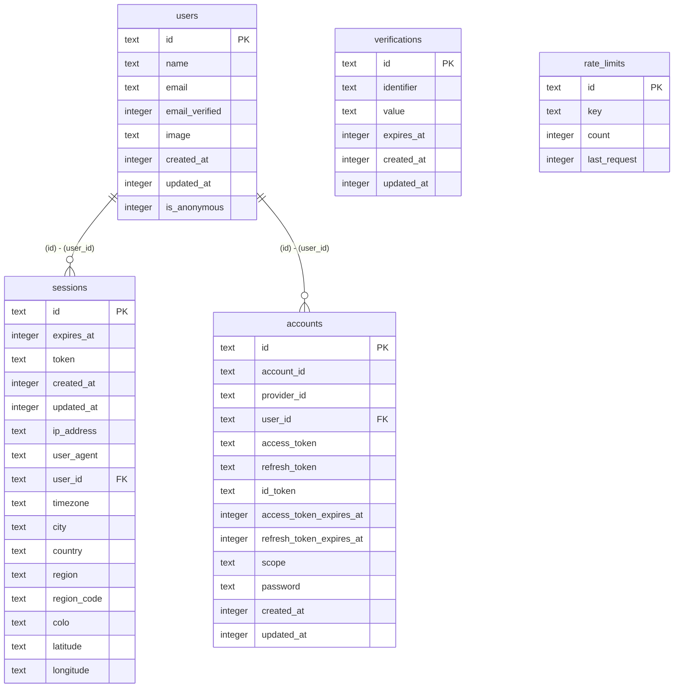

```mermaid
erDiagram
    users ||--o{ sessions : "(id) - (user_id)"
    users ||--o{ accounts : "(id) - (user_id)"
    users {
        text id PK
        text name
        text email
        integer email_verified
        text image
        integer created_at
        integer updated_at
        integer is_anonymous
    }
    sessions {
        text id PK
        integer expires_at
        text token
        integer created_at
        integer updated_at
        text ip_address
        text user_agent
        text user_id FK
        text timezone
        text city
        text country
        text region
        text region_code
        text colo
        text latitude
        text longitude
    }
    accounts {
        text id PK
        text account_id
        text provider_id
        text user_id FK
        text access_token
        text refresh_token
        text id_token
        integer access_token_expires_at
        integer refresh_token_expires_at
        text scope
        text password
        integer created_at
        integer updated_at
    }
    verifications {
        text id PK
        text identifier
        text value
        integer expires_at
        integer created_at
        integer updated_at
    }
    rate_limits {
        text id PK
        text key
        integer count
        integer last_request
    }
```
