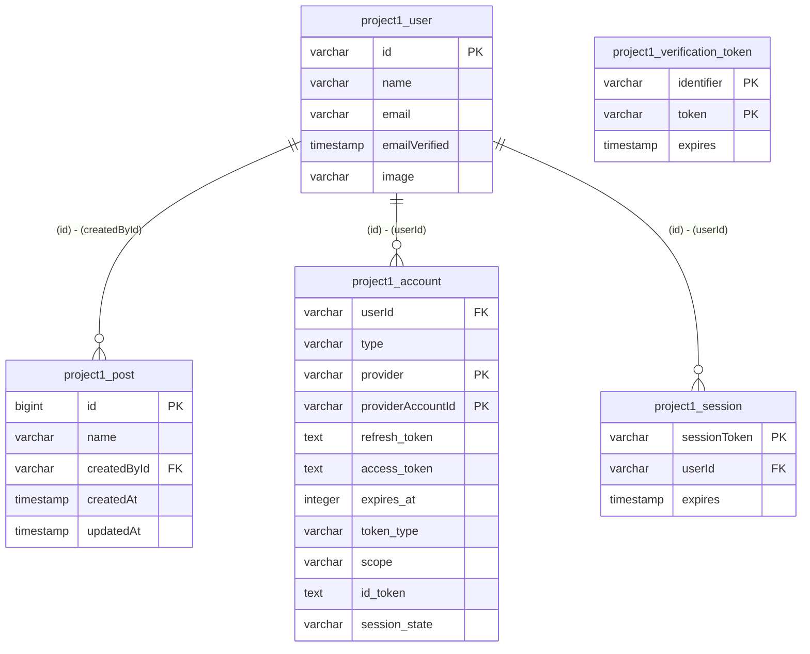

```mermaid
erDiagram
    project1_user ||--o{ project1_post : "(id) - (createdById)"
    project1_user ||--o{ project1_account : "(id) - (userId)"
    project1_user ||--o{ project1_session : "(id) - (userId)"
    project1_post {
        bigint id PK
        varchar name
        varchar createdById FK
        timestamp createdAt
        timestamp updatedAt
    }
    project1_user {
        varchar id PK
        varchar name
        varchar email
        timestamp emailVerified
        varchar image
    }
    project1_account {
        varchar userId FK
        varchar type
        varchar provider PK
        varchar providerAccountId PK
        text refresh_token
        text access_token
        integer expires_at
        varchar token_type
        varchar scope
        text id_token
        varchar session_state
    }
    project1_session {
        varchar sessionToken PK
        varchar userId FK
        timestamp expires
    }
    project1_verification_token {
        varchar identifier PK
        varchar token PK
        timestamp expires
    }
```
