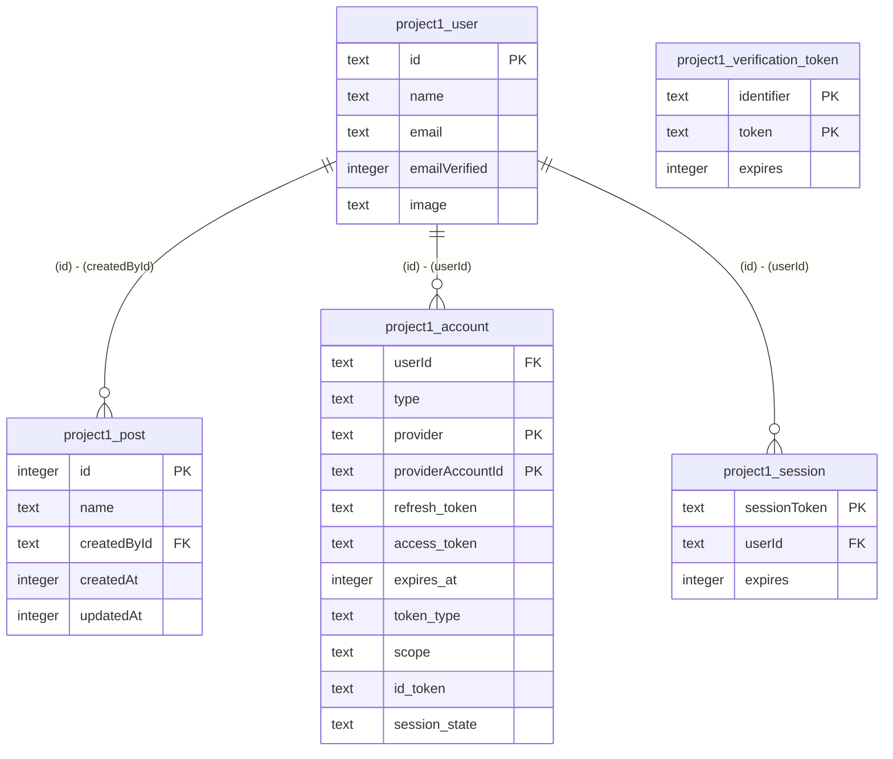

```mermaid
erDiagram
    project1_user ||--o{ project1_post : "(id) - (createdById)"
    project1_user ||--o{ project1_account : "(id) - (userId)"
    project1_user ||--o{ project1_session : "(id) - (userId)"
    project1_post {
        integer id PK
        text name
        text createdById FK
        integer createdAt
        integer updatedAt
    }
    project1_user {
        text id PK
        text name
        text email
        integer emailVerified
        text image
    }
    project1_account {
        text userId FK
        text type
        text provider PK
        text providerAccountId PK
        text refresh_token
        text access_token
        integer expires_at
        text token_type
        text scope
        text id_token
        text session_state
    }
    project1_session {
        text sessionToken PK
        text userId FK
        integer expires
    }
    project1_verification_token {
        text identifier PK
        text token PK
        integer expires
    }
```
