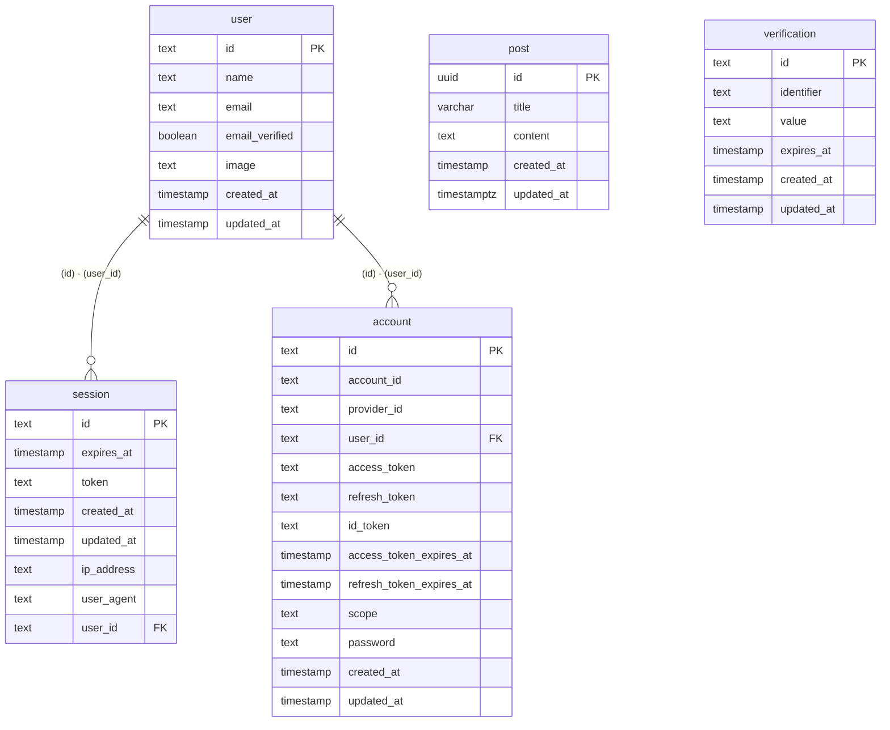

```mermaid
erDiagram
    user ||--o{ session : "(id) - (user_id)"
    user ||--o{ account : "(id) - (user_id)"
    post {
        uuid id PK
        varchar title
        text content
        timestamp created_at
        timestamptz updated_at
    }
    user {
        text id PK
        text name
        text email
        boolean email_verified
        text image
        timestamp created_at
        timestamp updated_at
    }
    session {
        text id PK
        timestamp expires_at
        text token
        timestamp created_at
        timestamp updated_at
        text ip_address
        text user_agent
        text user_id FK
    }
    account {
        text id PK
        text account_id
        text provider_id
        text user_id FK
        text access_token
        text refresh_token
        text id_token
        timestamp access_token_expires_at
        timestamp refresh_token_expires_at
        text scope
        text password
        timestamp created_at
        timestamp updated_at
    }
    verification {
        text id PK
        text identifier
        text value
        timestamp expires_at
        timestamp created_at
        timestamp updated_at
    }
```
