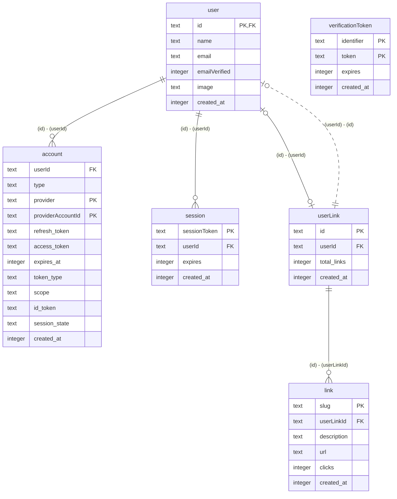

```mermaid
erDiagram
    user ||--o{ account : "(id) - (userId)"
    user ||--o{ session : "(id) - (userId)"
    user |o--o| userLink : "(id) - (userId)"
    userLink ||--o{ link : "(id) - (userLinkId)"
    userLink ||..o| user : "(userId) - (id)"
    user {
        text id PK, FK
        text name
        text email
        integer emailVerified
        text image
        integer created_at
    }
    account {
        text userId FK
        text type
        text provider PK
        text providerAccountId PK
        text refresh_token
        text access_token
        integer expires_at
        text token_type
        text scope
        text id_token
        text session_state
        integer created_at
    }
    session {
        text sessionToken PK
        text userId FK
        integer expires
        integer created_at
    }
    verificationToken {
        text identifier PK
        text token PK
        integer expires
        integer created_at
    }
    userLink {
        text id PK
        text userId FK
        integer total_links
        integer created_at
    }
    link {
        text slug PK
        text userLinkId FK
        text description
        text url
        integer clicks
        integer created_at
    }
```
