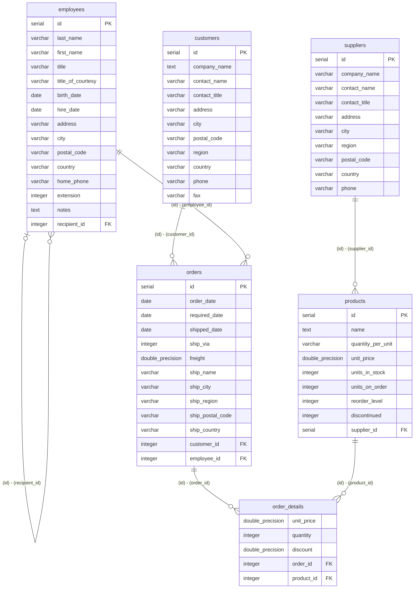

```mermaid
erDiagram
    employees |o--o{ employees : "(id) - (recipient_id)"
    customers ||--o{ orders : "(id) - (customer_id)"
    employees ||--o{ orders : "(id) - (employee_id)"
    suppliers ||--o{ products : "(id) - (supplier_id)"
    orders ||--o{ order_details : "(id) - (order_id)"
    products ||--o{ order_details : "(id) - (product_id)"
    customers {
        serial id PK
        text company_name
        varchar contact_name
        varchar contact_title
        varchar address
        varchar city
        varchar postal_code
        varchar region
        varchar country
        varchar phone
        varchar fax
    }
    employees {
        serial id PK
        varchar last_name
        varchar first_name
        varchar title
        varchar title_of_courtesy
        date birth_date
        date hire_date
        varchar address
        varchar city
        varchar postal_code
        varchar country
        varchar home_phone
        integer extension
        text notes
        integer recipient_id FK
    }
    orders {
        serial id PK
        date order_date
        date required_date
        date shipped_date
        integer ship_via
        double_precision freight
        varchar ship_name
        varchar ship_city
        varchar ship_region
        varchar ship_postal_code
        varchar ship_country
        integer customer_id FK
        integer employee_id FK
    }
    suppliers {
        serial id PK
        varchar company_name
        varchar contact_name
        varchar contact_title
        varchar address
        varchar city
        varchar region
        varchar postal_code
        varchar country
        varchar phone
    }
    products {
        serial id PK
        text name
        varchar quantity_per_unit
        double_precision unit_price
        integer units_in_stock
        integer units_on_order
        integer reorder_level
        integer discontinued
        serial supplier_id FK
    }
    order_details {
        double_precision unit_price
        integer quantity
        double_precision discount
        integer order_id FK
        integer product_id FK
    }
```
