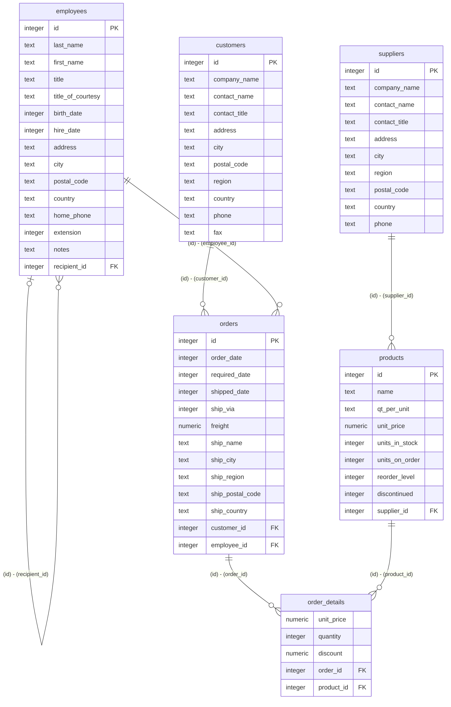

```mermaid
erDiagram
    employees |o--o{ employees : "(id) - (recipient_id)"
    customers ||--o{ orders : "(id) - (customer_id)"
    employees ||--o{ orders : "(id) - (employee_id)"
    suppliers ||--o{ products : "(id) - (supplier_id)"
    orders ||--o{ order_details : "(id) - (order_id)"
    products ||--o{ order_details : "(id) - (product_id)"
    customers {
        integer id PK
        text company_name
        text contact_name
        text contact_title
        text address
        text city
        text postal_code
        text region
        text country
        text phone
        text fax
    }
    employees {
        integer id PK
        text last_name
        text first_name
        text title
        text title_of_courtesy
        integer birth_date
        integer hire_date
        text address
        text city
        text postal_code
        text country
        text home_phone
        integer extension
        text notes
        integer recipient_id FK
    }
    orders {
        integer id PK
        integer order_date
        integer required_date
        integer shipped_date
        integer ship_via
        numeric freight
        text ship_name
        text ship_city
        text ship_region
        text ship_postal_code
        text ship_country
        integer customer_id FK
        integer employee_id FK
    }
    suppliers {
        integer id PK
        text company_name
        text contact_name
        text contact_title
        text address
        text city
        text region
        text postal_code
        text country
        text phone
    }
    products {
        integer id PK
        text name
        text qt_per_unit
        numeric unit_price
        integer units_in_stock
        integer units_on_order
        integer reorder_level
        integer discontinued
        integer supplier_id FK
    }
    order_details {
        numeric unit_price
        integer quantity
        numeric discount
        integer order_id FK
        integer product_id FK
    }
```
