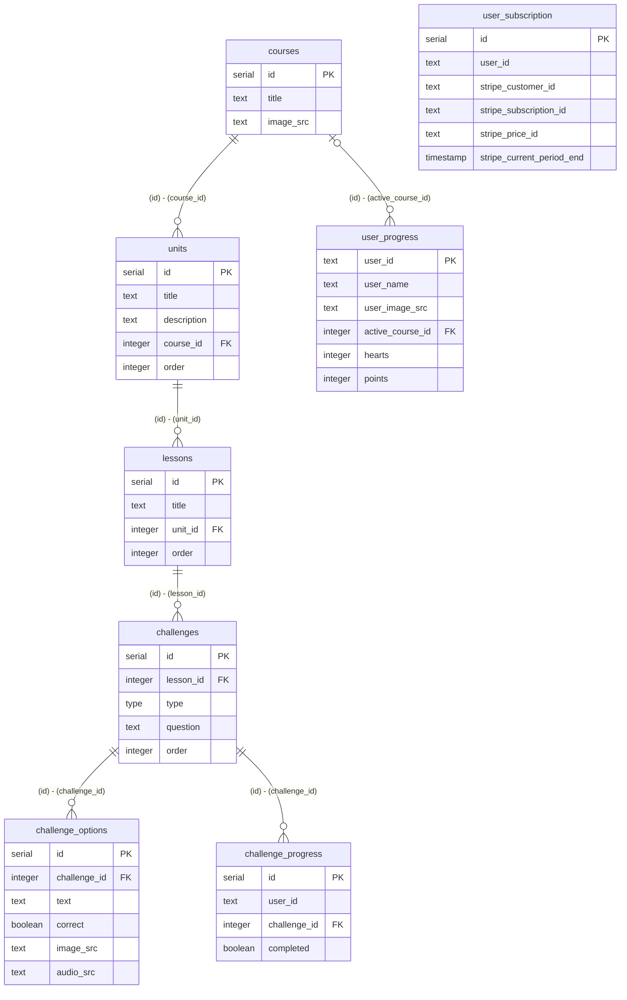

```mermaid
erDiagram
    courses ||--o{ units : "(id) - (course_id)"
    units ||--o{ lessons : "(id) - (unit_id)"
    lessons ||--o{ challenges : "(id) - (lesson_id)"
    challenges ||--o{ challenge_options : "(id) - (challenge_id)"
    challenges ||--o{ challenge_progress : "(id) - (challenge_id)"
    courses |o--o{ user_progress : "(id) - (active_course_id)"
    courses {
        serial id PK
        text title
        text image_src
    }
    units {
        serial id PK
        text title
        text description
        integer course_id FK
        integer order
    }
    lessons {
        serial id PK
        text title
        integer unit_id FK
        integer order
    }
    challenges {
        serial id PK
        integer lesson_id FK
        type type
        text question
        integer order
    }
    challenge_options {
        serial id PK
        integer challenge_id FK
        text text
        boolean correct
        text image_src
        text audio_src
    }
    challenge_progress {
        serial id PK
        text user_id
        integer challenge_id FK
        boolean completed
    }
    user_progress {
        text user_id PK
        text user_name
        text user_image_src
        integer active_course_id FK
        integer hearts
        integer points
    }
    user_subscription {
        serial id PK
        text user_id
        text stripe_customer_id
        text stripe_subscription_id
        text stripe_price_id
        timestamp stripe_current_period_end
    }
```
