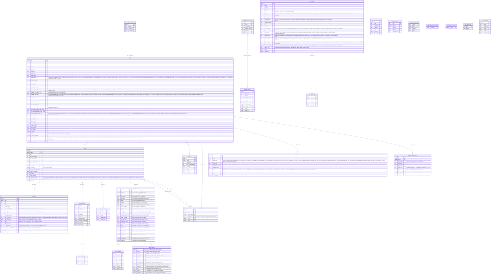

```mermaid
erDiagram
    app_collections |o--o{ apps : "(id) - (collection_id)"
    apps ||--o{ chats : "(id) - (app_id)"
    chats ||--o{ messages : "(id) - (chat_id)"
    chats ||--o{ chat_turn_intents : "(id) - (chat_id)"
    chats ||--o| chat_queue_states : "(id) - (chat_id)"
    chat_turn_intents ||--o| chat_queue_entries : "(intent_id) - (intent_id)"
    chats ||--o{ agent_threads : "(id) - (chat_id)"
    agent_threads ||--o{ agent_messages : "(id) - (thread_id)"
    agent_threads ||--o{ agent_activities : "(id) - (thread_id)"
    apps ||--o{ versions : "(id) - (app_id)"
    apps ||--o{ security_fix_chats : "(id) - (app_id)"
    chats ||--o{ security_fix_chats : "(id) - (review_chat_id)"
    chats ||--o{ security_fix_chats : "(id) - (fix_chat_id)"
    apps ||--o{ coolify_app_connections : "(id) - (app_id)"
    apps ||--o{ cloudflare_app_connections : "(id) - (app_id)"
    language_model_providers |o--o{ language_models : "(id) - (custom_provider_id)"
    mcp_servers ||--o{ mcp_tool_consents : "(id) - (server_id)"
    prompts {
        integer id PK
        text title
        text description
        text content
        text slug
        integer created_at
        integer updated_at
    }
    app_collections {
        integer id PK
        text name
        integer created_at
        integer updated_at
    }
    apps {
        integer id PK
        text name
        text path
        integer created_at
        integer updated_at
        text github_org
        text github_repo
        text github_branch
        text gitlab_instance_url "The GitLab project an app is linked to. An app links to GitHub or GitLab, never both. Which one an app belongs to is decided in src/shared/linked_remote.ts, and src/ipc/utils/app_git_remote.ts builds the URLs and credentials on top of it — resolve through those rather than reading these columns directly, so the UI and the push cannot disagree about the provider. The instance URL is recorded because Dyad holds one GitLab connection at a time and it can later point at a different instance than this project is on — pushing there would silently go to the wrong GitLab."
        integer gitlab_project_id
        text gitlab_project_path
        text gitlab_branch
        text supabase_project_id
        text supabase_parent_project_id "If supabaseProjectId is a branch, then the parent project id set. This is because there's no way to retrieve ALL the branches for ALL projects in a single API call This is only used for display purposes but is NOT used for any actual supabase management logic."
        text supabase_organization_slug "Supabase organization slug for credential lookup"
        text supabase_test_user_id "In-flight ephemeral test-user id for isolated e2e runs against Supabase. Supabase's free tier has no DB branching, so instead of a throwaway branch we create a dedicated throwaway auth user (via the Auth Admin API, stamped app_metadata.dyad_test=true) and run the tests authenticated as it. Set while a test session holds that user, cleared on teardown. Persisted so a crash mid-session can be reconciled (orphan user deleted) on the next launch. See ipc/utils/supabase_test_user.ts."
        text neon_project_id
        text neon_development_branch_id
        text neon_preview_branch_id
        text neon_active_branch_id
        text neon_test_branch_id "In-flight ephemeral test branch for isolated e2e test runs. Set while a test session holds a throwaway copy-on-write branch, cleared on teardown. Persisted so a crash mid-session can be reconciled (orphan branch deleted) on the next launch. See ipc/utils/neon_test_branch.ts."
        text neon_production_auth_cookie_secret
        text neon_development_auth_cookie_secret
        text selected_database_branch_type "Which Neon branch the unified database section is set to deploy/sync against ('production' | 'development'). Null is interpreted differently by each consumer: the backend sync (getSelectedDeployBranchType) treats null as production, while the DatabaseSection UI treats null as 'not yet chosen' and shows the branch picker until the user selects one. Read by the main process when syncing env vars + trusted domains to Vercel."
        text vercel_project_id
        text vercel_project_name
        text vercel_team_id
        text vercel_deployment_url
        text install_command
        text start_command
        text chat_context
        integer is_favorite
        text theme_id "Theme ID for design system theming (null means 'no theme')"
        integer needs_app_blueprint
        integer testing_enabled "Per-app opt-in for the experimental AI E2E testing feature. Off by default: running tests can mutate the app's real data, so the Tests panel gates all run/generate controls behind this flag until the user explicitly enables it (after acknowledging the data-backup warning). See TestsPanel.tsx."
        integer collection_id FK
    }
    test_user_cleanup {
        text user_id PK
        integer app_id
        text owner_id
        text project_id
        text organization_slug
    }
    test_branch_cleanup {
        text branch_id PK
        integer app_id
        text owner_id
        text project_id
    }
    chats {
        integer id PK
        integer app_id FK
        text title
        text execution_backend
        text claude_session_id
        text claude_session_state
        text initial_commit_hash
        integer created_at
        integer compacted_at "Context compaction fields"
        text compaction_backup_path
        integer pending_compaction
        text chat_mode
        text model_selection
        text referenced_app_ids "App ids referenced via `@app:Name` that stay available for the rest of the chat (agent-backed modes only). Stored on the chat rather than derived from message history so references survive compaction, which rewrites history. Ids, not paths: apps can be renamed or moved, so paths are resolved per turn."
        integer is_favorite
    }
    messages {
        integer id PK
        integer chat_id FK
        text role
        text content
        text approval_state
        text source_commit_hash "The commit hash of the codebase at the time the message was created"
        text commit_hash "The commit hash of the codebase at the time the message was sent"
        text request_id
        text user_input_request_id
        text chat_turn_intent_id "Stable idempotency identity for main-owned chat turn admission. Unlike userInputRequestId, ordinary queued turns also carry this identity."
        integer max_tokens_used "Max tokens used for this message (only for assistant messages)"
        text model "Model name used for this message (only for assistant messages)"
        text inference_source
        text ai_messages_json "AI SDK messages (v5 envelope) for preserving tool calls/results in agent mode"
        integer using_free_agent_mode_quota "Track if this message used the free agent quota (for non-Pro users)"
        integer is_compaction_summary "Indicates this message is a compaction summary"
        integer created_at
    }
    chat_turn_intents {
        text intent_id PK
        integer chat_id FK
        text payload_hash
        text intent
        text acceptance
        text recovery
        text terminal_outcome
        integer accepted_message_id
        integer created_at
        integer updated_at
    }
    chat_queue_states {
        integer chat_id PK, FK
        integer revision
        integer paused
        text pause_reason
        integer updated_at
    }
    chat_queue_entries {
        text intent_id PK, FK
        integer position
        text status
    }
    agent_threads {
        text id PK "Stable UUID for the sub-agent thread."
        integer chat_id FK "Chat that owns and displays this thread."
        text persona "Specialized role assigned to the sub-agent."
        text task_name "Short user-visible name for the task."
        text assignment "Full assignment originally given to the sub-agent."
        text status "Current lifecycle state of the thread."
        text provider "Provider used to run the sub-agent model."
        text model "Provider model identifier used by the sub-agent."
        text reasoning_effort "Provider-specific reasoning effort value."
        text context_json "Durable invocation context such as scope and source message."
        text result_json "Structured terminal result produced by the sub-agent."
        text review_base_commit "Base commit used to construct a review target."
        text review_target_commit "Target commit used to construct a review target."
        text review_diff_hash "Hash identifying the exact diff reviewed."
        text invocation_source "User or system path that created this thread."
        text remediation_source "Action that initiated review remediation."
        integer auto_fix_at "Scheduled time at which automatic fixes begin."
        text error "User-visible terminal error, when the thread fails."
        integer input_tokens "Cumulative model input tokens used by the thread."
        integer output_tokens "Cumulative model output tokens used by the thread."
        integer tool_call_count "Cumulative number of child tool calls."
        integer created_at "Time at which the thread was created."
        integer started_at "Time at which execution first started."
        integer completed_at "Time at which execution reached a terminal state."
        integer updated_at "Time of the latest durable thread update."
    }
    agent_messages {
        integer id PK
        text thread_id FK
        integer sequence
        text message_id
        text role
        text content
        integer consumed
        integer created_at
    }
    agent_activities {
        integer id PK "Local row identifier for the activity snapshot."
        text thread_id FK "Sub-agent thread that owns this activity."
        integer sequence "Stable first-seen order within the thread."
        text tool_call_id "AI SDK call identifier used to update this activity."
        text tool_name "Registered name of the invoked tool."
        text status "Current execution state of the tool invocation."
        text presentation_xml "Existing Dyad XML used to render the activity."
        text input_json "Validated tool arguments retained for grounded report reconstruction."
        text output_text "Bounded model-visible tool result retained for grounded reports."
        text error "User-visible tool error when execution fails."
        integer started_at "Time at which the tool invocation first appeared."
        integer completed_at "Time at which the invocation reached a terminal state."
    }
    versions {
        integer id PK
        integer app_id FK
        text commit_hash
        text neon_db_timestamp
        integer is_favorite
        text note
        integer created_at
        integer updated_at
    }
    security_fix_chats {
        integer id PK
        integer app_id FK
        integer review_chat_id FK
        text finding_key "Hash of the normalized finding(s) the fix chat was created for"
        integer fix_chat_id FK
        integer created_at
    }
    coolify_app_connections {
        integer id PK
        integer app_id FK
        text server_uuid "Where the deployment goes. Coolify addresses a resource by all three: the machine, the grouping, and the lane within it — an app can have a production and a staging copy in one project on one server. The Coolify instance is deliberately not here. Its only handle is the URL, which changes without the instance changing (http to https once a certificate lands, an IP becoming a domain), so keying on it would make every app look moved. These are UUIDs, so they do not collide across instances anyway."
        text project_uuid
        text environment_name
        text application_uuid
        text domain "What the user asked for, not where the app ended up — that is app_url. Null means no custom domain, so the address is whatever the deploy is entitled to generate. Never write a generated address back here, or the user's 'no preference' becomes a stored preference they cannot undo."
        text app_url
        integer last_deployed_at
    }
    cloudflare_app_connections {
        integer id PK
        integer app_id FK
        text root_directory "Path from the repository root, '' for the root itself."
        text account_id
        text worker_name
        text worker_tag "Cloudflare's immutable id for the Worker; its builds API keys on this."
        text trigger_uuid "The rule that deploys this target on each push."
        text worker_url "The workers.dev address, or null when the Worker has that route off."
        integer created_at
    }
    language_model_providers {
        text id PK
        text name
        text api_base_url
        text env_var_name
        integer created_at
        integer updated_at
    }
    language_models {
        integer id PK
        text display_name
        text api_name
        text builtin_provider_id
        text custom_provider_id FK
        text description
        integer max_output_tokens
        integer context_window
        integer created_at
        integer updated_at
    }
    mcp_servers {
        integer id PK
        text name
        text transport
        text command
        text args "Store typed JSON for args and environment variables"
        text env_json "Legacy plaintext env vars and headers. These remain for unedited rows so older builds can still use their existing configuration; new writes and secret edits clear them in favor of the encrypted columns below, which are what this build reads."
        text headers_json
        text env_encrypted "Env vars and headers encrypted via Electron `safeStorage`, or base64 plaintext where no keyring is available (see encryptSecretMap). Both hold a JSON object of strings."
        text headers_encrypted
        text url
        integer enabled
        integer oauth_enabled "Whether this server requires OAuth. When true, the MCP manager wires an `OAuthClientProvider` into the streamable HTTP transport so the Vercel `@ai-sdk/mcp` `auth()` flow can drive PKCE + refresh."
        text oauth_state "OAuth state (tokens, expiry, client info). Encrypted via Electron `safeStorage`, or base64 plaintext where no keyring is available (see encryptToString). Read/written only by DyadOAuthClientProvider."
        text oauth_client_id "Optional pre-registered OAuth client_id for servers that don't support dynamic client registration (RFC 7591). User-supplied via the add-server UI; left blank for servers that support DCR."
        text oauth_client_secret "Optional pre-registered OAuth client_secret for confidential clients. Encrypted via `safeStorage` (base64 plaintext fallback where no keyring exists). Never sent to the renderer."
        text oauth_scope "Space-separated OAuth scopes requested at the authorize endpoint. Server-defined values; check provider docs. Blank means omit the `scope` parameter entirely so the server applies its own default (rather than us guessing a value that fits a minority of providers)."
        integer oauth_callback_port "Per-server callback port. Manual (non-DCR) flows pre-register a redirect URI that includes the port, so it must stay stable for those rows. Null falls back to DEFAULT_OAUTH_CALLBACK_PORT."
        text catalog_slug "Slug of the curated catalog entry this server was added from. Null for manually configured servers."
        integer created_at
        integer updated_at
    }
    mcp_tool_consents {
        integer id PK
        integer server_id FK
        text tool_name
        text consent
        integer updated_at
    }
    chat_search_dirty_messages {
        integer message_id PK
    }
    chat_search_dirty_chats {
        integer chat_id PK
    }
    chat_search_meta {
        text key PK
        text value
    }
    custom_themes {
        integer id PK
        text name
        text description
        text prompt
        integer created_at
        integer updated_at
    }
```
