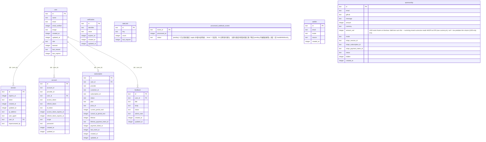

```mermaid
erDiagram
    user ||--o{ session : "(id) - (user_id)"
    user ||--o{ account : "(id) - (user_id)"
    user ||--o| subscription : "(id) - (user_id)"
    user ||--o{ feedback : "(id) - (user_id)"
    user {
        text id PK
        text name
        text email
        integer email_verified
        text image
        integer created_at
        integer updated_at
        text role
        integer banned
        text ban_reason
        integer ban_expires
    }
    session {
        text id PK
        integer expires_at
        text token
        integer created_at
        integer updated_at
        text ip_address
        text user_agent
        text user_id FK
        text impersonated_by
    }
    account {
        text id PK
        text account_id
        text provider_id
        text user_id FK
        text access_token
        text refresh_token
        text id_token
        integer access_token_expires_at
        integer refresh_token_expires_at
        text scope
        text password
        integer created_at
        integer updated_at
    }
    verification {
        text id PK
        text identifier
        text value
        integer expires_at
        integer created_at
        integer updated_at
    }
    rateLimit {
        text id PK
        text key
        integer count
        integer last_request
    }
    subscription {
        text id PK
        text user_id FK
        text provider
        text customer_id
        text subscription_id
        text status
        text plan
        text price_id
        integer current_period_end
        integer cancel_at_period_end
        integer lifetime
        text lifetime_payment_intent_id
        integer payment_failed_at
        integer last_event_at
        integer created_at
        integer updated_at
    }
    processed_webhook_events {
        text event_id PK
        integer processed_at
        text status "'pending' = 已认领未落库（apply 中/曾中途死掉）；'done' = 已应用。D1 无跨语句事务， 认领与落库间的宕机窗口靠「陈旧 pending 可被重试接管」闭合（见 handleWebhook）。"
    }
    waitlist {
        text id PK
        text email
        text locale
        text source
        integer created_at
    }
    sponsorship {
        text id PK
        text email
        text github
        text message
        integer amount
        text currency
        integer amount_usd "USD cents frozen at checkout. Wall tiers sum this — summing mixed currencies reads HK$78 as $78 (see currency.ts). null = row predates the column (USD-only era)."
        text mode
        text stripe_session_id
        text stripe_subscription_id
        text stripe_payment_intent_id
        text status
        integer hidden
        integer created_at
    }
    feedback {
        text id PK
        text user_id FK
        text title
        text body
        text status
        text admin_note
        integer created_at
        integer updated_at
    }
```
