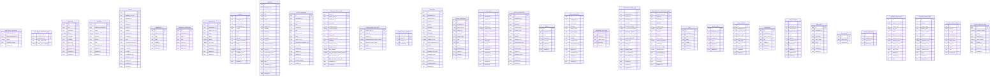

```mermaid
erDiagram
    local_library_connections {
        text account_user_id PK
        text library_workspace_id
        integer active
        text recovery_settings
        text created_at
    }
    local_library_attachment_state {
        text account_user_id PK
        text attachment_id PK
        text cloud_object_key
        integer cloud_sync_enabled
    }
    templates {
        text id PK
        text title
        text description
        integer pinned
        integer pin_order
        text category
        text icon_json
        text targets_json
        text sections_json
        text created_at
        text updated_at
    }
    calendars {
        text id PK
        text tracking_id_calendar
        text name
        integer enabled
        text provider
        text source
        text color
        text connection_id
        text created_at
        text updated_at
        text deleted_at
    }
    events {
        text id PK
        text tracking_id_event
        text calendar_id
        text title
        text started_at
        text ended_at
        text location
        text meeting_link
        text description
        text note
        text recurrence_series_id
        integer has_recurrence_rules
        integer is_all_day
        text provider
        text participants_json
        text attendance_json
        text created_at
        text updated_at
        text deleted_at
    }
    workspaces {
        text id PK
        text owner_user_id
        text kind
        text name
        text created_at
        text updated_at
        text deleted_at
    }
    workspace_memberships {
        text id PK
        text workspace_id
        text user_id
        text role
        text created_at
        text updated_at
        text deleted_at
    }
    organizations {
        text id PK
        text workspace_id
        text owner_user_id
        text name
        text memo
        integer pinned
        integer pin_order
        text metadata_json
        text created_at
        text updated_at
        text deleted_at
    }
    humans {
        text id PK
        text workspace_id
        text owner_user_id
        text organization_id
        text name
        text email
        text phone
        text job_title
        text linkedin_username
        text memo
        integer pinned
        integer pin_order
        text metadata_json
        text created_at
        text updated_at
        text deleted_at
    }
    sessions {
        text id PK
        text workspace_id
        text owner_user_id
        text title
        text kind
        text status
        text created_at
        text updated_at
        text started_at
        text ended_at
        text timezone
        text language
        text event_id
        text external_event_id
        text external_provider
        text series_id
        text source_apps_json
        text event_json
        text folder_path
        text slug
        text metadata_json
        text share_activation_json
        text deletion_context
        text deleted_at
    }
    session_documents {
        text id PK
        text workspace_id
        text session_id
        text kind
        text template_id
        text title
        text body_format
        text body
        text source_hash
        text generation_metadata_json
        integer sort_order
        text created_by
        text updated_by
        text created_at
        text updated_at
        text content_version
        text deleted_at
    }
    shared_session_cache {
        text share_id PK
        text viewer_user_id PK
        text workspace_id
        text session_id
        integer schema_version
        integer content_revision
        text title
        text body_json
        text attachments_json
        text capability
        integer manage_access
        integer access_version
        integer web_editable
        integer web_edit_base_content_revision
        text web_edit_base_title
        text web_edit_base_body_json
        text published_at
        text cached_at
    }
    session_share_sync_state {
        text viewer_user_id PK
        text share_id PK
        text session_id
        integer acknowledged_content_revision
        text baseline_source_hash
        text status
        text updated_at
    }
    session_share_activation {
        text viewer_user_id PK
        text share_id PK
        text session_id
        text activated_at
    }
    transcripts {
        text id PK
        text workspace_id
        text owner_user_id
        text session_id
        text source
        text provider
        text model
        text language
        integer started_at_ms
        integer ended_at_ms
        text audio_attachment_id
        text memo
        text words_json
        text speaker_hints_json
        text metadata_json
        text created_at
        text updated_at
        text content_version
        text deleted_at
    }
    session_participants {
        text id PK
        text workspace_id
        text owner_user_id
        text session_id
        text human_id
        text display_name
        text email
        text role
        text source
        text metadata_json
        text created_at
        text updated_at
        text deleted_at
    }
    action_items {
        text id PK
        text workspace_id
        text session_id
        text source_type
        text source_id
        integer source_order
        text assignee_human_id
        text status
        text text
        text body_json
        text due_at
        text completed_at
        text created_by
        text updated_by
        text metadata_json
        text created_at
        text updated_at
        text deleted_at
    }
    session_attachments {
        text id PK
        text workspace_id
        text session_id
        text filename
        text relative_path
        text content_type
        integer size_bytes
        text sha256
        text storage_kind
        text cloud_object_key
        integer cloud_sync_enabled
        text source_type
        text source_id
        text metadata_json
        text created_at
        text updated_at
        text deleted_at
    }
    folders {
        text id PK
        text workspace_id
        text path
        text instructions
        text icon_json
        text created_at
        text updated_at
        text deleted_at
    }
    folder_attachments {
        text id PK
        text workspace_id
        text folder_path
        text filename
        text relative_path
        text content_type
        integer size_bytes
        text sha256
        text storage_kind
        text cloud_object_key
        text source_type
        text source_id
        text metadata_json
        text created_at
        text updated_at
        text deleted_at
    }
    attachment_local_state {
        text attachment_id PK
        text session_id
        text relative_path
        text availability
        text updated_at
    }
    attachment_transfer_jobs {
        text id PK
        text attachment_id
        text session_id
        text workspace_id
        text direction
        text expected_sha256
        integer expected_size_bytes
        text ciphertext_sha256
        integer ciphertext_size_bytes
        text remote_object_id
        text object_key
        text cache_id
        text phase
        integer attempt_count
        text next_attempt_at
        text last_attempt_at
        text last_error
        text created_at
        text updated_at
        text completed_at
    }
    shared_session_attachment_cache {
        text viewer_user_id PK
        text share_id PK
        text attachment_id PK
        text filename
        text content_type
        integer size_bytes
        text sha256
        text cache_id
        text claim_token
        integer cache_generation
        text availability
        integer access_version
        integer attempt_count
        text next_attempt_at
        text last_attempt_at
        text last_error
        text created_at
        text updated_at
    }
    tags {
        text id PK
        text workspace_id
        text owner_user_id
        text name
        text created_at
        text updated_at
        text deleted_at
    }
    session_tags {
        text id PK
        text workspace_id
        text owner_user_id
        text session_id
        text tag_id
        text created_at
        text updated_at
        text deleted_at
    }
    entity_mentions {
        text id PK
        text workspace_id
        text owner_user_id
        text source_type
        text source_id
        text target_type
        text target_id
        text created_at
        text updated_at
        text deleted_at
    }
    chat_groups {
        text id PK
        text workspace_id
        text owner_user_id
        text title
        text created_at
        text updated_at
        text deleted_at
    }
    chat_messages {
        text id PK
        text workspace_id
        text chat_group_id
        text owner_user_id
        text role
        text content
        text metadata_json
        text parts_json
        text status
        text created_at
        text updated_at
        text deleted_at
    }
    daily_notes {
        text id PK
        text workspace_id
        text owner_user_id
        text note_date
        text body_format
        text body
        text created_at
        text updated_at
        text deleted_at
    }
    app_settings {
        text id PK
        text value_json
        text updated_at
    }
    synced_preferences {
        text id PK
        text workspace_id
        text value_json
        text updated_at
    }
    migration_import_runs {
        text id PK
        integer importer_version
        text source_root
        integer dry_run
        text status
        integer discovered_count
        integer imported_count
        integer matched_count
        integer skipped_count
        integer conflict_count
        integer error_count
        text started_at
        text completed_at
        text error
    }
    migration_import_items {
        text id PK
        text run_id
        text source_path
        text source_kind
        text source_sha256
        text status
        integer discovered_count
        integer imported_count
        integer matched_count
        integer skipped_count
        integer conflict_count
        text error
        text created_at
        text completed_at
    }
    migration_import_targets {
        text id PK
        text run_id
        text item_id
        text source_path
        text source_kind
        text table_name
        text target_id
        text status
        text error
        text created_at
    }
    storage_migration_state {
        text id PK
        integer importer_version
        text phase
        text latest_run_id
        integer parity_verified
        text cutover_at
        text rollback_until
        text last_error
        text updated_at
    }
```
