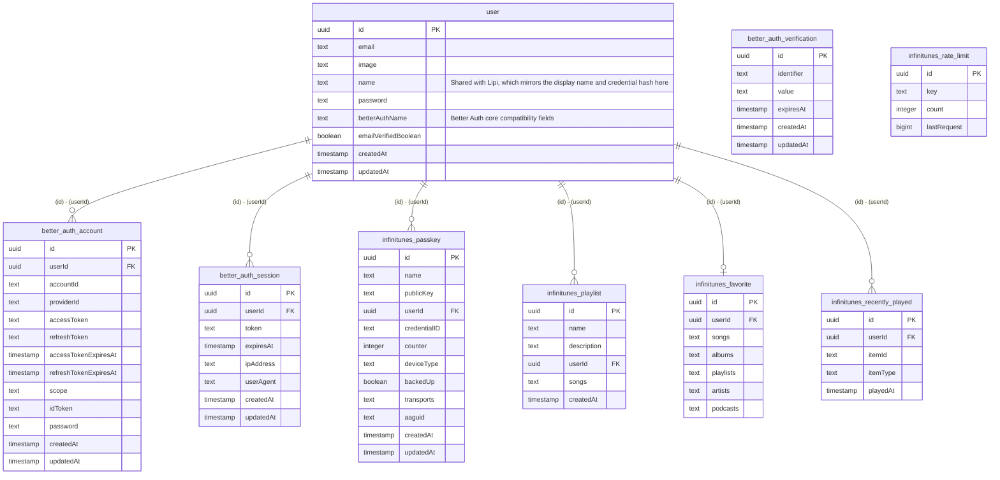

```mermaid
erDiagram
    user ||--o{ better_auth_account : "(id) - (userId)"
    user ||--o{ better_auth_session : "(id) - (userId)"
    user ||--o{ infinitunes_passkey : "(id) - (userId)"
    user ||--o{ infinitunes_playlist : "(id) - (userId)"
    user ||--o| infinitunes_favorite : "(id) - (userId)"
    user ||--o{ infinitunes_recently_played : "(id) - (userId)"
    user {
        uuid id PK
        text email
        text image
        text name "Shared with Lipi, which mirrors the display name and credential hash here"
        text password
        text betterAuthName "Better Auth core compatibility fields"
        boolean emailVerifiedBoolean
        timestamp createdAt
        timestamp updatedAt
    }
    better_auth_account {
        uuid id PK
        uuid userId FK
        text accountId
        text providerId
        text accessToken
        text refreshToken
        timestamp accessTokenExpiresAt
        timestamp refreshTokenExpiresAt
        text scope
        text idToken
        text password
        timestamp createdAt
        timestamp updatedAt
    }
    better_auth_session {
        uuid id PK
        uuid userId FK
        text token
        timestamp expiresAt
        text ipAddress
        text userAgent
        timestamp createdAt
        timestamp updatedAt
    }
    better_auth_verification {
        uuid id PK
        text identifier
        text value
        timestamp expiresAt
        timestamp createdAt
        timestamp updatedAt
    }
    infinitunes_rate_limit {
        uuid id PK
        text key
        integer count
        bigint lastRequest
    }
    infinitunes_passkey {
        uuid id PK
        text name
        text publicKey
        uuid userId FK
        text credentialID
        integer counter
        text deviceType
        boolean backedUp
        text transports
        text aaguid
        timestamp createdAt
        timestamp updatedAt
    }
    infinitunes_playlist {
        uuid id PK
        text name
        text description
        uuid userId FK
        text songs
        timestamp createdAt
    }
    infinitunes_favorite {
        uuid id PK
        uuid userId FK
        text songs
        text albums
        text playlists
        text artists
        text podcasts
    }
    infinitunes_recently_played {
        uuid id PK
        uuid userId FK
        text itemId
        text itemType
        timestamp playedAt
    }
```
