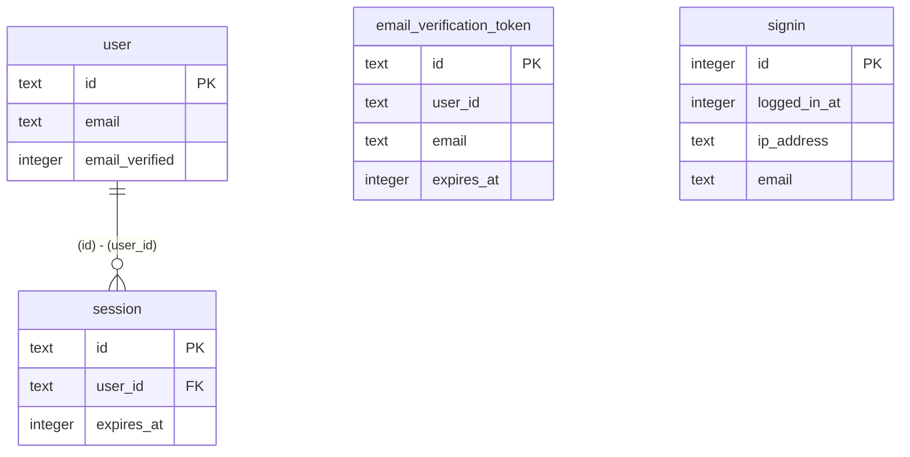

```mermaid
erDiagram
    user ||--o{ session : "(id) - (user_id)"
    user {
        text id PK
        text email
        integer email_verified
    }
    session {
        text id PK
        text user_id FK
        integer expires_at
    }
    email_verification_token {
        text id PK
        text user_id
        text email
        integer expires_at
    }
    signin {
        integer id PK
        integer logged_in_at
        text ip_address
        text email
    }
```
