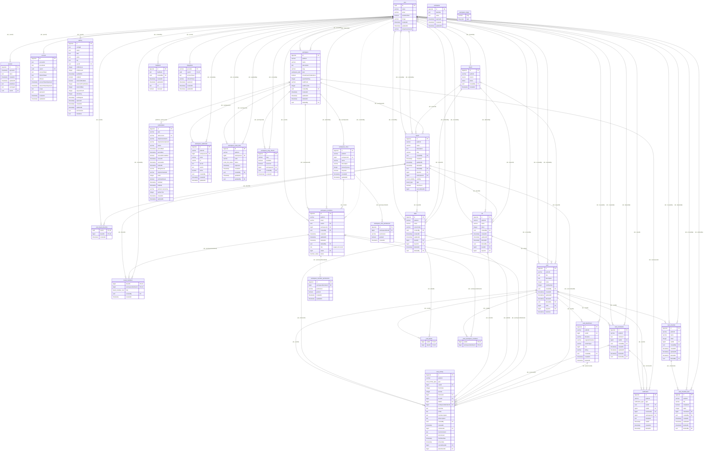

```mermaid
erDiagram
    user ||--o{ session : "(id) - (userId)"
    user ||--o{ account : "(id) - (userId)"
    user ||--o{ apiKey : "(id) - (userId)"
    user |o--o{ board : "(id) - (createdBy)"
    user |o--o{ board : "(id) - (deletedBy)"
    import |o--o{ board : "(id) - (importId)"
    workspace ||--o{ board : "(id) - (workspaceId)"
    user ||--o{ user_board_favorites : "(id) - (userId)"
    board ||--o{ user_board_favorites : "(id) - (boardId)"
    board ||--o{ board_members : "(id) - (boardId)"
    workspace_members ||--o{ board_members : "(id) - (workspaceMemberId)"
    user |o--o{ board_members : "(id) - (createdBy)"
    user |o--o{ card : "(id) - (createdBy)"
    user |o--o{ card : "(id) - (deletedBy)"
    list ||--o{ card : "(id) - (listId)"
    import |o--o{ card : "(id) - (importId)"
    card ||--o{ card_activity : "(id) - (cardId)"
    list |o--o{ card_activity : "(id) - (fromListId)"
    list |o--o{ card_activity : "(id) - (toListId)"
    label |o--o{ card_activity : "(id) - (labelId)"
    workspace_members |o--o{ card_activity : "(id) - (workspaceMemberId)"
    user |o--o{ card_activity : "(id) - (createdBy)"
    card_comments |o--o{ card_activity : "(id) - (commentId)"
    board |o--o{ card_activity : "(id) - (sourceBoardId)"
    card_attachment |o--o{ card_activity : "(id) - (attachmentId)"
    card ||--o{ _card_labels : "(id) - (cardId)"
    label ||--o{ _card_labels : "(id) - (labelId)"
    card ||--o{ _card_workspace_members : "(id) - (cardId)"
    workspace_members ||--o{ _card_workspace_members : "(id) - (workspaceMemberId)"
    card ||--o{ card_comments : "(id) - (cardId)"
    user |o--o{ card_comments : "(id) - (createdBy)"
    user |o--o{ card_comments : "(id) - (deletedBy)"
    card ||--o{ card_attachment : "(id) - (cardId)"
    user |o--o{ card_attachment : "(id) - (createdBy)"
    card ||--o{ card_checklist : "(id) - (cardId)"
    user |o--o{ card_checklist : "(id) - (createdBy)"
    user |o--o{ card_checklist : "(id) - (deletedBy)"
    card_checklist ||--o{ card_checklist_item : "(id) - (checklistId)"
    user |o--o{ card_checklist_item : "(id) - (createdBy)"
    user |o--o{ card_checklist_item : "(id) - (deletedBy)"
    user |o--o{ feedback : "(id) - (createdBy)"
    user |o--o{ import : "(id) - (createdBy)"
    user ||--o{ integration : "(id) - (userId)"
    user |o--o{ label : "(id) - (createdBy)"
    board ||--o{ label : "(id) - (boardId)"
    import |o--o{ label : "(id) - (importId)"
    user |o--o{ label : "(id) - (deletedBy)"
    user |o--o{ list : "(id) - (createdBy)"
    user |o--o{ list : "(id) - (deletedBy)"
    board ||--o{ list : "(id) - (boardId)"
    import |o--o{ list : "(id) - (importId)"
    user ||--o{ notification : "(id) - (userId)"
    card |o--o{ notification : "(id) - (cardId)"
    card_comments |o--o{ notification : "(id) - (commentId)"
    workspace |o--o{ notification : "(id) - (workspaceId)"
    workspace ||--o{ workspace_roles : "(id) - (workspaceId)"
    workspace_roles ||--o{ workspace_role_permissions : "(id) - (workspaceRoleId)"
    workspace |o--o{ subscription : "(publicId) - (referenceId)"
    workspace ||--o{ workspace_webhooks : "(id) - (workspaceId)"
    user ||--o{ workspace_webhooks : "(id) - (createdBy)"
    workspace ||--o{ workspace_invite_links : "(id) - (workspaceId)"
    user |o--o{ workspace_invite_links : "(id) - (createdBy)"
    user |o--o{ workspace_invite_links : "(id) - (updatedBy)"
    user |o--o{ workspace : "(id) - (createdBy)"
    user |o--o{ workspace : "(id) - (deletedBy)"
    user |o--o{ workspace_members : "(id) - (userId)"
    workspace ||--o{ workspace_members : "(id) - (workspaceId)"
    user |o--o{ workspace_members : "(id) - (deletedBy)"
    workspace_roles |o--o{ workspace_members : "(id) - (roleId)"
    workspace |o--o{ workspace_slug_checks : "(id) - (workspaceId)"
    user |o--o{ workspace_slug_checks : "(id) - (createdBy)"
    user ||..o{ workspace_members : "(id) - (createdBy)"
    workspace_members ||..o{ workspace_member_permissions : "(id) - (workspaceMemberId)"
    session {
        bigserial id PK
        timestamp expiresAt
        text token
        timestamp createdAt
        timestamp updatedAt
        text ipAddress
        text userAgent
        uuid userId FK
    }
    account {
        bigserial id PK
        text accountId
        text providerId
        uuid userId FK
        text accessToken
        text refreshToken
        text idToken
        timestamp accessTokenExpiresAt
        timestamp refreshTokenExpiresAt
        text scope
        text password
        timestamp createdAt
        timestamp updatedAt
    }
    verification {
        bigserial id PK
        text identifier
        text value
        timestamp expiresAt
        timestamp createdAt
        timestamp updatedAt
    }
    apiKey {
        bigserial id PK
        text configId
        text name
        text start
        text prefix
        text key
        uuid userId FK
        integer refillInterval
        integer refillAmount
        timestamp lastRefillAt
        boolean enabled
        boolean rateLimitEnabled
        integer rateLimitTimeWindow
        integer rateLimitMax
        integer requestCount
        integer remaining
        timestamp lastRequest
        timestamp expiresAt
        timestamp createdAt
        timestamp updatedAt
        text permissions
        text metadata
    }
    board {
        bigserial id PK
        varchar publicId
        varchar name
        text description
        varchar slug
        uuid createdBy FK
        timestamp createdAt
        timestamp updatedAt
        timestamp deletedAt
        uuid deletedBy FK
        bigint importId FK
        bigint workspaceId FK
        board_visibility visibility
        board_type type
        boolean isArchived
        bigint sourceBoardId
    }
    user_board_favorites {
        uuid userId PK, FK
        bigint boardId PK, FK
        timestamp createdAt
    }
    board_members {
        bigint boardId PK, FK
        bigint workspaceMemberId PK, FK
        board_member_role role
        uuid createdBy FK
        timestamp createdAt
    }
    card {
        bigserial id PK
        varchar publicId
        text title
        text description
        integer index
        integer cardNumber
        uuid createdBy FK
        timestamp createdAt
        timestamp updatedAt
        timestamp deletedAt
        uuid deletedBy FK
        bigint listId FK
        bigint importId FK
        timestamp dueDate
    }
    card_activity {
        bigserial id PK
        varchar publicId
        card_activity_type type
        bigint cardId FK
        integer fromIndex
        integer toIndex
        bigint fromListId FK
        bigint toListId FK
        bigint labelId FK
        bigint workspaceMemberId FK
        text fromTitle
        text toTitle
        text fromDescription
        text toDescription
        uuid createdBy FK
        timestamp createdAt
        bigint commentId FK
        text fromComment
        text toComment
        timestamp fromDueDate
        timestamp toDueDate
        bigint sourceBoardId FK
        bigint attachmentId FK
    }
    _card_labels {
        bigint cardId PK, FK
        bigint labelId PK, FK
    }
    _card_workspace_members {
        bigint cardId PK, FK
        bigint workspaceMemberId PK, FK
    }
    card_comments {
        bigserial id PK
        varchar publicId
        text comment
        bigint cardId FK
        uuid createdBy FK
        timestamp createdAt
        timestamp updatedAt
        timestamp deletedAt
        uuid deletedBy FK
    }
    card_attachment {
        bigserial id PK
        varchar publicId
        bigint cardId FK
        varchar filename
        varchar originalFilename
        varchar contentType
        bigint size
        varchar s3Key
        uuid createdBy FK
        timestamp createdAt
        timestamp deletedAt
    }
    card_checklist {
        bigserial id PK
        varchar publicId
        varchar name
        integer index
        bigint cardId FK
        uuid createdBy FK
        timestamp createdAt
        timestamp updatedAt
        timestamp deletedAt
        uuid deletedBy FK
    }
    card_checklist_item {
        bigserial id PK
        varchar publicId
        varchar title
        boolean completed
        integer index
        bigint checklistId FK
        uuid createdBy FK
        timestamp createdAt
        timestamp updatedAt
        timestamp deletedAt
        uuid deletedBy FK
    }
    feedback {
        bigserial id PK
        text feedback
        uuid createdBy FK
        timestamp createdAt
        timestamp updatedAt
        text url
        boolean reviewed
    }
    import {
        bigserial id PK
        varchar publicId
        source source
        status status
        uuid createdBy FK
        timestamp createdAt
    }
    integration {
        varchar provider PK
        uuid userId PK, FK
        text accessToken
        varchar refreshToken
        timestamp expiresAt
        timestamp createdAt
        timestamp updatedAt
    }
    label {
        bigserial id PK
        varchar publicId
        varchar name
        varchar colourCode
        uuid createdBy FK
        timestamp createdAt
        timestamp updatedAt
        bigint boardId FK
        bigint importId FK
        timestamp deletedAt
        uuid deletedBy FK
    }
    list {
        bigserial id PK
        varchar publicId
        varchar name
        integer index
        uuid createdBy FK
        timestamp createdAt
        timestamp updatedAt
        timestamp deletedAt
        uuid deletedBy FK
        bigint boardId FK
        bigint importId FK
    }
    notification {
        bigserial id PK
        varchar publicId
        notification_type type
        uuid userId FK
        bigint cardId FK
        bigint commentId FK
        bigint workspaceId FK
        text metadata
        timestamp readAt
        timestamp createdAt
        timestamp deletedAt
    }
    workspace_roles {
        bigserial id PK
        varchar publicId
        bigint workspaceId FK
        varchar name
        varchar description
        integer hierarchyLevel
        boolean isSystem
        timestamp createdAt
        timestamp updatedAt
    }
    workspace_role_permissions {
        bigserial id PK
        bigint workspaceRoleId FK
        varchar permission
        boolean granted
        timestamp createdAt
    }
    workspace_member_permissions {
        bigserial id PK
        bigint workspaceMemberId FK
        varchar permission
        boolean granted
        timestamp createdAt
        timestamp updatedAt
    }
    subscription {
        bigserial id PK
        varchar plan
        varchar referenceId FK
        varchar stripeCustomerId
        varchar stripeSubscriptionId
        varchar status
        timestamp periodStart
        timestamp periodEnd
        boolean cancelAtPeriodEnd
        timestamp cancelAt
        timestamp canceledAt
        timestamp endedAt
        varchar billingInterval
        varchar stripeScheduleId
        integer seats
        boolean unlimitedSeats
        timestamp trialStart
        timestamp trialEnd
        varchar partnerLicenseKey
        integer partnerTier
        timestamp createdAt
        timestamp updatedAt
    }
    user {
        uuid id PK
        varchar name
        varchar email
        boolean emailVerified
        varchar image
        timestamp createdAt
        timestamp updatedAt
        varchar stripeCustomerId
    }
    workspace_webhooks {
        bigserial id PK
        varchar publicId
        bigint workspaceId FK
        varchar name
        varchar url
        text secret
        text events
        boolean active
        uuid createdBy FK
        timestamp createdAt
        timestamp updatedAt
    }
    workspace_invite_links {
        bigserial id PK
        varchar publicId
        bigint workspaceId FK
        varchar code
        invite_link_status status
        timestamp expiresAt
        timestamp createdAt
        uuid createdBy FK
        timestamp updatedAt
        uuid updatedBy FK
    }
    workspace {
        bigserial id PK
        varchar publicId
        varchar name
        text description
        varchar slug
        workspace_plan plan
        boolean showEmailsToMembers
        integer weekStartDay
        varchar cardPrefix
        integer cardCounter
        uuid createdBy FK
        timestamp createdAt
        timestamp updatedAt
        timestamp deletedAt
        uuid deletedBy FK
    }
    workspace_members {
        bigserial id PK
        varchar publicId
        varchar email
        uuid userId FK
        bigint workspaceId FK
        uuid createdBy FK
        timestamp createdAt
        timestamp updatedAt
        timestamp deletedAt
        uuid deletedBy FK
        role role "Legacy role enum"
        bigint roleId FK
        member_status status
    }
    workspace_slugs {
        varchar slug
        slug_type type
    }
    workspace_slug_checks {
        bigserial id PK
        varchar slug
        boolean available
        boolean reserved
        bigint workspaceId FK
        uuid createdBy FK
        timestamp createdAt
    }
```
