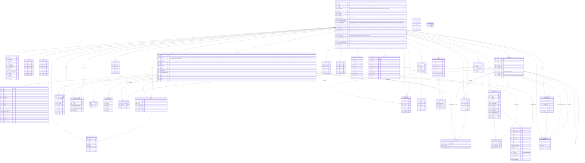

```mermaid
erDiagram
    user ||--o{ account : "(id) - (userId)"
    user ||--o{ session : "(id) - (userId)"
    user ||--o{ apiKey : "(id) - (userId)"
    user ||--o{ bookmarks : "(id) - (userId)"
    bookmarks ||--o| bookmarkLinks : "(id) - (id)"
    bookmarks |o--o{ assets : "(id) - (bookmarkId)"
    user ||--o{ assets : "(id) - (userId)"
    bookmarks ||--o{ highlights : "(id) - (bookmarkId)"
    user ||--o{ highlights : "(id) - (userId)"
    bookmarks ||--o{ userReadingProgress : "(id) - (bookmarkId)"
    user ||--o{ userReadingProgress : "(id) - (userId)"
    bookmarks ||--o| bookmarkTexts : "(id) - (id)"
    bookmarks ||--o| bookmarkAssets : "(id) - (id)"
    user ||--o{ bookmarkTags : "(id) - (userId)"
    bookmarks ||--o{ tagsOnBookmarks : "(id) - (bookmarkId)"
    bookmarkTags ||--o{ tagsOnBookmarks : "(id) - (tagId)"
    user ||--o{ bookmarkLists : "(id) - (userId)"
    bookmarkLists |o--o{ bookmarkLists : "(id) - (parentId)"
    bookmarks ||--o{ bookmarksInLists : "(id) - (bookmarkId)"
    bookmarkLists ||--o{ bookmarksInLists : "(id) - (listId)"
    listCollaborators |o--o{ bookmarksInLists : "(id) - (listMembershipId)"
    bookmarkLists ||--o{ listCollaborators : "(id) - (listId)"
    user ||--o{ listCollaborators : "(id) - (userId)"
    user |o--o{ listCollaborators : "(id) - (addedBy)"
    bookmarkLists ||--o{ listInvitations : "(id) - (listId)"
    user ||--o{ listInvitations : "(id) - (userId)"
    user |o--o{ listInvitations : "(id) - (invitedBy)"
    user ||--o{ customPrompts : "(id) - (userId)"
    user ||--o{ chatSessions : "(id) - (userId)"
    chatSessions ||--o{ chatMessages : "(id) - (chatId)"
    user ||--o{ rssFeeds : "(id) - (userId)"
    user ||--o{ webhooks : "(id) - (userId)"
    rssFeeds ||--o{ rssFeedImports : "(id) - (rssFeedId)"
    bookmarks |o--o{ rssFeedImports : "(id) - (bookmarkId)"
    user ||--o{ backups : "(id) - (userId)"
    assets |o--o{ backups : "(id) - (assetId)"
    user ||--o{ ruleEngineRules : "(id) - (userId)"
    bookmarkTags |o--o{ ruleEngineRules : "(userId, id) - (userId, tagId)"
    user ||--o{ ruleEngineActions : "(id) - (userId)"
    ruleEngineRules ||--o{ ruleEngineActions : "(id) - (ruleId)"
    bookmarkTags |o--o{ ruleEngineActions : "(userId, id) - (userId, tagId)"
    bookmarkLists |o--o{ ruleEngineActions : "(userId, id) - (userId, listId)"
    user ||--o{ invites : "(id) - (invitedBy)"
    user ||--o| subscriptions : "(id) - (userId)"
    user ||--o| inAppSubscriptions : "(id) - (userId)"
    user ||--o{ importSessions : "(id) - (userId)"
    bookmarkLists |o--o{ importSessions : "(id) - (rootListId)"
    importSessions ||--o{ importSessionBookmarks : "(id) - (importSessionId)"
    bookmarks ||--o{ importSessionBookmarks : "(id) - (bookmarkId)"
    importSessions ||--o{ importStagingBookmarks : "(id) - (importSessionId)"
    bookmarks |o--o{ importStagingBookmarks : "(id) - (resultBookmarkId)"
    user {
        text id PK
        text name
        text email
        integer emailVerified "Nullable and without a SQL default because SQLite can't add those constraints to an existing column without rebuilding the user table."
        text image
        text role
        integer createdAt
        integer updatedAt
        integer bookmarkQuota "Admin Only Settings"
        integer storageQuota
        integer browserCrawlingEnabled
        text manualTierName "Admin-granted plan label (e.g. a collaborator name). While set, Stripe and in-app purchase syncs don't downgrade the user's entitlements; it's cleared when the user gets an active paid subscription."
        text bookmarkClickAction "User Settings"
        text archiveDisplayBehaviour
        text timezone
        integer backupsEnabled "Backup Settings"
        text backupsFrequency
        integer backupsRetentionDays
        integer readerFontSize "Reader view settings (nullable = opt-in, null means use client default)"
        real readerLineHeight
        text readerFontFamily
        integer autoTaggingEnabled "AI Settings (nullable = opt-in, null means use server default)"
        integer autoSummarizationEnabled
        text tagStyle
        text curatedTagIds
        text inferredTagLang
    }
    account {
        text id PK
        text accountId
        text providerId
        text userId FK
        text accessToken
        text refreshToken
        text idToken
        integer accessTokenExpiresAt
        integer refreshTokenExpiresAt
        text scope
        text password
        integer createdAt
        integer updatedAt
    }
    session {
        text id PK
        text token
        text userId FK
        integer expiresAt
        text ipAddress
        text userAgent
        integer createdAt
        integer updatedAt
    }
    verificationToken {
        text id PK
        text identifier
        text value
        integer expiresAt
        integer createdAt
        integer updatedAt
    }
    apiKey {
        text id PK
        text name
        integer createdAt
        integer lastUsedAt
        text keyId
        text keyHash
        text scopes
        text userId FK
    }
    bookmarks {
        text id PK
        integer createdAt "The `createdAt` field and the `createdAt` column intentionally don't match. Re-saving an existing bookmark bumps it back to the top of the list, so the timestamp everything sorts and filters on is now 'when was this last saved' and lives in the `lastSavedAt` column. It keeps the `createdAt` field name because that's what the API has always exposed and what every query already orders by. The immutable 'when did this row first appear' timestamp stays in the original `createdAt` column, and is exposed to clients as `firstCreatedAt`."
        integer lastSavedAt
        integer modifiedAt
        text title
        integer archived
        integer favourited
        text userId FK
        text taggingStatus
        text summarizationStatus
        text embeddingStatus
        text summary
        text note
        text type
        text source
    }
    bookmarkLinks {
        text id PK, FK
        text url
        text title "Crawled info"
        text description
        text author
        text publisher
        integer datePublished
        integer dateModified
        text imageUrl
        text favicon
        text htmlContent
        text contentAssetId
        text readerViewStatus
        integer readerViewScore
        text readerViewReasons
        integer readerViewClassifierVersion
        integer crawledAt
        text crawlStatus
        integer crawlStatusCode
        integer probeMetadataAt "When the pre-crawl probe last extracted and stored this link's metadata. Lets crawl retries skip re-fetching it."
    }
    assets {
        text id PK "Asset ids don't have a default function as they are generated by the caller"
        text assetType
        integer size
        text contentType
        text fileName
        text bookmarkId FK
        text userId FK
    }
    highlights {
        text id PK
        text bookmarkId FK
        text userId FK
        integer startOffset
        integer endOffset
        text color
        text text
        text prefix
        text suffix
        text note
        integer createdAt
    }
    userReadingProgress {
        text id PK
        text bookmarkId FK
        text userId FK
        integer readingProgressOffset
        text readingProgressAnchor
        integer readingProgressPercent
        integer modifiedAt
    }
    bookmarkTexts {
        text id PK, FK
        text text
        text sourceUrl
    }
    bookmarkAssets {
        text id PK, FK
        text assetType
        text assetId
        text content
        text metadata
        text fileName
        text sourceUrl
    }
    bookmarkTags {
        text id PK
        text name
        text normalizedName
        integer createdAt
        text userId FK
    }
    tagsOnBookmarks {
        text bookmarkId PK, FK
        text tagId PK, FK
        integer attachedAt
        text attachedBy
    }
    bookmarkLists {
        text id PK
        text name
        text description
        text icon
        integer createdAt
        text userId FK
        text type
        text query "Only applicable for smart lists"
        text parentId FK
        text rssToken "Whoever have access to this token can read the content of this list"
        integer public
    }
    bookmarksInLists {
        text bookmarkId PK, FK
        text listId PK, FK
        integer addedAt
        text listMembershipId FK "Tie the list's existence to the user's membership of this list."
    }
    listCollaborators {
        text id PK
        text listId FK
        text userId FK
        text role
        integer createdAt
        text addedBy FK
    }
    listInvitations {
        text id PK
        text listId FK
        text userId FK
        text role
        text status
        integer invitedAt
        text invitedEmail
        text invitedBy FK
    }
    customPrompts {
        text id PK
        text text
        integer enabled
        text appliesTo
        integer createdAt
        text userId FK
    }
    chatSessions {
        text id PK
        text title
        text userId FK
        integer createdAt
        integer modifiedAt
    }
    chatMessages {
        text id PK
        text chatId FK
        text role
        text content
        text metadata
        integer createdAt
    }
    rssFeeds {
        text id PK
        text name
        text url
        integer enabled
        integer importTags
        integer createdAt
        integer lastFetchedAt
        integer lastSuccessfulFetchAt
        text lastFetchedStatus
        text userId FK
    }
    webhooks {
        text id PK
        integer createdAt
        text url
        text userId FK
        text events
        text token
    }
    rssFeedImports {
        text id PK
        integer createdAt
        text entryId
        text rssFeedId FK
        text bookmarkId FK
    }
    backups {
        text id PK
        text userId FK
        text assetId FK
        integer createdAt
        integer size
        integer bookmarkCount
        text status
        text errorMessage
    }
    config {
        text key PK
        text value
    }
    ruleEngineRules {
        text id PK
        integer enabled
        text name
        text description
        text event
        text condition
        text userId FK "References"
        text tagId FK
    }
    ruleEngineActions {
        text id PK
        text userId FK
        text ruleId FK
        text action
        text listId FK "References"
        text tagId FK
    }
    invites {
        text id PK
        text email
        text token
        integer createdAt
        integer usedAt
        text invitedBy FK
    }
    subscriptions {
        text id PK
        text userId FK
        text stripeCustomerId
        text stripeSubscriptionId
        text status
        text tier
        text priceId
        integer cancelAtPeriodEnd
        integer startDate
        integer endDate
        integer createdAt
        integer modifiedAt
    }
    inAppSubscriptions {
        text id PK
        text userId FK
        text store "The RevenueCat store identifier (e.g. 'app_store', 'play_store')."
        text productId
        text status
        integer cancelAtPeriodEnd
        integer billingIssue
        integer isSandbox
        integer startDate
        integer endDate
        integer createdAt
        integer modifiedAt
    }
    importSessions {
        text id PK
        text name
        text userId FK
        text message
        text rootListId FK
        text status
        integer lastProcessedAt
        integer completedAt
        integer totalBookmarks
        integer completedBookmarks
        integer failedBookmarks
        integer pendingBookmarks
        integer processingBookmarks
        integer createdAt
        integer modifiedAt
    }
    importSessionBookmarks {
        text id PK
        text importSessionId FK
        text bookmarkId FK
        integer createdAt
    }
    importStagingBookmarks {
        text id PK
        text importSessionId FK
        text type "Bookmark data to create"
        text url
        text title
        text content
        text note
        text tags
        text listIds
        integer sourceAddedAt
        integer archived
        text status "Processing state"
        integer processingStartedAt
        text result "Result (for observability)"
        text resultReason
        text resultBookmarkId FK
        integer createdAt
        integer completedAt
    }
```
