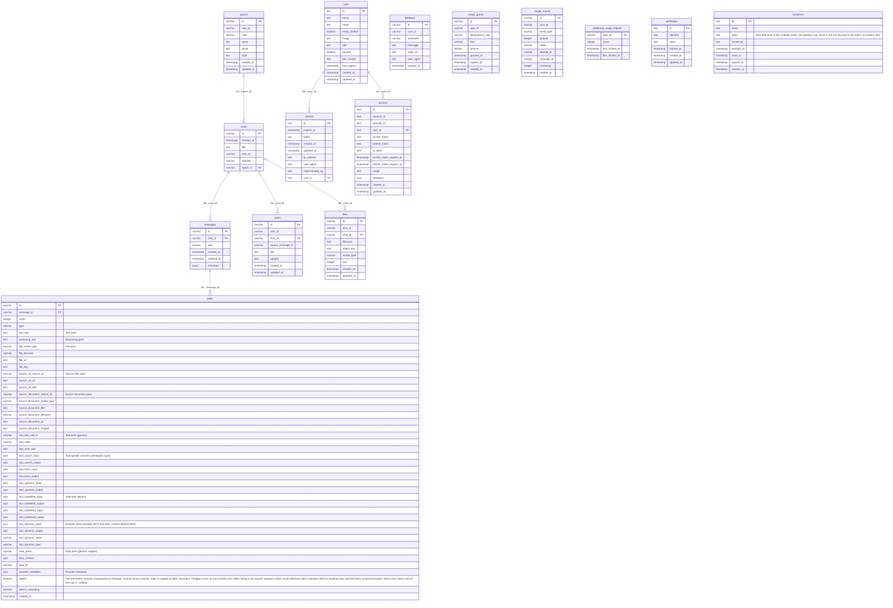

```mermaid
erDiagram
    spaces |o--o{ chats : "(id) - (space_id)"
    chats ||--o{ messages : "(id) - (chat_id)"
    messages ||--o{ parts : "(id) - (message_id)"
    chats |o--o{ notes : "(id) - (chat_id)"
    chats |o--o{ files : "(id) - (chat_id)"
    user ||--o{ session : "(id) - (user_id)"
    user ||--o{ account : "(id) - (user_id)"
    spaces {
        varchar id PK
        varchar user_id
        varchar color
        text name
        text about
        text style
        timestamp created_at
        timestamp updated_at
    }
    chats {
        varchar id PK
        timestamp created_at
        text title
        varchar user_id
        varchar visibility
        varchar space_id FK
    }
    messages {
        varchar id PK
        varchar chat_id FK
        varchar role
        timestamp created_at
        timestamp updated_at
        jsonb metadata
    }
    parts {
        varchar id PK
        varchar message_id FK
        integer order
        varchar type
        text text_text "Text parts"
        text reasoning_text "Reasoning parts"
        varchar file_media_type "File parts"
        varchar file_filename
        text file_url
        text file_key
        varchar source_url_source_id "Source URL parts"
        text source_url_url
        text source_url_title
        varchar source_document_source_id "Source document parts"
        varchar source_document_media_type
        text source_document_title
        varchar source_document_filename
        text source_document_url
        text source_document_snippet
        varchar tool_tool_call_id "Tool parts (generic)"
        varchar tool_state
        text tool_error_text
        json tool_search_input "Tool-specific columns (all Morphic tools)"
        json tool_search_output
        json tool_fetch_input
        json tool_fetch_output
        json tool_question_input
        json tool_question_output
        json tool_todoWrite_input "Todo tool columns"
        json tool_todoWrite_output
        json tool_todoRead_input
        json tool_todoRead_output
        json tool_dynamic_input "Dynamic tools (includes MCP and other runtime-defined tools)"
        json tool_dynamic_output
        varchar tool_dynamic_name
        varchar tool_dynamic_type
        varchar data_prefix "Data parts (generic support)"
        json data_content
        varchar data_id
        json provider_metadata "Provider metadata"
        tsvector search "Full-text search columns (maintained by Postgres, used by history search). Input is capped at 100k characters: Postgres errors on any tsvector over 1MB ('string is too long for tsvector'), which would otherwise abort migration 0020 on existing rows and fail inserts of oversized parts. Worst-case vector size at this cap is ~220KB."
        tsvector search_reasoning
        timestamp created_at
    }
    notes {
        varchar id PK
        varchar user_id
        varchar chat_id FK
        varchar source_message_id
        text title
        text content
        timestamp created_at
        timestamp updated_at
    }
    files {
        varchar id PK
        varchar user_id
        varchar chat_id FK
        text filename
        text object_key
        varchar media_type
        integer size
        timestamp created_at
        timestamp updated_at
    }
    feedback {
        varchar id PK
        varchar user_id
        varchar sentiment
        text message
        text page_url
        text user_agent
        timestamp created_at
    }
    usage_grants {
        varchar id PK
        varchar user_id
        varchar idempotency_key
        varchar kind
        integer amount
        timestamp granted_at
        timestamp expires_at
        timestamp created_at
    }
    usage_events {
        varchar id PK
        varchar user_id
        varchar event_type
        integer amount
        varchar mode
        varchar attempt_id
        varchar message_id
        integer remaining
        timestamp created_at
    }
    additional_usage_interest {
        varchar user_id PK
        integer count
        timestamp first_clicked_at
        timestamp last_clicked_at
    }
    user {
        text id PK
        text name
        text email
        boolean email_verified
        text image
        text role
        boolean banned
        text ban_reason
        timestamp ban_expires
        timestamp created_at
        timestamp updated_at
    }
    session {
        text id PK
        timestamp expires_at
        text token
        timestamp created_at
        timestamp updated_at
        text ip_address
        text user_agent
        text impersonated_by
        text user_id FK
    }
    account {
        text id PK
        text account_id
        text provider_id
        text user_id FK
        text access_token
        text refresh_token
        text id_token
        timestamp access_token_expires_at
        timestamp refresh_token_expires_at
        text scope
        text password
        timestamp created_at
        timestamp updated_at
    }
    verification {
        text id PK
        text identifier
        text value
        timestamp expires_at
        timestamp created_at
        timestamp updated_at
    }
    invitations {
        text id PK
        text email
        text token "SHA-256 hash of the invitation token; the plaintext only exists in the link returned to the admin at creation time."
        text invited_by
        timestamp revoked_at
        timestamp used_at
        timestamp expires_at
        timestamp created_at
    }
```
