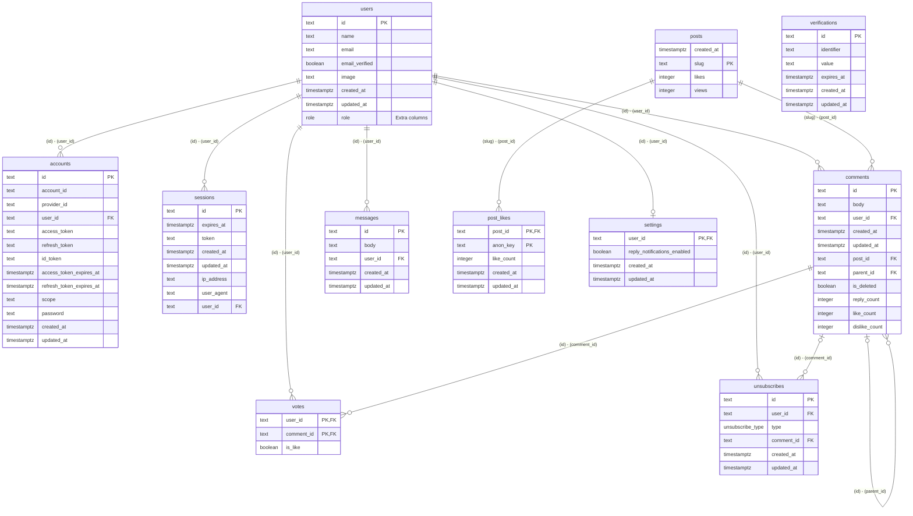

```mermaid
erDiagram
    users ||--o{ accounts : "(id) - (user_id)"
    users ||--o{ sessions : "(id) - (user_id)"
    users ||--o{ comments : "(id) - (user_id)"
    posts ||--o{ comments : "(slug) - (post_id)"
    comments |o--o{ comments : "(id) - (parent_id)"
    users ||--o{ votes : "(id) - (user_id)"
    comments ||--o{ votes : "(id) - (comment_id)"
    users ||--o{ messages : "(id) - (user_id)"
    posts ||--o{ post_likes : "(slug) - (post_id)"
    users ||--o| settings : "(id) - (user_id)"
    users ||--o{ unsubscribes : "(id) - (user_id)"
    comments |o--o{ unsubscribes : "(id) - (comment_id)"
    users {
        text id PK
        text name
        text email
        boolean email_verified
        text image
        timestamptz created_at
        timestamptz updated_at
        role role "Extra columns"
    }
    accounts {
        text id PK
        text account_id
        text provider_id
        text user_id FK
        text access_token
        text refresh_token
        text id_token
        timestamptz access_token_expires_at
        timestamptz refresh_token_expires_at
        text scope
        text password
        timestamptz created_at
        timestamptz updated_at
    }
    sessions {
        text id PK
        timestamptz expires_at
        text token
        timestamptz created_at
        timestamptz updated_at
        text ip_address
        text user_agent
        text user_id FK
    }
    verifications {
        text id PK
        text identifier
        text value
        timestamptz expires_at
        timestamptz created_at
        timestamptz updated_at
    }
    comments {
        text id PK
        text body
        text user_id FK
        timestamptz created_at
        timestamptz updated_at
        text post_id FK
        text parent_id FK
        boolean is_deleted
        integer reply_count
        integer like_count
        integer dislike_count
    }
    votes {
        text user_id PK, FK
        text comment_id PK, FK
        boolean is_like
    }
    messages {
        text id PK
        text body
        text user_id FK
        timestamptz created_at
        timestamptz updated_at
    }
    posts {
        timestamptz created_at
        text slug PK
        integer likes
        integer views
    }
    post_likes {
        text post_id PK, FK
        text anon_key PK
        integer like_count
        timestamptz created_at
        timestamptz updated_at
    }
    settings {
        text user_id PK, FK
        boolean reply_notifications_enabled
        timestamptz created_at
        timestamptz updated_at
    }
    unsubscribes {
        text id PK
        text user_id FK
        unsubscribe_type type
        text comment_id FK
        timestamptz created_at
        timestamptz updated_at
    }
```
