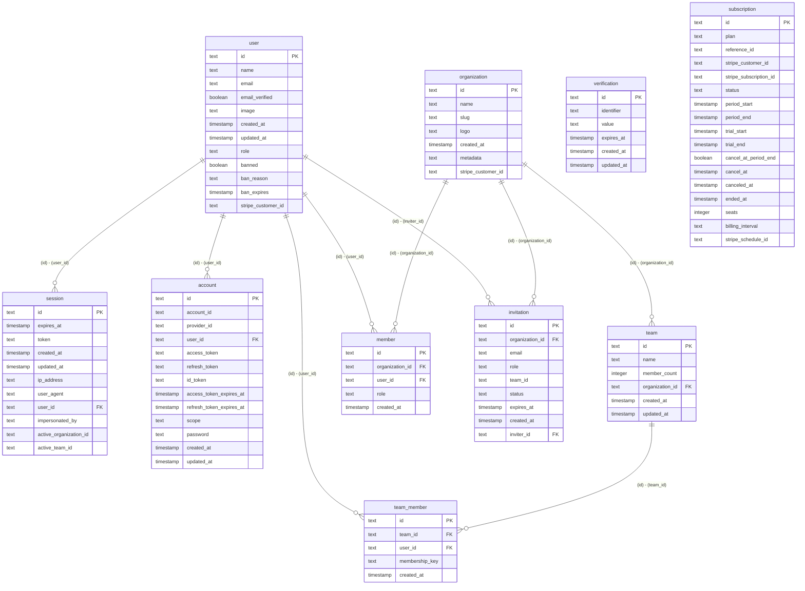

```mermaid
erDiagram
    user ||--o{ session : "(id) - (user_id)"
    user ||--o{ account : "(id) - (user_id)"
    organization ||--o{ team : "(id) - (organization_id)"
    team ||--o{ team_member : "(id) - (team_id)"
    user ||--o{ team_member : "(id) - (user_id)"
    organization ||--o{ member : "(id) - (organization_id)"
    user ||--o{ member : "(id) - (user_id)"
    organization ||--o{ invitation : "(id) - (organization_id)"
    user ||--o{ invitation : "(id) - (inviter_id)"
    user {
        text id PK
        text name
        text email
        boolean email_verified
        text image
        timestamp created_at
        timestamp updated_at
        text role
        boolean banned
        text ban_reason
        timestamp ban_expires
        text stripe_customer_id
    }
    session {
        text id PK
        timestamp expires_at
        text token
        timestamp created_at
        timestamp updated_at
        text ip_address
        text user_agent
        text user_id FK
        text impersonated_by
        text active_organization_id
        text active_team_id
    }
    account {
        text id PK
        text account_id
        text provider_id
        text user_id FK
        text access_token
        text refresh_token
        text id_token
        timestamp access_token_expires_at
        timestamp refresh_token_expires_at
        text scope
        text password
        timestamp created_at
        timestamp updated_at
    }
    verification {
        text id PK
        text identifier
        text value
        timestamp expires_at
        timestamp created_at
        timestamp updated_at
    }
    organization {
        text id PK
        text name
        text slug
        text logo
        timestamp created_at
        text metadata
        text stripe_customer_id
    }
    team {
        text id PK
        text name
        integer member_count
        text organization_id FK
        timestamp created_at
        timestamp updated_at
    }
    team_member {
        text id PK
        text team_id FK
        text user_id FK
        text membership_key
        timestamp created_at
    }
    member {
        text id PK
        text organization_id FK
        text user_id FK
        text role
        timestamp created_at
    }
    invitation {
        text id PK
        text organization_id FK
        text email
        text role
        text team_id
        text status
        timestamp expires_at
        timestamp created_at
        text inviter_id FK
    }
    subscription {
        text id PK
        text plan
        text reference_id
        text stripe_customer_id
        text stripe_subscription_id
        text status
        timestamp period_start
        timestamp period_end
        timestamp trial_start
        timestamp trial_end
        boolean cancel_at_period_end
        timestamp cancel_at
        timestamp canceled_at
        timestamp ended_at
        integer seats
        text billing_interval
        text stripe_schedule_id
    }
```
