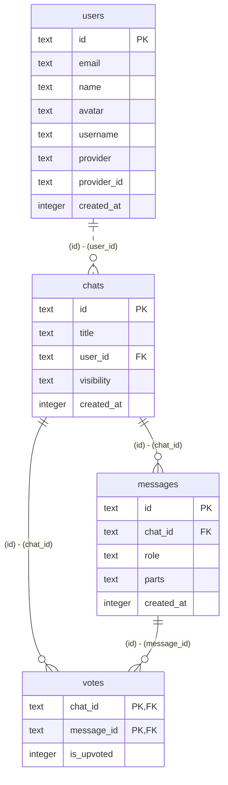

```mermaid
erDiagram
    chats ||--o{ messages : "(id) - (chat_id)"
    chats ||--o{ votes : "(id) - (chat_id)"
    messages ||--o{ votes : "(id) - (message_id)"
    users ||..o{ chats : "(id) - (user_id)"
    users {
        text id PK
        text email
        text name
        text avatar
        text username
        text provider
        text provider_id
        integer created_at
    }
    chats {
        text id PK
        text title
        text user_id FK
        text visibility
        integer created_at
    }
    messages {
        text id PK
        text chat_id FK
        text role
        text parts
        integer created_at
    }
    votes {
        text chat_id PK, FK
        text message_id PK, FK
        integer is_upvoted
    }
```
